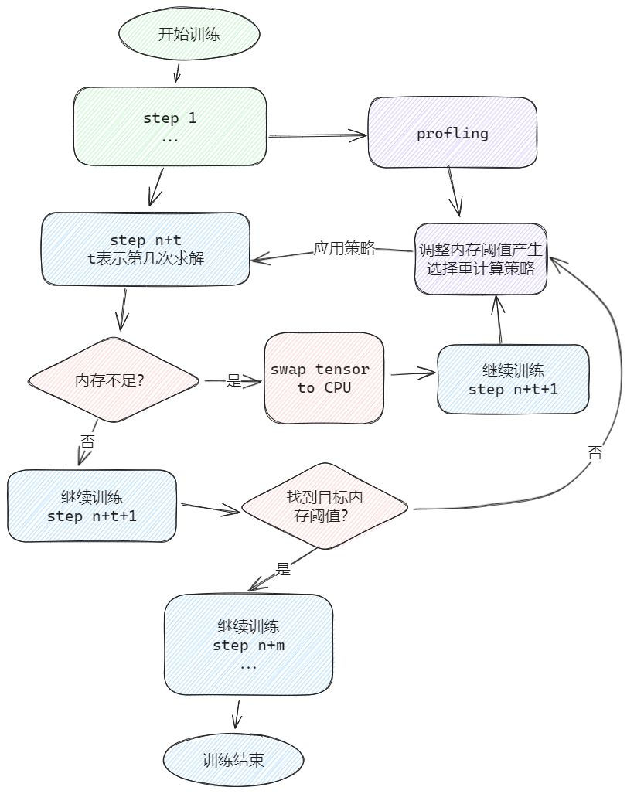
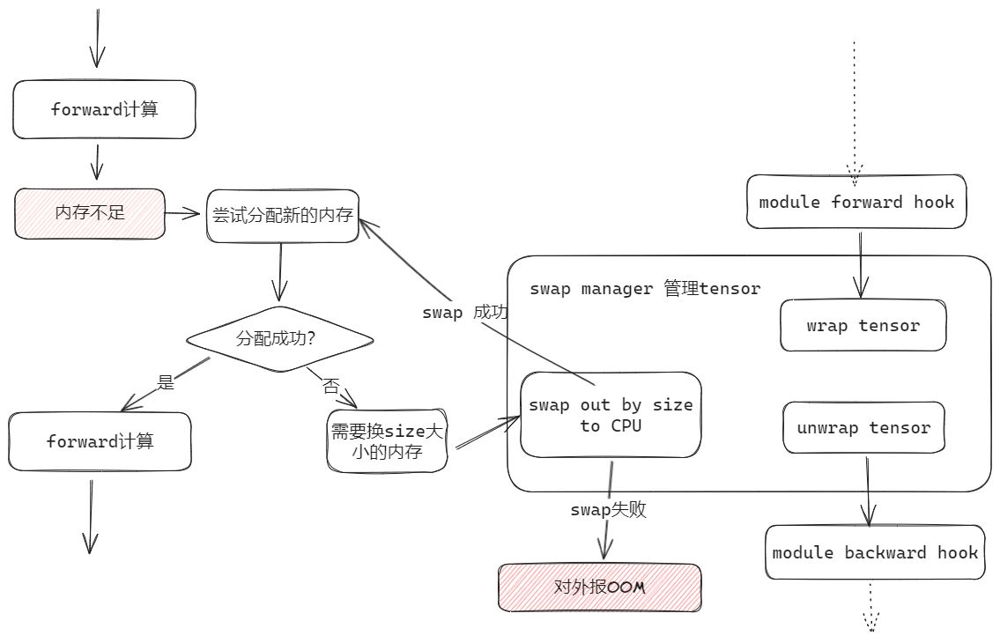

# 自适应选择重计算

## 问题分析

重计算特性可以有效的减少显存使用，但是策略较为固定，无法最大限度使用显存资源。

## 解决方案

为了在最大限度地利用 NPU 显存的同时，提高模型训练的性能，我们支持通过自动调整训练内存大小来自动选择重新计算策略。这一特性称为自适应选择重计算。

### 解决思路

自适应选择重计算设计主要包括重计算策略搜索、SwapManager 功能和内存管理三大部分。

其中重计算策略搜索依赖 SwapManager 功能及时将 tensor 换到 CPU，避免 OOM 导致训练中断。

自动选择重计算策略流程如下图所示：

 

SwapManager 能需要内存管理适配 PTA 的 NPUPluggableAllocator 接口拦截 OOM，让 SwapManager 功能可以介入，流程如下图所示：

 

## 使用场景

该特性主要用于训练场景，如果用户发现 NPU 报显存不足时，reserved 和 allocated 的显存差距很大 (如 reserved-allocated > 1G)，则说明 torch 中可能产生了较多内存碎片，可以考虑开启该特性。

示例：内存不足时报错信息：Tried to allocate 384.00 MiB (NPU 2; 61.22 GiB total capacity; 53.87 GiB already allocated; 53.87 GiB current active; 1.59 GiB free; 56.60 GiB reserved in total by PyTorch)，发现reserved-allocated=2.73G，则可以考虑开启该特性。

**注意：** 由于该特性在内存充足时倾向于新申请内存而非将已申请内存空间碎片化，因此在少量情况下可能和 hccl 抢占显存，而导致 hccl 在显存不足时无法通知 torch 释放额外预留的空闲空间，从而报 hccl 显存不足的错误。
通过 `torch_npu.npu.set_per_process_memory_fraction` 接口设置允许 torch 占用的内存上限可解决该问题。

> `torch_npu.npu.set_per_process_memory_fraction` 接口设置：  
> 位置：AscendSpeed/ascendspeed/core/memory/memory_fragmentation/memory_recorder.py  
> 添加：torch_npu.npu.set_per_process_memory_fraction(X)，其中 X 为想要限制 torch 占用内存的最高比例，例如 0.94

## 使用方法

1. 启用自适应选择重计算，请首先打开设置环境变量`export ADAPTIVE_RECOMPUTING=1`，并且脚本中添加`--adaptive-recompute-device-swap`标志开启自适应选择重计算策略。
2. （可选）支持手动调整训练内存大小来自动选择重计算策略，请使用`--adaptive-recompute-device-size`进行设置来指定自适应选择重计算策略的训练内存大小（单位：MB）。内存>0为有效内存，最大内存限度为device最大内存。在该范围内自适应重计算才可以进行最优策略搜寻，不在有效内存范围内会使用读取到的device最大内存信息作为默认值。需要注意的是内存设定较小时，性能会与全重计算一致。该方式如果发生OOM，您需要重新选择一个新的内存值来重启模型训练。您也可以通过二分法的方式获得最优解，对该特性不熟悉请勿使用此选项。使用此选项请参考[自适应选择重计算Wiki](https://gitee.com/ascend/ModelLink/wikis/Algorithm%20Introduction/Auto%20Selective%20Recomputing)。
3. （可选）支持设置停止profiling的训练step，请使用`--adaptive-recompute-profiling-step`进行设置。该参数需要设置为>0的整数。默认在第10步停止profiling。若该值<=0，则采用默认值10，推荐设置该值>5。当step<5或者>总步数的1/10时，会有告警信息，但不影响正常训练，不会对性能和精度有任何影响。

## 使用效果

Llama2-7B 节省约 1.64GB，Llama2-13B 节省约 1.34GB。
