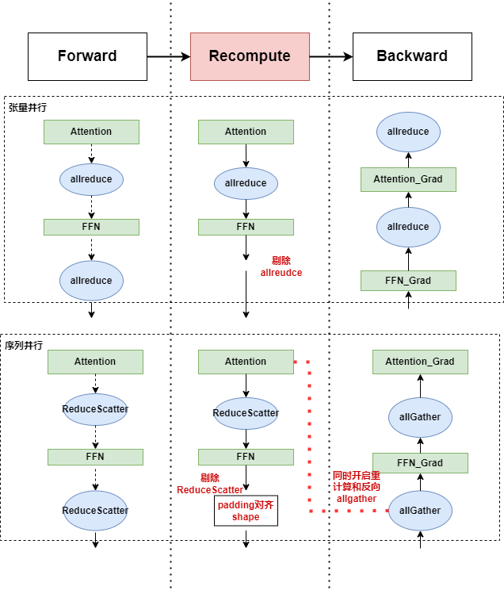
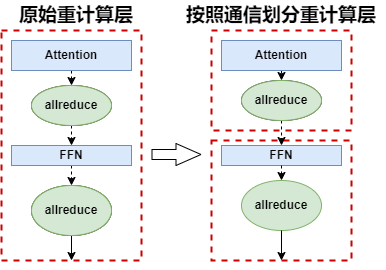

# TP重计算通信优化

## 问题分析

在大部分大模型训练客户场景，开启重计算和TP并行属于必须配置，开启重计算虽然能节省内存，但是会导致TP维度通信耗时增长50%，整体计算耗时会增长30%~
40%。

## 解决方案

重计算通信算子消除，优化重计算层划分，实现大模型训练通信性能提升。

### 解决思路:

#### **重计算通信优化**

开启张量并行时，在前向层FFN末端会插入AllReduce算子，其反向对应的是Identity，由于重计算只是为了获取中间激活值，所以其末端AllReduce的输出是冗余的，因此可以消除末端AllReduce，而不影响中间计算和后续的反向计算，如下图所示。
  
 

#### **反向通信Overlap**

开启序列并行时，在前向层末端FFN会插入ReduceScatter通信，同时在反向中会插入AllGather通信，重计算时可以直接消除ReduceScatter通信，同时将反向时的AllGather隐藏在前向计算中，如上图所示。

#### **重计算层划分优化**

如下图所示，按照通信算子的位置去划分重计算层，可以将层内通信转化成层末端通信，通过上述重计算通信优化方式，可以完全消除重计算引入的通信耗时，E2E TP维度通信耗时可以缩减1/3。

  
 

## 使用场景

模型开启了全节点内张量并行并且也开启了全重计算。

## 使用方法

设置`--optimize-recomp-communication-level`，可选项为`1`或者`2`，其中 level=1 代表仅对 MLP 层进行通信优化，level=2 代表对 MLP + ATTN 层都进行通信优化。

## 使用效果

Llama2-7B 模型在重计算全部开启的场景下，level1 吞吐提升 2.0%，level2 吞吐提升 4.1%。

