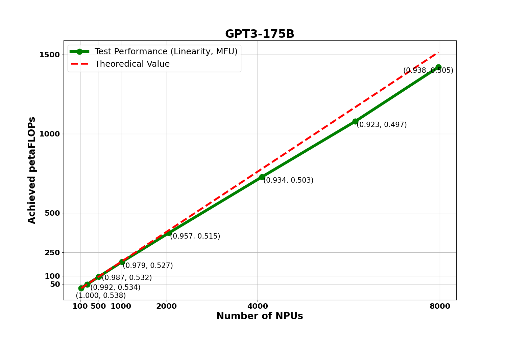

  
  

    <a href="https://gitee.com/ascend/ModelLink/blob/master/LICENSE">
    
    
    

MindSpeed-LLM作为昇腾大模型训练框架，旨在为华为 [昇腾芯片](https://www.hiascend.com/) 提供端到端的大语言模型训练方案, 包含分布式预训练、分布式指令微调、分布式偏好对齐以及对应的开发工具链。

---

## MindSpeed-LLM 大模型训练框架功能特性概览

### 训练方案

* 分布式预训练：预训练方案/并行策略/加速算法/融合算子
* 分布式指令微调：指令微调方案/Prompt模板/动态padding/长序列方案
* 分布式偏好对齐：偏好对齐方案/DPO/奖励模型
* 开发工具链：权重转换/数据处理/分布式推理/分布式评估
* 昇腾工具链：Profiling采集/确定性计算/高可用

### 预置模型

- MindSpeed-LLM [100+ 预置大模型及其权重下载地址](./docs/models/pretrain.md)
- MindSpeed-LLM [使用指南](./docs/USER_GUIDE.md)
- [基于 Megatron-LM + MindSpeed-LLM 训练自定义大模型](./docs/DEVELOP_GUIDE.md) 

### 研发中特性与模型

- O1: <u>https://openai.com/index/learning-to-reason-with-llms/</u>
- COT：[<u>Chain-of-Thought Reasoning without Prompting</u>](https://arxiv.org/pdf/2402.10200)
- GRPO: [DeepSeek Reinforcement Learning](https://arxiv.org/pdf/2405.04434)
- Search: [<u>AlphaZero-Like Tree-Search</u>](https://arxiv.org/pdf/2309.17179)
- PPO: [Proximal Policy Optimization Algorithms](https://arxiv.org/abs/1707.06347)
- PRM: [<u>Reward Modeling as Next-Token Prediction</u>](https://arxiv.org/pdf/2408.15240)
- QLoRA: [<u>Efficient Finetuning of Quantized LLMs</u>](https://arxiv.org/pdf/2305.14314)
- Mamba2: [<u>Transformers are SSMs</u>](https://arxiv.org/pdf/2405.21060)
- Mamba-Hybird: [<u>An Empirical Study of Mamba-based Language Models</u>](https://arxiv.org/pdf/2406.07887)
- DeepSeek-V2: [236B](https://huggingface.co/deepseek-ai/DeepSeek-V2)
- DeepSeek-V2.5: [236B](https://huggingface.co/deepseek-ai/DeepSeek-V2.5)
- QWen2.5: [72B](https://huggingface.co/Qwen/Qwen2.5-72B)
- MiniCPM3: [4B](https://huggingface.co/openbmb/MiniCPM3-4B)
- Yi1.5: [6B](https://huggingface.co/01-ai/Yi-1.5-6B), [9B](https://huggingface.co/01-ai/Yi-1.5-9B), [34B](https://huggingface.co/01-ai/Yi-1.5-34B)
- Phi3.5: [MoE](https://huggingface.co/microsoft/Phi-3.5-MoE-instruct), [Mini](https://huggingface.co/microsoft/Phi-3.5-mini-instruct)

---

##  分布式预训练

【预训练实测集群性能与线性度】

<table>
  <thead>
    <tr>
      <th>模型系列</th>
      <th>实验模型</th>
      <th>硬件信息</th>
      <th>集群规模</th>
      <th>MFU</th>
    </tr>
  </thead>
  <tbody>
    <tr>
      <td rowspan="3">LLAMA2</td>
      <td>LLAMA2-7B</td>
      <td>Atlas 900 A2 PODc</td>
      <td>1x8</td>
      <td><a href="./examples/mcore/llama2/pretrain_llama2_7b_pack_ptd.sh">65.8%</a></td>
    </tr>
    <tr>
      <td>LLAMA2-13B</td>
      <td>Atlas 900 A2 PODc</td>
      <td>1x8</td>
      <td><a href="./examples/mcore/llama2/pretrain_llama2_13b_pack_ptd.sh">57.4%</a></td>
    </tr>
    <tr>
      <td>LLAMA2-70B</td>
      <td>Atlas 900 A2 PODc</td>
      <td>4x8</td>
      <td><a href="./examples/mcore/llama2/pretrain_llama2_70b_pack_ptd.sh">53.9%</a></td>
    </tr>
  </tbody>
</table>

基于 `GPT3-175B` 稠密大模型，从128颗 NPU 扩展到 7968颗 NPU 进行 MFU 与线性度实验，下图是实验数据：

  

图中呈现了对应集群规模下的 `MFU` 值与集群整体的 `线性度`情况. 计算公式已经放到社区，点击链接可进行参考：[MFU计算公式](https://gitee.com/ascend/ModelLink/wikis/%E6%9C%AF%E8%AF%AD%E5%AE%9A%E4%B9%89/%E5%A4%A7%E6%A8%A1%E5%9E%8B%20MFU%20%E8%AE%A1%E7%AE%97%E5%85%AC%E5%BC%8F)，[线性度计算公式](https://gitee.com/ascend/ModelLink/wikis/%E6%9C%AF%E8%AF%AD%E5%AE%9A%E4%B9%89/%E7%BA%BF%E6%80%A7%E5%BA%A6%E5%85%AC%E5%BC%8F).

【并行策略/加速算法/显存优化/融合算子】

<table><thead>
  <tr>
    <th>场景</th>
    <th>特性名称</th>
    <th>Mcore</th>
    <th>Legacy</th>
    <th>贡献方</th>
  </tr></thead>
<tbody>
  <tr>
    <td rowspan="4">SPTD并行</td>
    <td><a href="https://gitee.com/ascend/MindSpeed/blob/master/docs/features/tensor-parallel.md">张量并行</a></td>
    <td>✅</td>
    <td>✅</td>
    <td>【昇腾】</td>
  </tr>
  <tr>
    <td><a href="https://gitee.com/ascend/MindSpeed/blob/master/docs/features/pipeline-parallel.md">流水线并行</a></td>
    <td>✅</td>
    <td>✅</td>
    <td>【昇腾】</td>
  </tr>
  <tr>
    <td><a href="./docs/features/virtual_pipeline_parallel.md">虚拟流水并行</a></td>
    <td>✅</td>
    <td>✅</td>
    <td>【昇腾】</td>
  </tr>
  <tr>
    <td><a href="https://gitee.com/ascend/MindSpeed/blob/master/docs/features/sequence-parallel.md">序列并行</a></td>
    <td>✅</td>
    <td>✅</td>
    <td>【昇腾】</td>
  </tr>
  <tr>
    <td rowspan="3">长序列并行</td>
    <td><a href="https://gitee.com/ascend/MindSpeed/blob/master/docs/features/ring-attention-context-parallel.md">Ascend Ring Attention 长序列并行</a></td>
    <td>✅</td>
    <td>❌</td>
    <td>【昇腾】</td>
  </tr>
  <tr>
    <td><a href="https://gitee.com/ascend/MindSpeed/blob/master/docs/features/ulysses-context-parallel.md">Ulysses 长序列并行</a></td>
    <td>✅</td>
    <td>❌</td>
    <td>【昇腾】</td>
  </tr>
  <tr>
    <td><a href="https://gitee.com/ascend/MindSpeed/blob/master/docs/features/hybrid-context-parallel.md">混合长序列并行</a></td>
    <td>✅</td>
    <td>❌</td>
    <td>【昇腾】</td>
  </tr>
  <tr>
    <td rowspan="2">MOE</td>
    <td><a href="https://github.com/NVIDIA/Megatron-LM/blob/main/megatron/core/transformer/moe/README.md">MOE 专家并行</a></td>
    <td>✅</td>
    <td>❌</td>
    <td>【昇腾】</td>
  </tr>
  <tr>
    <td><a href="https://gitee.com/ascend/MindSpeed/blob/master/docs/features/megatron_moe/megatron-moe-allgather-dispatcher.md">MOE 重排通信优化</a></td>
    <td>✅</td>
    <td>❌</td>
    <td>【计算研究部】</td>
  </tr>
  <tr>
    <td rowspan="4">显存优化</td>
    <td><a href="https://gitee.com/ascend/MindSpeed/blob/master/docs/features/reuse-fp32-param.md">参数副本复用</a></td>
    <td>✅</td>
    <td>✅</td>
    <td>【计算算法部】</td>
  </tr>
    <tr>
    <td><a href="https://gitee.com/ascend/MindSpeed/blob/master/docs/features/distributed-optimizer.md">分布式优化器</a></td>
    <td>✅</td>
    <td>✅</td>
    <td>【昇腾】</td>
  </tr>
  <tr>
    <td><a href="https://gitee.com/ascend/MindSpeed/blob/master/docs/features/swap_attention.md">Swap Attention</a></td>
    <td>✅</td>
    <td>✅</td>
    <td>【计算研究部】</td>
  </tr>
  <tr>
    <td><a href="./docs/features/recompute_relative.md">重计算</a></td>
    <td>✅</td>
    <td>✅</td>
    <td>【计算研究部】</td>
  </tr>
  <tr>
    <td rowspan="5">融合算子</td>
    <td><a href="https://gitee.com/ascend/MindSpeed/blob/master/docs/features/flash-attention.md">Flash attention</a></td>
    <td>✅</td>
    <td>✅</td>
    <td>【昇腾】</td>
  </tr>
  <tr>
    <td><a href="https://gitee.com/ascend/MindSpeed/blob/master/docs/features/rms_norm.md">Fused rmsnorm</a></td>
    <td>✅</td>
    <td>✅</td>
    <td>【昇腾】</td>
  </tr>
  <tr>
    <td><a href="https://gitee.com/ascend/MindSpeed/blob/master/docs/features/swiglu.md">Fused swiglu</a></td>
    <td>✅</td>
    <td>✅</td>
    <td>【昇腾】</td>
  </tr>
  <tr>
    <td><a href="https://gitee.com/ascend/MindSpeed/blob/master/docs/features/rotary-embedding.md">Fused rotary position embedding</a></td>
    <td>✅</td>
    <td>✅</td>
    <td>【昇腾】</td>
  </tr>
  <tr>
    <td><a href="https://gitee.com/ascend/MindSpeed/blob/master/docs/features/megatron_moe/megatron-moe-gmm.md">GMM</a></td>
    <td>✅</td>
    <td>❌</td>
    <td>【昇腾】</td>
  </tr>
  <tr>
    <td rowspan="4">通信掩盖</td>
    <td><a href="https://gitee.com/ascend/MindSpeed/blob/master/docs/features/async-ddp-param-gather.md">梯度reduce通算掩盖</a></td>
    <td>✅</td>
    <td>✅</td>
    <td>【昇腾】</td>
  </tr>
  <tr>
    <td><a href="https://gitee.com/ascend/MindSpeed/blob/master/docs/features/recompute_independent_pipelining.md">Recompute in advance</a></td>
    <td>✅</td>
    <td>❌</td>
    <td>【昇腾】</td>
  </tr>
  <tr>
    <td><a href="https://gitee.com/ascend/MindSpeed/blob/master/docs/features/async-ddp-param-gather.md">权重all-gather通算掩盖</a></td>
    <td>✅</td>
    <td>❌</td>
    <td>【昇腾】</td>
  </tr>
  <tr>
    <td><a href="./docs/features/mc2.md">MC2</a></td>
    <td>✅</td>
    <td>✅</td>
    <td>【昇腾】</td>
  </tr>
</tbody></table>

---

##  分布式指令微调

【指令微调实测性能】

<table>
  <tr>
    <th>模型</th>
    <th>硬件</th>
    <th>集群</th>
    <th>框架</th>
    <th>方案</th>
    <th>序列</th>
    <th>性能</th>
  </tr>
  <tr>
    <td rowspan="7">llama2-7B</td>
    <td rowspan="7">Atlas 900 A2 PODc</td>
    <td rowspan="7">1x8</td>
    <td>MindSpeed-LLM + NPU</td>
    <td>全参</td>
    <td>dynamic</td>
    <th><a href="./examples/mcore/llama2/tune_llama2_7b_full_ptd.sh">45.7 samples/s</a></th>
  </tr>
  <tr>
    <td><a href="https://github.com/hiyouga/LLaMA-Factory/tree/main">DeepSpeed</a> + NPU</td>
    <td>全参</td>
    <td>dynamic</td>
    <td>40.4 samples/s</td>
  </tr>
  <tr>
    <td><a href="https://github.com/hiyouga/LLaMA-Factory/tree/main">DeepSpeed</a> + 参考</td>
    <td>全参</td>
    <td>dynamic</td>
    <td>46.5 samples/s</td>
  </tr>
  <tr>
    <td>MindSpeed-LLM + NPU</td>
    <td>全参</td>
    <td>16K</td>
    <th><a href="./examples/mcore/llama2/tune_llama2_7b_full_pack_16k.sh">1.455 samples/s</a></th>
  </tr>
  <tr>
    <td><a href="https://github.com/hiyouga/LLaMA-Factory/tree/main">DeepSpeed</a> + 参考</td>
    <td>全参</td>
    <td>16K</td>
    <td>1.003 samples/s</td>
  </tr>
  <tr>
    <td>MindSpeed-LLM + NPU</td>
    <td>全参</td>
    <td>32K</td>
    <th><a href="./examples/mcore/llama2/tune_llama2_7b_full_pack_32k.sh">0.727 samples/s</a></th>
  </tr>
  <tr>
    <td><a href="https://github.com/hiyouga/LLaMA-Factory/tree/main">DeepSpeed</a> + 参考</td>
    <td>全参</td>
    <td>32K</td>
    <td>0.4 samples/s</td>
  </tr>
  <tr>
    <td rowspan="3">llama2-13B</td>
    <td rowspan="3">Atlas 900 A2 PODc</td>
    <td rowspan="3">1x8</td>
    <td>MindSpeed-LLM + NPU</td>
    <td>全参</td>
    <td>dynamic</td>
    <th><a href="./examples/mcore/llama2/tune_llama2_13b_full_ptd.sh">28.4 samples/s</a></th>
  </tr>
    <tr>
    <td><a href="https://github.com/hiyouga/LLaMA-Factory/tree/main">DeepSpeed</a> + NPU</td>
    <td>全参</td>
    <td>dynamic</td>
    <td>17.8 samples/s</td>
  </tr>
  <tr>
    <td><a href="https://github.com/hiyouga/LLaMA-Factory/tree/main">DeepSpeed</a> + 参考</td>
    <td>全参</td>
    <td>dynamic</td>
    <td>24.9 samples/s</td>
  </tr>
  <tr>
    <td rowspan="2">llama2-70B</td>
    <td rowspan="2">Atlas 900 A2 PODc</td>
    <td rowspan="2">1x8</td>
    <td>MindSpeed-LLM + NPU</td>
    <td>LoRA</td>
    <td>dynamic</td>
    <th><a href="./examples/legacy/llama2/tune_llama2_70b_lora_ptd.sh">11.72 samples/s</a></th>
  </tr>
  <tr>
    <td><a href="https://github.com/hiyouga/LLaMA-Factory/tree/main">DeepSpeed</a> + 参考</td>
    <td>LoRA</td>
    <td>dynamic</td>
    <td>3.489 samples/s</td>
  </tr>
</table>

【指令微调特性】

<table><thead>
  <tr>
    <th>场景</th>
    <th>特性名称</th>
    <th>Mcore</th>
    <th>Legacy</th>
    <th>贡献方</th>
  </tr></thead>
<tbody>
  <tr>
    <td rowspan="2">微调数据集支持格式</td>
    <td><a href="./docs/features/alpaca_dataset.md">Alpaca 风格</a></td>
    <td>✅</td>
    <td>✅</td>
    <td>【昇腾】</td>
  </tr>
  <tr>
    <td><a href="./docs/features/sharegpt_dataset.md">ShareGPT 风格</a></td>
    <td>✅</td>
    <td>✅</td>
    <td>【昇腾】</td>
  </tr>
  <tr>
    <td rowspan="4">全参微调</td>
    <td><a href="./docs/features/instruction_finetune.md">单样本微调</td>
    <td>✅</td>
    <td>✅</td>
    <td>【昇腾】</td>
  </tr>
  <tr>
    <td><a href="./docs/features/multi-sample_pack_fine-tuning.md">多样本 pack</td>
    <td>✅</td>
    <td>✅</td>
    <td>【NAIE】</td>
  </tr>
    <tr>
    <td>多轮对话</td>
    <td>✅</td>
    <td>✅</td>
    <td>【昇腾】</td>
  </tr>
  <tr>
    <td>长序列方案</td>
    <td>✅</td>
    <td>✅</td>
    <td>【NAIE】</td>
  </tr>
  <tr>
    <td rowspan="2">低参微调</td>
    <td><a href="./docs/features/lora_finetune.md">LoRA 微调</a></td>
    <td>✅</td>
    <td>✅</td>
    <td>【NAIE】</td>
  </tr>
  <tr>
    <td><a href="./docs/features/cc_lora.md">CCLoRA</a></td>
    <td>✅</td>
    <td>✅</td>
    <td>【计算算法部】</td>
  </tr>
</tbody></table>

---

##  分布式偏好对齐

【偏好对齐特性】

<table><thead>
  <tr>
    <th>场景</th>
    <th>特性名称</th>
    <th>Mcore</th>
    <th>Legacy</th>
    <th>贡献方</th>
  </tr></thead>
<tbody>
  <tr>
    <td>偏好对齐</td>
    <td>Offline DPO</td>
    <td>✅</td>
    <td>❌</td>
    <td>【NAIE】</td>
  </tr>
  <tr>
    <td>奖励模型</td>
    <td>ORM</td>
    <td>✅</td>
    <td>❌</td>
    <td>【昇腾】</td>
  </tr>
</tbody></table>

---

## 开发工具链

<table>
  <thead>
    <tr>
      <th>场景</th>
      <th>特性</th>
      <th>Mcore</th>
      <th>Legacy</th>
      <th>贡献方</th>
    </tr>
  </thead>
  <tbody>
    <tr>
      <td>权重转换</td>
      <td><a href="./docs/models/checkpoint.md">Huggingface 与 Megatron 互转</a></td>
      <td>✅</td>
      <td>✅</td>
      <td>【昇腾】</td>
    </tr>
    <tr>
      <td rowspan="3">数据处理</td>
      <td><a href="./docs/features/pretrain_dataset.md">预训练数据处理</a></td>
      <td>✅</td>
      <td>✅</td>
      <td>【昇腾】</td>
    </tr>
    <tr>
      <td><a href="./docs/features/alpaca_dataset.md">Alpaca风格指令微调数据处理</a></td>
      <td>✅</td>
      <td>✅</td>
      <td>【昇腾】</td>
    </tr>
    <tr>
      <td><a href="./docs/features/sharegpt_dataset.md">ShareGPT风格指令微调数据处理</a></td>
      <td>✅</td>
      <td>✅</td>
      <td>【昇腾】</td>
    </tr>  
    <tr>
      <td rowspan="2">分布式推理</td>
      <td>流式推理</td>
      <td>✅</td>
      <td>✅</td>
      <td>【NAIE】</td>
    </tr>
    <tr>
      <td>微调后 Chat 对话</td>
      <td>✅</th>
      <td>✅</th>
      <td>【NAIE】</td>
    </tr>
    <tr>
      <td>分布式评估</td>
      <td><a href="./docs/models/evaluation.md">开源测评集评测</a></td>
      <td>✅</td>
      <td>✅</td>
      <td>【NAIE】</td>
    </tr>
  </tbody>
</table>

---

## 昇腾工具链

<table>
  <thead>
    <tr>
      <th>场景</th>
      <th>特性</th>
      <th>Mcore</th>
      <th>Legacy</th>
      <th>贡献方</th>
    </tr>
  </thead>
  <tbody>
    <tr>
      <td>性能采集分析</td>
      <td><a href="./docs/features/profiling.md">基于昇腾芯片采集 profiling 数据</a></td>
      <td>✅</td>
      <td>✅</td>
      <td>【昇腾】</td>
    </tr>
    <tr>
      <td rowspan="2">高可用性</td>
      <td><a href="./docs/features/deterministic_computation.md">基于昇腾芯片开启确定性计算</a></td>
      <td>✅</td>
      <td>✅</td>
      <td>【昇腾】</td>
    </tr>
    <tr>
      <td><a href="./docs/features/high_availability.md">基于昇腾芯片开启临终 ckpt 保存</a></td>
      <td>✅</td>
      <td>✅</td>
      <td>【计算研究部】</td>
    </tr>
  </tbody>
</table>

---

## 版本配套与维护策略

<table border="0">
  <tr>
    <th>依赖软件</th>
    <th>版本</th>
    <th>软件安装指南</th>
    <th>推荐硬件形态</th>
  </tr>
  <tr>
    <td>昇腾NPU驱动</td>
    <td rowspan="2">Ascend HDK 24.1.RC4</td>
    <td rowspan="2">《<a href="https://www.hiascend.com/document/detail/zh/canncommercial/80RC2/softwareinst/instg/instg_0003.html?Mode=PmIns&OS=Ubuntu&Software=cannToolKit">驱动固件安装指南</a>》</td>
    <td rowspan="8">Atlas 900 A2 PODc</td>
  </tr>
  <tr>
    <td>昇腾NPU固件</td>
  </tr>
  <tr>
    <td>Toolkit（开发套件）</td>
    <td rowspan="2">CANN 8.0.RC4</td>
    <td rowspan="2">《<a href="https://www.hiascend.com/document/detail/zh/canncommercial/80RC2/softwareinst/instg/instg_0000.html">CANN 软件安装指南</a>》</td>
  </tr>
  <tr>
    <td>Kernel（算子包）</td>
  </tr>
  <tr>
  </tr>
  <tr>
    <td>PyTorch</td>
    <td rowspan="3">2.1.0 PTA 6.0.RC4</td>
    <td rowspan="3">《<a href="https://www.hiascend.com/document/detail/zh/Pytorch/60RC2/configandinstg/instg/insg_0001.html">Ascend Extension for PyTorch 配置与安装</a>》</td>
  </tr>
  <tr>
    <td>torch_npu插件</td>
  </tr>
  <tr>
    <td>apex</td>
  </tr>
</table>

MindSpeed-LLM版本有以下五个维护阶段：

| **状态**            | **时间** | **说明**                                                               |
| ------------------- | -------- |----------------------------------------------------------------------|
| 计划                | 1—3 个月 | 计划特性                                                                 |
| 开发                | 3 个月   | 开发特性                                                                 |
| 维护                | 6-12 个月| 合入所有已解决的问题并发布版本，针对不同的MindSpeed-LLM版本采取不同的维护策略，常规版本和长期支持版本维护周期分别为6个月和12个月 |
| 无维护              | 0—3 个月 | 合入所有已解决的问题，无专职维护人员，无版本发布                                             |
| 生命周期终止（EOL） | N/A      | 分支不再接受任何修改                                                           |

MindSpeed-LLM已发布版本维护策略：

| **MindSpeed-LLM版本** | **维护策略** | **当前状态** | **发布时间**   | **后续状态**         | **EOL日期** |
|-----------------|-----------|--------|------------|-----------------------|-----------|
| 1.0.RC4             |  常规版本  | 维护   | 2024/12/30 | 预计2025/06/30起无维护 |           |
| 1.0.RC3             |  常规版本  | 维护   | 2024/09/30 | 预计2025/03/30起无维护 |           |
| 1.0.RC2             |  常规版本  | EOL   | 2024/06/30 | 生命周期终止 |  2024/12/30 |
| 1.0.RC1             |  常规版本  | EOL   | 2024/03/30 | 生命周期终止     | 2024/9/30|
| bk_origin_23    |  Demo     | EOL    | 2023       | 生命周期终止     | 2024/6/30 |

---

## 致谢

MindSpeed-LLM由华为公司的下列部门联合贡献 ：
- 昇腾计算产品部
- 计算算法部
- 计算研究部
- 公共开发部：NAIE
- 全球技术服务部：GTS
- 华为云计算
- 昇腾计算生态使能部

感谢来自社区的每一个PR，欢迎贡献 MindSpeed-LLM

---

## 安全声明

[MindSpeed-LLM安全声明](https://gitee.com/ascend/ModelLink/wikis/%E5%AE%89%E5%85%A8%E7%9B%B8%E5%85%B3/%E5%AE%89%E5%85%A8%E5%A3%B0%E6%98%8E)
