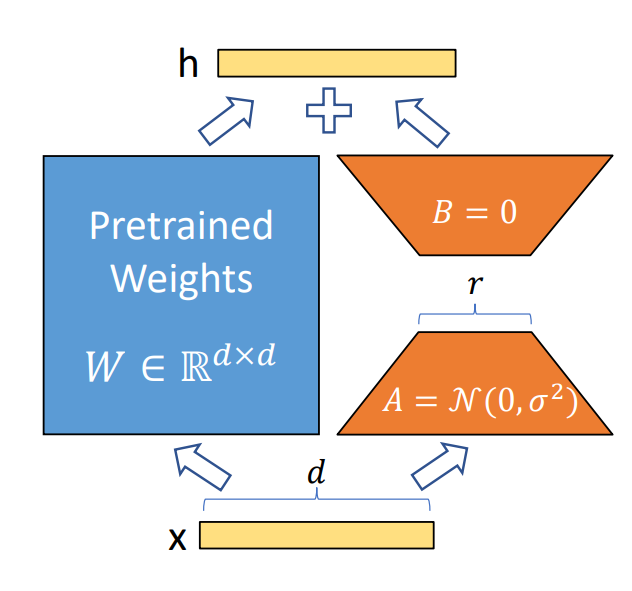
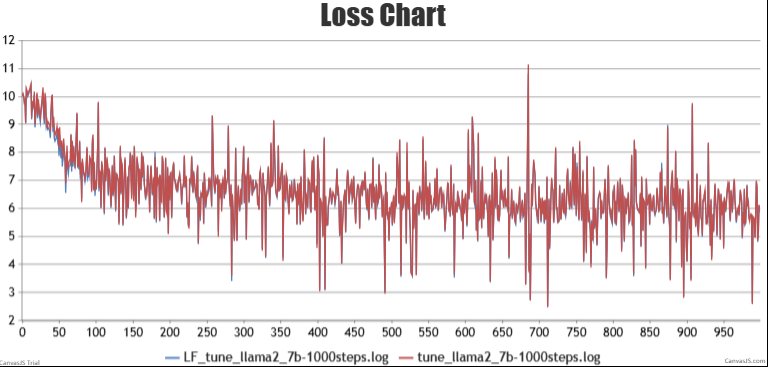

# LoRA 微调简介

LoRA（Low-Rank Adaptation）是一种高效的模型微调方法，广泛应用于预训练的深度学习模型。通过在权重上添加低秩矩阵，LoRA 使得微调过程更为轻量，节省计算资源和存储空间。

## LoRA 的原理

LoRA 的核心思想是将模型的参数更新分解为低秩的形式。具体步骤如下：

- **分解权重更新**：在传统的微调方法中，直接对模型的权重进行更新。而 LoRA 通过在每一层的权重矩阵中引入两个低秩矩阵 $A$ 和 $B$ 进行替代。即：
$
W' = W + A \cdot B
$



   其中，$W'$ 是更新后的权重，$W$ 是原始权重，$A$ 和 $B$ 是需要学习的低秩矩阵。

- **降低参数量**：由于 $A$ 和 $B$ 的秩较低，所需的参数量显著减少，节省了存储和计算成本。

## ModelLink 与 DeepSpeed 对比

- **ModelLink  与 <a href="https://github.com/hiyouga/LLaMA-Factory/tree/main">DeepSpeed</a> loss 对比图**：



| 问题         | DeepSpeed 回答                 | ModelLink   回答            |
|--------------|-------------------------------|-----------------------------|
| User:你是谁        | Assistant:  I am John.           | ModelLink: 我是叶凯。    |
| User:你可以说中文吗     | Assistant:可以说中文.                   | ModelLink: 可以。         |
| User:能推荐几本自然语言处理的书吗?         | Assistant:自然语言处理的书有很多,我可以推荐几本优秀的书:<br>《自然语言处理导论》、《深度学习与自然语言处理》、《自然语言处理概论》、《自然语言处理实战》等。               | ModelLink: 可以推荐的自然语言处理的书有《自然语言处理入门》、《深度学习:自然语言处理和计算机视觉》、《自然语言处理评估》、《统计自然语言处理》等。 |
| User:上面几本书的阅读顺序是什么呢? | Assistant:上面几本书的阅读顺序是<br>《自然语言处理导论》、《深度学习与自然语言处理》、《自然语言处理概论》、《自然语言处理实战》。 | ModelLink: 建议先阅读《自然语言处理入门》、《自然语言处理评估》、《统计自然语言处理》,然后再阅读《深度学习:自然语言处理和计算机视觉》。     |
| User:9.11和09.9哪个比较大  | Assistant: 9.11比9.9大。             | ModelLink: 9.11 |

### 数据预处理示例

ModelLink 数据预处理脚本命名和启动方法：

```shell
# Legacy 模型
bash examples/legacy/llama2/data_convert_llama2_instruction.sh

# Mcore 模型
bash examples/mcore/llama2/data_convert_llama2_instruction.sh
```

在数据预处理时，若 `output-prefix` 为 `./finetune_dataset/llama-2-7b/alpaca`，则使用以下命令：

```shell
python ./preprocess_data.py \
    --input ./dataset/train-00000-of-00001-a09b74b3ef9c3b56.parquet \
    --tokenizer-name-or-path ./model_from_hf/llama-2-7b-hf \
    --output-prefix ./finetune_dataset/llama-2-7b/alpaca \
    --workers 16 \
    --log-interval 1000 \
    --tokenizer-type PretrainedFromHF \
    --handler-name AlpacaStyleInstructionHandler \
    --prompt-type llama2
```

在指令微调时，`DATA_PATH` 也应保持一致：

```shell
DATA_PATH="./finetune_dataset/llama-2-7b/alpaca"  # 数据集路径
```

- **`--prompt-type`**  
  指定模型模板，使 base 模型在微调后具备更好的对话能力。

- **`--variable-seq-lengths`**  
  支持动态序列长度微调，默认按 8 的倍数进行 padding，可以通过 `--pad-to-multiple-of` 参数修改 padding 的倍数。

### LoRA 微调

ModelLink LoRA微调脚本命名和启动方法：

```shell
# Legacy 模型
bash examples/legacy/llama2/tune_llama2_7b_lora_ptd.sh

# Mcore 模型
bash examples/mcore/llama2/tune_llama2_7b_lora_ptd.sh
```
#### 参数说明
- **`--load`**  
  若不指定该参数加载权重，模型会随机初始化权重。

- **`--lora-r`**  
  LoRA rank，表示低秩矩阵的维度。较低的 rank 值模型在训练时会使用更少的参数更新，从而减少计算量和内存消耗。然而，过低的 rank 可能限制模型的表达能力。

- **`--lora-alpha`**  
  控制 LoRA 权重对原始权重的影响比例, 数值越高则影响越大。一般保持 `α/r` 为 2。

- **`--lora-fusion`**  
  是否启用<td><a href="./docs/features/cc_lora.md">CCLoRA</a></td>算法，该算法通过计算通信掩盖提高性能。

- **`--lora-target-modules`**  
  选择需要添加 LoRA 的模块。  
  *mcore 模型可选模块：* `linear_qkv`, `linear_proj`, `linear_fc1`, `linear_fc2`  
  *legacy 模型可选模块：* `query_key_value`, `dense`, `dense_h_to_4h`, `dense_4h_to_h`

- **`--lora-load`**  
  加载 LoRA 权重断点继续训练或用于推理。在推理时需与 `--load` 参数配合使用，加载 `CKPT_SAVE_DIR` 路径下的 LoRA 权重。

### Lora 权重与 Base 权重合并与转换

在权重转换命令中，添加以下参数即可将训练好的 Lora 权重与 Base 权重融合,合并后转换为 Megatron-Legacy 权重.：

```bash
--lora-load ${CHECKPOINT_LORA}  \
--lora-r 16 \
--lora-alpha 32 \
--lora-target-modules query_key_value dense dense_h_to_4h dense_4h_to_h \
```

以下是将合并后的权重转换为 Megatron-Legacy 格式的示例命令：

```shell
# 请确保您已配置好环境变量
source /usr/local/Ascend/ascend-toolkit/set_env.sh

python convert_ckpt.py \
    --model-type GPT \
    --load-model-type mg \
    --save-model-type mg \
    --load-dir ./model_weights/llama-2-7b-legacy/ \
    --lora-load ./ckpt/llama-2-7b-lora \
    --lora-r 16 \
    --lora-alpha 32 \
    --lora-target-modules query_key_value dense dense_h_to_4h dense_4h_to_h \
    --target-tensor-parallel-size 1 \
    --target-pipeline-parallel-size 1 \
    --save-dir ./model_weights/llama-2-7b-lora2legacy
```

以下是启动转换脚本的示例：

```shell
# 以 legacy 下的模型为例
bash examples/legacy/llama2/ckpt_convert_llama2_legacy2legacy_lora.sh
```

#### 合并后转换为 Hugging Face 权重

若希望将合并后的权重转换为 Hugging Face（HF）格式，可以使用以下命令：

```shell
# 请确保您已配置好环境变量
source /usr/local/Ascend/ascend-toolkit/set_env.sh

python convert_ckpt.py \
    --model-type GPT \
    --load-model-type mg \
    --save-model-type hf \
    --load-dir ./model_weights/llama-2-7b-legacy/ \
    --lora-load ./ckpt/llama-2-7b-lora \
    --lora-r 16 \
    --lora-alpha 32 \
    --lora-target-modules query_key_value dense dense_h_to_4h dense_4h_to_h \
    --target-tensor-parallel-size 1 \
    --target-pipeline-parallel-size 1 \
    --save-dir ./model_from_hf/llama-2-7b-hf/    # 填写原始 HF 模型路径，新权重将存储于 ./model_from_hf/llama-2-7b-hf/mg2hg/
```

以下是启动转换脚本的示例：

```shell
# 以 legacy 下的模型为例
bash examples/legacy/llama2/ckpt_convert_llama2_legacy2hf_lora.sh
```

**注意：** `lora` 参数的值应与微调时的参数设置保持一致，以确保转换后的模型具有相同的性能表现和兼容性。

### LoRA 推理

ModelLink 推理脚本命名和启动方法：

```shell
# Legacy 模型
bash examples/legacy/llama2/generate_llama2_7b_lora_ptd.sh

# Mcore 模型
bash examples/mcore/llama2/generate_llama2_7b_lora_ptd.sh
```

启动前需根据实际情况修改启动脚本中的模型权重路径和分词器路径：

```shell
CHECKPOINT="./model_weights/llama-2-7b-mcore"
CHECKPOINT_LORA="./ckpt/llama-2-7b-lora/"
TOKENIZER_PATH="./model_from_hf/llama-2-hf/"

# 启动任务
bash examples/mcore/llama2/generate_llama2_7b_lora_ptd.sh
```

### LoRA 微调权重评估

使用 LoRA 微调权重的专用评估脚本：

```shell
bash examples/legacy/llama2/evaluate_llama2_7B_lora_mmlu_ptd.sh
```

#### 评估参数说明

- **`--prompt-type`**：模型对话模板，确保评估输入结构匹配模型需求。
- **`--hf-chat-template`**：若模型具备内置 `chat_template` 属性，可添加该参数，使用内置模板。
- **`--eval-language`**：指定数据集语言，默认 `en`（英文），中文数据集应设置为 `zh`。

### 注意事项

- **对话模板选择**：根据模型和数据需求选择合适模板，确保微调和评估一致性。
- **语言匹配**：设定数据集语言以优化评估效果。
- **内置模板使用**：启用 `--hf-chat-template` 时简化输入格式，确保评估的准确性。
## 参考文献

- [LoRA: Low-Rank Adaptation of Large Language Models](https://arxiv.org/abs/2106.09685)