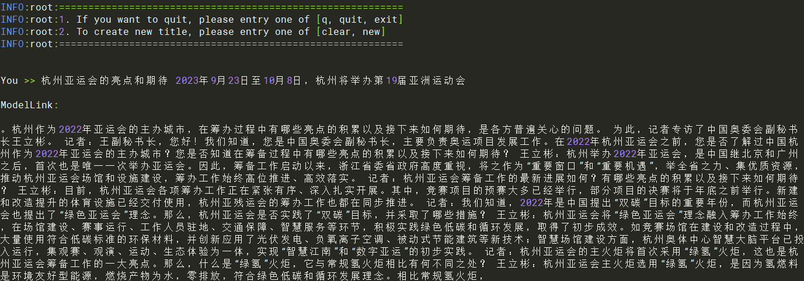

# Aquila2  $\color{black}{\rm\tiny{【Model}}$ $\color{black}{\rm\tiny{contributed}}$ $\color{black}{\rm\tiny{by}}$ $\color{black}{\rm\tiny{Community】}}$ 

<p align="left">
        <b><a href="README.md">简体中文</a></b> |
        <b>English</b> 
    </p>
</p>

- [Aquila2-7B](#7b)
  - [Training](#7b-training)
    - [Script](#7b-script)
    - [Performance](#7b-performance)
      - [Machine performance](#7b-throughput)
  - [Inference](#7b-inference)
  - [Evaluation](#7b-evaluation)

- [Aquila2-34B](#34b)
  - [Training](#34b-training)
    - [Script](#34b-script)
    - [Performance](#34b-performance)
      - [Machine performance](#34b-throughput)
  - [Inference](#34b-inference)
  - [Evaluation](#34b-evaluation)

<h1 id="7b">Aquila2-7B</h1>
<h2 id="7b-training">Training</h2>

Here's a hardware summary of pre-training Aquila2-7B:

| Hardware |                      Value                      |
| :------: | :---------------------------------------------: |
|   NPU    |               8 x Ascend NPUs                   |

<h3 id="7b-script">Script</h3>

1. Clone the repository to your local server and switch to modellink branch:

    ```shell
    git clone https://gitee.com/ascend/ModelLink.git
    git clone https://github.com/NVIDIA/Megatron-LM.git
    cd Megatron-LM
    git checkout -f bcce6f
    cp -r megatron ../ModelLink/
    cd ..
    cd ModelLink
    mkdir logs
    mkdir model_from_hf
    mkdir dataset
    mkdir ckpt
    ```

2. Build conda environment

    ```bash
    # python3.8
    conda create -n test python=3.8
    conda activate test

    # install torch, torch_npu and apex
    pip install torch-2.2.0-cp38-cp38-manylinux_2_17_aarch64.manylinux2014_aarch64.whl
    pip install torch_npu-2.2.0*-cp38-cp38-linux_aarch64.whl
    pip install apex-0.1_ascend*-cp38-cp38-linux_aarch64.whl

    # source the set_env.sh file based on your host settings(you may need to change the path)
    source /usr/local/Ascend/ascend-toolkit/set_env.sh
    
    # use git to clone the AscendSpeed source code, enter the directory, then install ascendspeed package by source code
    git clone https://gitee.com/ascend/AscendSpeed.git
    cd AscendSpeed/
    git checkout 224ae35e8fc96778f957029d1371ddb623452a50
    pip install -r requirements.txt
    pip install -e .
    cd ..

    # install other packages
    pip install -r requirements.txt
    ```

3. Download the Aquila2-7B model, config, and tokenizer from [here](https://huggingface.co/BAAI/Aquila2-7B/tree/main)

    save to ModelLink/model_from_hf/Aquila2-7B/ directory.

4. Weights convert

    HuggingFace weights --> Megatron weights
    ***(This scenario is generally used to train open-source HuggingFace models on Megatron)***

    ```shell
    # please modify the path to set_env.sh based on your environment.
    source /usr/local/Ascend/ascend-toolkit/set_env.sh
    python tools/checkpoint/convert_ckpt.py \
        --model-type GPT \
        --load-dir ./model_from_hf/Aquila2-7B/ \
        --save-dir ./model_weights/Aquila2-7B-v0.1-tp8-pp1/ \
        --loader llama2_hf \
        --saver megatron \
        --target-tensor-parallel-size 8 \
        --target-pipeline-parallel-size 1 \
        --tokenizer-model ./model_from_hf/Aquila2-7B/tokenizer.json
    ```

    Any Megatron weights with parallel slicing strategy --> Any Megatron weights with parallel slicing strategy
    ***(This scenario is generally used to convert the trained megatron model back to the HuggingFace format)***

    ```shell
    # Modify the ascend-toolkit path
    source /usr/local/Ascend/ascend-toolkit/set_env.sh
    python tools/checkpoint/convert_ckpt.py --model-type GPT \
        --loader megatron \
        --saver megatron \
        --save-model-type save_huggingface_llama \
        --load-dir ./model_weights/Aquila2-7B-v0.1-tp8-pp1/ \
        --target-tensor-parallel-size 1 \
        --target-pipeline-parallel-size 1 \
        --save-dir ./model_from_hf/Aquila2-7B/   # <-- Fill in the original HF model path here, new weights will be saved in ./model_from_hf/Aquila2-7B/mg2hg/
    ```

    Weight conversion is suitable for pre-training, fine-tuning, inference and evaluation. Adjust the parameters `target-tensor-parallel-size` and `target-pipeline-parallel-size` according to different tasks.


5. Pre-training
   
    5.1 Prepare dataset

    Download the Aquila2-7B datasets from [here](https://huggingface.co/datasets/tatsu-lab/alpaca/resolve/main/data/train-00000-of-00001-a09b74b3ef9c3b56.parquet) 

    ```shell
    # download datasets
    cd ./dataset
    wget https://huggingface.co/datasets/tatsu-lab/alpaca/resolve/main/data/train-00000-of-00001-a09b74b3ef9c3b56.parquet
    cd ..

    # process datasets          
    mkdir ./dataset/Aquila2-7B/
    python ./tools/preprocess_data.py \
        --input ./dataset/train-00000-of-00001-a09b74b3ef9c3b56.parquet \
        --tokenizer-name-or-path ./model_from_hf/Aquila2-7B/ \
        --output-prefix ./dataset/Aquila2-7B/alpaca \
        --workers 4 \
        --log-interval 1000 \
        --tokenizer-type PretrainedFromHF
    ```

    5.2 Pre-training
    
    Config Aquila2-7B pre-training script : examples/codellama/pretrain_aquila2_7b_ptd.sh

    ```shell
    # modify the script according to your own  ascend-toolkit path
    source /usr/local/Ascend/ascend-toolkit/set_env.sh 

    CKPT_SAVE_DIR="./ckpt/Aquila2-7B/"
    DATA_PATH="./dataset/Aquila2-7B/alpaca_text_document"
    TOKENIZER_MODEL="./model_from_hf/Aquila2-7B/tokenizer.model"
    CKPT_LOAD_DIR="./model_weights/Aquila2-7B-v0.1-tp8-pp1/"
    ```
    
    - *If you do not load weights for pre-training, you can ignore CKPT_LOAD_DIR, and remove the `--load` parameter from the training script, and vice versa*
    - *If you do not want to save weights during pre-training, you can ignore CKPT_SAVE_DIR, and remove the `--save` parameter from the training script, and vice versa*
    - *When you want to save checkpoint and load it in future pre-training, just follow the above "save" and "load" suggestions.*

    Launch Aquila2-7B  pre-training script: examples/aquila2/pretrain_aquila2_7b_ptd.sh

    ```shell
    bash examples/aquila2/pretrain_aquila2_7b_ptd.sh 
    ```
    **Note**: If using multi machine training, it is necessary to set up multi machine data sharing, and non primary nodes can read the primary node data through data sharing. Alternatively, directly copy the data generated by the master node to non master nodes.

6. Fine-tuning

    6.1 Prepare fine-tuning dataset

    Download the fine-tuning datasets from [here](https://huggingface.co/datasets/tatsu-lab/alpaca/resolve/main/data/train-00000-of-00001-a09b74b3ef9c3b56.parquet)

    ```shell
    # download datasets
    mkdir finetune_dataset
    cd ./finetune_dataset
    wget https://huggingface.co/datasets/tatsu-lab/alpaca/resolve/main/data/train-00000-of-00001-a09b74b3ef9c3b56.parquet
    cd ..

    # process datasets  
    mkdir ./finetune_dataset/Aquila2-7B/
    python ./tools/preprocess_data.py \
        --input ./finetune_dataset/train-00000-of-00001-a09b74b3ef9c3b56.parquet \
        --tokenizer-name-or-path ./model_from_hf/Aquila2-7B/ \
        --output-prefix ./finetune_dataset/Aquila2-7B/alpaca \
        --workers 4 \
        --log-interval 1000 \
        --tokenizer-type PretrainedFromHF \
        --handler-name GeneralInstructionHandler \
        --append-eod
    ```

    6.2 Full Parameters Fine-Tuning

    The configuration script for full parameters fine-tuning  is basically the same as that for `pretrain_aquila2_7b_ptd.sh`.*The difference is that the dataset and the training parameter `--is-instruction-dataset` are added.*

    Add the fine-tuning parameter `--finetune` so that fine-tuning starts from the first step.

    ```bash
    DATA_PATH="./finetune_dataset/Aquila2-7B/alpaca"
    CKPT_LOAD_DIR="./ckpt/Aquila2-7B/"
        --load ${CKPT_LOAD_DIR} \
        --finetune \
        --is-instruction-dataset \
        --tokenizer-not-use-fast \
    ```

<h3 id="7b-performance">Performance</h3>

<h4 id="7b-throughput">Machine performance</h4>

The performance of Aquila2-7B in Ascend NPU and reference device:

| Device    | Model      | Iterations | throughput rate (tokens/p/s) | single iteration step time (s/step) |
| --------- | ---------- | ---------- | ---------------------------- | ----------------------------------- |
| NPU       | Aquila2-7B | 5000       | 3323                         | 4.93                                |
| Reference | Aquila2-7B | 5000       | 2673                         | 6.13                                |

<h2 id="7b-inference">Inference</h2>

We support AscendSpeed Inference for text generation with Aquila 7B model.

Inference is different from pre-training because it requires loading the pre-trained model weights. Therefore, we need to complete the aforementioned model weight conversion task first, then configure the Aquila2-7B Inference shell script `examples/aquila2/generate_aquila2_7b_ptd.sh`. "CKPT_LOAD_DIR" must point to the converted weights directory, and "TOKENIZER_PATH" must point to the directory which contains Aquila vocabulary files -- in our example, it is "./model_from_hf/Aquila2-7B/". In your operation, please fill in correct value based on your actual scenario.

```shell
# please change to actual values
CKPT_LOAD_DIR="./model_weights/Aquila2-7B-v0.1-tp8-pp1/"
TOKENIZER_PATH="./model_from_hf/Aquila2-7B/"
```

Start Aquila2-7B Inference:

```shell
bash ./examples/aquila2/generate_aquila2_7b_ptd.sh
```

Sample results of Aquila2-7B Inference:



<h2 id="7b-evaluation">Evaluation</h2>

We use BoolQ benchmark to evaluate our model. You can [go to the BoolQ Benchmark page](https://github.com/google-research-datasets/boolean-questions) and find the [dataset](https://storage.cloud.google.com/boolq/dev.jsonl), download it and save it. For example, save to "ModelLink/boolq/test" directory

Evaluation task is similar to inference task too，it also requires loading the pre-trained model weights. Please note that the model structure parameters used in converting weights should be consistent with those used in running the evaluation task.

After weight conversion is complete, we configure the Aquila2-7B evaluation script `examples/aquila2/evaluate_aquila2_7b_ptd.sh`. We need to correctly specify the path to load weights, the path to tokenizer and vocab, and so on (the following example is for reference only)

```shell
CKPT_LOAD_DIR="./model_weights/Aquila2-7B-v0.1-tp8-pp1/"
TOKENIZER_PATH="./model_from_hf/Aquila2-7B/"
EVAL_DATA_PATH="./boolq/test"
TASK="boolq"
```

Start evaluation task

```shell
bash ./examples/aquila2/evaluate_aquila2_7b_ptd.sh
```

Sample Aquila2-7B performance running in **Ascend NPU**:

| Task                                                                   | Model     | NPU   | Benchmark |
| ---------------------------------------------------------------------- | --------- | ----- | --------- |
| [BoolQ](https://github.com/google-research-datasets/boolean-questions) | Aquila2-7B | 77.8% |  77.6%   |

<h1 id="34b">Aquila2-34B</h1>
<h2 id="34b-training">Training</h2>

Here's a hardware summary of pre-training Aquila2-34B:

| Hardware |                      Value                      |
| :------: | :---------------------------------------------: |
|   NPU    |               16 x Ascend NPUs                   |

<h3 id="34b-script">Script</h3>

1. Clone the repository to your local server and switch to modellink branch:

    ```shell
    git clone https://gitee.com/ascend/ModelLink.git
    git clone https://github.com/NVIDIA/Megatron-LM.git
    cd Megatron-LM
    git checkout -f bcce6f
    cp -r megatron ../ModelLink/
    cd ..
    cd ModelLink
    mkdir logs
    mkdir model_from_hf
    mkdir dataset
    mkdir ckpt
    ```

2. Build conda environment

    ```bash
    # python3.8
    conda create -n test python=3.8
    conda activate test

    # install torch, torch_npu and apex
    pip install torch-2.2.0-cp38-cp38-manylinux_2_17_aarch64.manylinux2014_aarch64.whl
    pip install torch_npu-2.2.0*-cp38-cp38-linux_aarch64.whl
    pip install apex-0.1_ascend*-cp38-cp38-linux_aarch64.whl

    # source the set_env.sh file based on your host settings(you may need to change the path)
    source /usr/local/Ascend/ascend-toolkit/set_env.sh
    
    # use git to clone the AscendSpeed source code, enter the directory, then install ascendspeed package by source code
    git clone https://gitee.com/ascend/AscendSpeed.git
    cd AscendSpeed/
    git checkout 224ae35e8fc96778f957029d1371ddb623452a50
    pip install -r requirements.txt
    pip install -e .
    cd ..

    # install other packages
    pip install -r requirements.txt
    ```

3. Download the Aquila2-34B model, config, and tokenizer from [here](https://huggingface.co/BAAI/Aquila2-34B/tree/main)

    save to ModelLink/model_from_hf/Aquila2-34B/ directory.

4. Weights convert

    HuggingFace weights --> Megatron weights
    ***(This scenario is generally used to train open-source HuggingFace models on Megatron)***

    ```shell
    # please modify the path to set_env.sh based on your environment.
    source /usr/local/Ascend/ascend-toolkit/set_env.sh
    python tools/checkpoint/convert_ckpt.py \
        --model-type GPT \
        --load-dir ./model_from_hf/Aquila2-34B/ \
        --save-dir ./model_weights/Aquila2-34B-v0.1-tp8-pp2/ \
        --loader llama2_hf \
        --saver megatron \
        --target-tensor-parallel-size 8 \
        --target-pipeline-parallel-size 2 \
        --tokenizer-model ./model_from_hf/Aquila2-34B/tokenizer.json \
        --params-dtype bf16
    ```

    Any Megatron weights with parallel slicing strategy --> Any Megatron weights with parallel slicing strategy
    ***(This scenario is generally used to convert the trained megatron model back to the HuggingFace format)***

    ```shell
    # Modify the ascend-toolkit path
    source /usr/local/Ascend/ascend-toolkit/set_env.sh
    python tools/checkpoint/convert_ckpt.py --model-type GPT \
        --loader megatron \
        --saver megatron \
        --save-model-type save_huggingface_llama \
        --load-dir ./model_weights/Aquila2-34B-v0.1-tp8-pp2/ \
        --target-tensor-parallel-size 1 \
        --target-pipeline-parallel-size 1 \
        --save-dir ./model_from_hf/Aquila2-34B/   # <-- Fill in the original HF model path here, new weights will be saved in ./model_from_hf/Aquila2-34B/mg2hg/
    ```

    Weight conversion is suitable for pre-training, fine-tuning, inference and evaluation. Adjust the parameters `target-tensor-parallel-size` and `target-pipeline-parallel-size` according to different tasks.


5. Pre-training
   
    5.1 Prepare dataset

    Download the Aquila2-34B datasets from [here](https://huggingface.co/datasets/tatsu-lab/alpaca/resolve/main/data/train-00000-of-00001-a09b74b3ef9c3b56.parquet) 

    ```shell
    # download datasets
    cd ./dataset
    wget https://huggingface.co/datasets/tatsu-lab/alpaca/resolve/main/data/train-00000-of-00001-a09b74b3ef9c3b56.parquet
    cd ..

    # process datasets          
    mkdir ./dataset/Aquila2-34B/
    python ./tools/preprocess_data.py \
        --input ./dataset/train-00000-of-00001-a09b74b3ef9c3b56.parquet \
        --tokenizer-name-or-path ./model_from_hf/Aquila2-34B/ \
        --output-prefix ./dataset/Aquila2-34B/alpaca \
        --workers 4 \
        --log-interval 1000 \
        --tokenizer-type PretrainedFromHF
    ```

    5.2 Pre-training
    
    Config Aquila2-34B pre-training script : examples/codellama/pretrain_aquila2_34b_ptd_16p.sh

    ```shell
    # modify the script according to your own  ascend-toolkit path
    source /usr/local/Ascend/ascend-toolkit/set_env.sh 

    CKPT_SAVE_DIR="./ckpt/Aquila2-34B/"
    DATA_PATH="./dataset/Aquila2-34B/alpaca_text_document"
    TOKENIZER_MODEL="./model_from_hf/Aquila2-34B/tokenizer.model"
    CKPT_LOAD_DIR="./model_weights/Aquila2-34B-v0.1-tp8-pp2/"
    ```
    
    - *If you do not load weights for pre-training, you can ignore CKPT_LOAD_DIR, and remove the `--load` parameter from the training script, and vice versa*
    - *If you do not want to save weights during pre-training, you can ignore CKPT_SAVE_DIR, and remove the `--save` parameter from the training script, and vice versa*
    - *When you want to save checkpoint and load it in future pre-training, just follow the above "save" and "load" suggestions.*

    Launch Aquila2-34B  pre-training script: examples/aquila2/pretrain_aquila2_34b_ptd_16p.sh

    ```shell
    bash examples/aquila2/pretrain_aquila2_34b_ptd_16p.sh 
    ```
    **Note**: If using multi machine training, it is necessary to set up multi machine data sharing, and non primary nodes can read the primary node data through data sharing. Alternatively, directly copy the data generated by the master node to non master nodes.

6. Fine-tuning

    6.1 Prepare fine-tuning dataset

    Download the fine-tuning datasets from [here](https://huggingface.co/datasets/tatsu-lab/alpaca/resolve/main/data/train-00000-of-00001-a09b74b3ef9c3b56.parquet)

    ```shell
    # download datasets
    mkdir finetune_dataset
    cd ./finetune_dataset
    wget https://huggingface.co/datasets/tatsu-lab/alpaca/resolve/main/data/train-00000-of-00001-a09b74b3ef9c3b56.parquet
    cd ..

    # process datasets  
    mkdir ./finetune_dataset/Aquila2-34B/
    python ./tools/preprocess_data.py \
        --input ./finetune_dataset/train-00000-of-00001-a09b74b3ef9c3b56.parquet \
        --tokenizer-name-or-path ./model_from_hf/Aquila2-34B/ \
        --output-prefix ./finetune_dataset/Aquila2-34B/alpaca \
        --workers 4 \
        --log-interval 1000 \
        --tokenizer-type PretrainedFromHF \
        --handler-name GeneralInstructionHandler \
        --append-eod
    ```

    6.2 Full Parameters Fine-Tuning

    The configuration script for full parameters fine-tuning  is basically the same as that for `pretrain_aquila2_34b_ptd_16p.sh`.*The difference is that the dataset and the training parameter `--is-instruction-dataset` are added.*

    Add the fine-tuning parameter `--finetune` so that fine-tuning starts from the first step.

    ```bash
    DATA_PATH="./finetune_dataset/Aquila2-34B/alpaca"
    CKPT_LOAD_DIR="./ckpt/Aquila2-34B/"
        --load ${CKPT_LOAD_DIR} \
        --finetune \
        --is-instruction-dataset \
        --tokenizer-not-use-fast \
    ```

<h3 id="34b-performance">Performance</h3>

<h4 id="34b-throughput">Machine performance</h4>

The performance of Aquila2-34B in Ascend NPU and reference device:

| Device    | Model       | Iterations | throughput rate (tokens/p/s) | single iteration step time (s/step) |
| --------- | ----------- | ---------- | ---------------------------- | ----------------------------------- |
| NPU       | Aquila2-34B | 5000       | 854                          | 307                                 |
| Reference | Aquila2-34B | 5000       | 732                          | 358                                 |

<h2 id="34b-inference">Inference</h2>

We support AscendSpeed Inference for text generation with Aquila 34B model.

Inference is different from pre-training because it requires loading the pre-trained model weights. Therefore, we need to complete the aforementioned model weight conversion task first, then configure the Aquila2-34B Inference shell script `examples/aquila2/generate_aquila2_34b_ptd.sh`. "CKPT_LOAD_DIR" must point to the converted weights directory, and "TOKENIZER_PATH" must point to the directory which contains Aquila vocabulary files -- in our example, it is "./model_from_hf/Aquila2-34B/". In your operation, please fill in correct value based on your actual scenario.

```shell
# please change to actual values
CKPT_LOAD_DIR="./model_weights/Aquila2-34B-v0.1-tp8-pp1/"
TOKENIZER_PATH="./model_from_hf/Aquila2-34B/"
```

Start Aquila2-34B Inference:

```shell
bash ./examples/aquila2/generate_aquila2_34b_ptd.sh
```

Sample results of Aquila2-34B Inference:


<h2 id="34b-evaluation">Evaluation</h2>

We use BoolQ benchmark to evaluate our model. You can [go to the BoolQ Benchmark page](https://github.com/google-research-datasets/boolean-questions) and find the [dataset](https://storage.cloud.google.com/boolq/dev.jsonl), download it and save it. For example, save to "ModelLink/boolq/test" directory

Evaluation task is similar to inference task too，it also requires loading the pre-trained model weights. Please note that the model structure parameters used in converting weights should be consistent with those used in running the evaluation task.

After weight conversion is complete, we configure the Aquila2-34B evaluation script `examples/aquila2/evaluate_aquila2_34b_ptd.sh`. We need to correctly specify the path to load weights, the path to tokenizer and vocab, and so on (the following example is for reference only)

```shell
CKPT_LOAD_DIR="./model_weights/Aquila2-34B-v0.1-tp8-pp1/"
TOKENIZER_PATH="./model_from_hf/Aquila2-34B/"
EVAL_DATA_PATH="./boolq/test"
TASK="boolq"
```

Start evaluation task

```shell
bash ./examples/aquila2/evaluate_aquila2_34b_ptd.sh
```

Sample Aquila2-34B performance running in **Ascend NPU**:

| Task                                                                   | Model     | NPU   | Benchmark |
| ---------------------------------------------------------------------- | --------- | ----- | --------- |
| [BoolQ](https://github.com/google-research-datasets/boolean-questions) | Aquila2-34B | 88.0% |  87.0%   |
