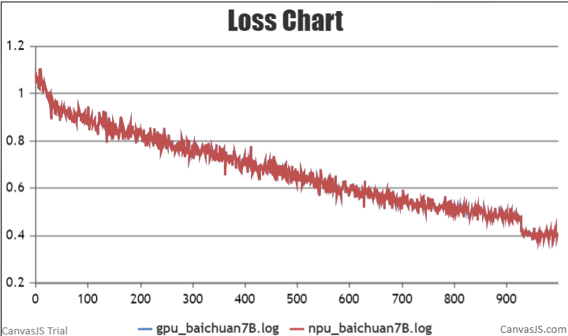
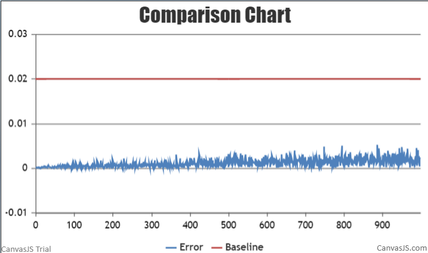
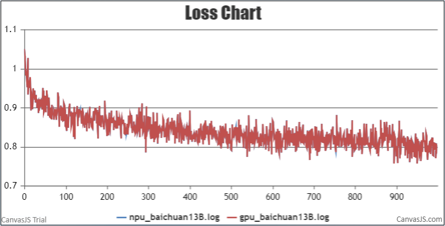

# BaiChuan
<p align="left">
        <b><a href="https://gitee.com/ascend/ModelLink/blob/modellink/examples/baichuan/README.md">简体中文</a></b> |
        <b>English</b> 
    </p>
</p>


#  Contents

- [Baichuan-7B](#contents)
  - [Training](#pre-training)
    - [Script](#script)
    - [Performance](#performance)
        - [Machine performance](#machine-performance)
        - [Accuracy of the loss](#accuracy-of-the-loss)

- [Baichuan-13B](#contents)
  - [Training](#pre-training)
    - [Script](#script)
    - [Performance](#performance)
        - [Machine performance](#machine-performance)
        - [Accuracy of the loss](#accuracy-of-the-loss)
  - [Inference](#Inference)
  - [Evaluation](#Evaluation)


# Baichuan-7B

## Training

Here's a hardware summary of pre-training Baichuan-7B:

| Hardware |                      Value                      |
| :------: | :---------------------------------------------: |
|   NPU    |               8 x Ascend NPUs                   |

### Script

1. Clone the repository to your local server:
```shell
git clone https://gitee.com/ascend/ModelLink.git 
cd ModeLlink 
git checkout modellink
mkdir logs
mkdir ckpt
```

2. Build environment

```bash
# python3.8
conda create -n test python=3.8
conda activate test

# install torch and torch_npu 
pip install torch-2.1.0-cp38-cp38m-linux_aarch64.whl
pip install torch_npu-2.1.0.XXX-cp38-cp38m-linux_aarch64.whl
pip install apex-0.1_ascend*-cp38-cp38m-linux_aarch64.whl

# modify the path according to your own  ascend-toolkit path
source /usr/local/Ascend/ascend-toolkit/set_env.sh

# install AscendSpeed
git clone https://gitee.com/ascend/AscendSpeed.git
cd AscendSpeed
pip install -r requirements.txt 
pip3 install -e .
cd ..

# install other packages
pip install -r requirements.txt 
```

3. Prepare pretrained weights
Download the Baichuan-7B checkpoint from [here](https://huggingface.co/baichuan-inc/Baichuan-7B/tree/main) 

```shell
mkdir baichuan-7B-hf
cd ./baichuan-7B-hf
wget https://huggingface.co/baichuan-inc/Baichuan-7B/resolve/main/config.json
wget https://huggingface.co/baichuan-inc/Baichuan-7B/resolve/main/configuration_baichuan.py
wget https://huggingface.co/baichuan-inc/Baichuan-7B/resolve/main/generation_config.json
wget https://huggingface.co/baichuan-inc/Baichuan-7B/resolve/main/handler.py
wget https://huggingface.co/baichuan-inc/Baichuan-7B/resolve/main/modeling_baichuan.py
wget https://huggingface.co/baichuan-inc/Baichuan-7B/resolve/main/pytorch_model.bin
wget https://huggingface.co/baichuan-inc/Baichuan-7B/resolve/main/special_tokens_map.json
wget https://huggingface.co/baichuan-inc/Baichuan-7B/resolve/main/tokenization_baichuan.py
wget https://huggingface.co/baichuan-inc/Baichuan-7B/resolve/main/tokenizer.model
wget https://huggingface.co/baichuan-inc/Baichuan-7B/resolve/main/tokenizer_config.json
cd ..
```
In order to adapt to the baichuan-7B model, the following script is used to convert the model pre-training weights.
```shell
mkdir weight

SCRIPT_PATH=./tools/ckpt_convert/llama/convert_weights_from_huggingface.py
python $SCRIPT_PATH \
    --input-model-dir ./baichuan-7B-hf \
    --output-model-dir ./weight \
    --tensor-model-parallel-size 8 \
    --pipeline-model-parallel-size 1 \
    --type 7B \
    --pse \
    --merge-mlp
```


4. Prepare dataset

Download the Baichuan-7B datasets from [here](https://huggingface.co/datasets/tatsu-lab/alpaca/resolve/main/data/train-00000-of-00001-a09b74b3ef9c3b56.parquet) 

```shell
# download datasets
mkdir dataset_baichuan7B
cd ./dataset_baichuan7B
wget https://huggingface.co/datasets/tatsu-lab/alpaca/resolve/main/data/train-00000-of-00001-a09b74b3ef9c3b56.parquet
cd ..

# process datasets                              
python ./tools/preprocess_data.py \
--input ./dataset_baichuan7B/train-00000-of-00001-a09b74b3ef9c3b56.parquet \
--tokenizer-name-or-path ./baichuan-7B-hf \
--output-prefix ./dataset_baichuan7B/alpaca \
--workers 4 \
--log-interval 1000 \
--tokenizer-type PretrainedFromHF
```


5. Config Baichuan-7B pre-training script : examples/baichuan/pretrain_baichuan_ptd_7B.sh 

```shell
# modify the script according to your own  ascend-toolkit path
source /usr/local/Ascend/ascend-toolkit/set_env.sh 

CKPT_SAVE_DIR="./ckpt"
DATA_PATH="./dataset_baichuan7B/alpaca_text_document"
TOKENIZER_MODEL="./baichuan-7B-hf/tokenizer.model"
CKPT_LOAD_DIR="./baichuan-7B-mt"
```


6. Launch Baichuan-7B  pre-training script: examples/baichuan/pretrain_baichuan_ptd_7B.sh 

```shell
bash examples/baichuan/pretrain_baichuan_ptd_7B.sh 
```


### Performance

#### Machine performance

The performance of Baichuan-7B in **Ascend NPU** and **Reference**:

| Device | Model       | total Iterations | throughput rate (samples/s) | throughput rate (tokens/s/p) | single-step time (s/step) | 
|:----:|:---------:|:----:|:---------------------:|:---------------:|:----------------:|
| NPUs | Baichuan-7B | 1000 | 5.16 | 2643.00 | 6.199| 
|  Reference  | Baichuan-7B | - | - |  2036 | - | 

#### Accuracy of the loss

NPU vs Reference loss.



NPU vs Reference loss relative error.




# Baichuan-13B

## Training

Here's a hardware summary of pre-training Baichuan-13B:

| Hardware |                      Value                      |
| :------: | :---------------------------------------------: |
|   NPU    |               8 x Ascend NPUs               |


### Script
1. Clone the repository to your local server:
```shell
git clone https://gitee.com/ascend/ModelLink.git 
cd ModeLlink 
git checkout modellink
mkdir logs
mkdir ckpt
```
2. Build environment

```bash
# python3.8
conda create -n test python=3.8
conda activate test

# install torch and torch_npu
pip install torch-2.1.0-cp38-cp38m-linux_aarch64.whl
pip install torch_npu-2.1.0.XXX-cp38-cp38m-linux_aarch64.whl
pip install apex-0.1_ascend*-cp38-cp38m-linux_aarch64.whl

# modify the path according to your own  ascend-toolkit path
source /usr/local/Ascend/ascend-toolkit/set_env.sh

#install Ascendspeed
git clone https://gitee.com/ascend/AscendSpeed.git
cd AscendSpeed
pip install -r requirements.txt 
pip3 install -e .
cd ..

# install other packages
pip install -r requirements.txt 
```

3. Prepare pretrained weights


Download the Baichuan-13B checkpoint from [here](https://huggingface.co/baichuan-inc/Baichuan-13B-Base/tree/main) 

```shell
mkdir baichuan-13B-hf
cd ./baichuan-13B-hf
wget https://huggingface.co/baichuan-inc/Baichuan-13B-Base/resolve/main/config.json
wget https://huggingface.co/baichuan-inc/Baichuan-13B-Base/resolve/main/configuration_baichuan.py
wget https://huggingface.co/baichuan-inc/Baichuan-13B-Base/resolve/main/generation_config.json
wget https://huggingface.co/baichuan-inc/Baichuan-13B-Base/resolve/main/modeling_baichuan.py
wget https://huggingface.co/baichuan-inc/Baichuan-13B-Base/resolve/main/pytorch_model-00001-of-00003.bin
wget https://huggingface.co/baichuan-inc/Baichuan-13B-Base/resolve/main/pytorch_model-00002-of-00003.bin
wget https://huggingface.co/baichuan-inc/Baichuan-13B-Base/resolve/main/pytorch_model-00003-of-00003.bin
wget https://huggingface.co/baichuan-inc/Baichuan-13B-Base/resolve/main/pytorch_model.bin.index.json
wget https://huggingface.co/baichuan-inc/Baichuan-13B-Base/resolve/main/quantizer.py
wget https://huggingface.co/baichuan-inc/Baichuan-13B-Base/resolve/main/special_tokens_map.json
wget https://huggingface.co/baichuan-inc/Baichuan-13B-Base/resolve/main/tokenization_baichuan.py
wget https://huggingface.co/baichuan-inc/Baichuan-13B-Base/resolve/main/tokenizer_config.json
wget https://huggingface.co/baichuan-inc/Baichuan-13B-Base/resolve/main/tokenizer.model
cd ..
```

In order to adapt to the baichuan-13B model, the following script is used to convert the model pre-training weights.

```shell
mkdir baichuan-13B-mt

SCRIPT_PATH=./tools/ckpt_convert/llama/convert_weights_from_huggingface.py
python $SCRIPT_PATH \
    --input-model-dir ./baichuan-13B-hf \
    --output-model-dir ./baichuan-13B-mt \
    --tensor-model-parallel-size 8 \
    --pipeline-model-parallel-size 1 \
    --type 13B \
    --pse  \
    --merge-mlp   
```

4. Prepare dataset
Download the Baichuan-13B datasets from [here](https://huggingface.co/datasets/tatsu-lab/alpaca/resolve/main/data/train-00000-of-00001-a09b74b3ef9c3b56.parquet) 

```python
mkdir dataset_baichuan13B
cd ./dataset_baichuan13B
wget https://huggingface.co/datasets/tatsu-lab/alpaca/resolve/main/data/train-00000-of-00001-a09b74b3ef9c3b56.parquet
cd ..

python ./tools/preprocess_data.py \
    --input ./dataset_baichuan13B/train-00000-of-00001-a09b74b3ef9c3b56.parquet \
    --tokenizer-name-or-path ./baichuan-13B-hf \
    --output-prefix ./dataset_baichuan13B/alpaca \
    --workers 4 \
    --log-interval 1000 \
    --tokenizer-type PretrainedFromHF 
```


5. Config Baichuan-13B pre-training script: examples/baichuan/pretrain_baichuan_ptd_13B.sh


```shell
# modify the script according to your own  ascend-toolkit path
source /usr/local/Ascend/ascend-toolkit/set_env.sh 

CKPT_SAVE_DIR="./ckpt"
DATA_PATH="./dataset_baichuan13B/alpaca_text_document"
TOKENIZER_MODEL="./baichuan-13B-hf/tokenizer.model"
CKPT_LOAD_DIR="./baichuan-13B-mt" 
```

6. Launch Baichuan-13B pre-training script: examples/baichuan/pretrain_baichuan_ptd_13B.sh

```bash
bash examples/baichuan/pretrain_baichuan_ptd_13B.sh
```


### Performance

#### Machine performance

The performance of the Baichuan-13B in **Ascend NPU** and **Reference**:

| Device |    Model     | total Iterations | throughput rate (samples/s) | throughput rate (tokens/s/p) | single-step time (s/step) | 
|:----:|:------------:|:----:|:------------------:|:--------------------:|:---------------:|
| NPUs | Baichuan-13B | 1000 | 2.37 | 1213| 13.5 |    
|  Reference | Baichuan-13B |  - |  -   | 862  |  -   |    


#### Accuracy of the loss

NPU vs Reference loss.


NPU vs Reference loss relative error.


## Inference
Config baichuan-13B inference script: tasks/inference/generate_baichuan_13b_ptd.sh
```bash
# modify the script according to your own ascend-toolkit path
source /usr/local/Ascend/ascend-toolkit/set_env.sh 
 
# modify script model path and tokenizer path
CHECKPOINT="your model directory path"
TOKENIZER_PATH="your tokenizer directory path"
```
Launch baichuan-13B inference script: tasks/inference/generate_baichuan_13b_ptd.sh
```bash
bash tasks/inference/generate_baichuan_13b_ptd.sh
```
Some inference samples are as follows:


## Evaluation
We use the boolq benchmark to evaluate our model. Benchmark [Download](https://storage.googleapis.com/boolq/dev.jsonl).
1. Prepare dataset
```shell
 mkdir boolq
 cd boolq
 wget https://storage.googleapis.com/boolq/dev.jsonl
 cd ..
```
2. Config Baichuan-13B evaluation script: tasks/evaluation/eval_baichuan_13B.sh

```shell
# config origin weight and vocab file path
CHECKPOINT=<origin-ckpt-path>
TOKENIZER_PATH=<tokenizer-path>
# config tasks and dataset path
DATA_PATH="./boolq/"
TASK="boolq"
```
3. Launch Baichuan-13B evaluation script: tasks/evaluation/eval_baichuan_13B.sh

```shell
bash ./tasks/evaluation/eval_baichuan_13B.sh
```

<table>
  <thead>
    <tr>
      <th>Task</th>
      <th>Subset</th>
      <th>Model</th>
      <th>NPU</th>
      <th>OpenSource</th>
    </tr>
  </thead>
  <tbody>
    <tr>
      <td><a href="https://huggingface.co/datasets/boolq">Boolq</a></td>
      <td>test</td>
      <th>Baichuan 13B</th>
      <td>0.747</td>
      <td><a href="https://hub.opencompass.org.cn/dataset-detail/BoolQ">0.736</a></td>
    </tr>
  </tbody>
</table>
