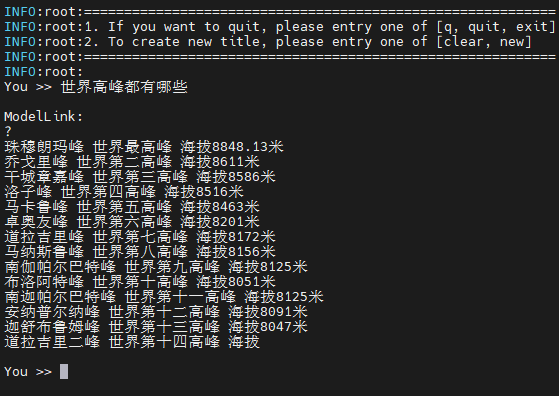
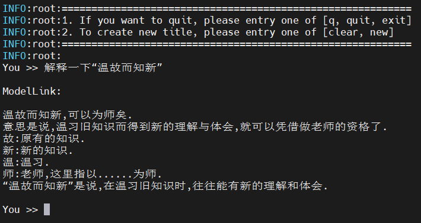
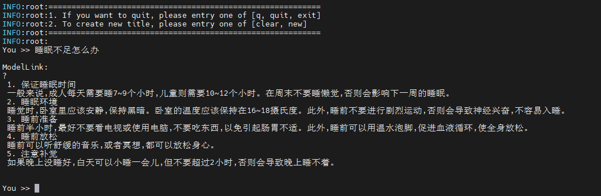

# BaiChuan
<p align="left">
        <b><a href="README.md">简体中文</a></b> |
        <b>English</b> 
    </p>
</p>


#  Contents

- [Baichuan-7B](#contents)
  - [Training](#pre-training)
    - [Script](#script)
    - [Performance](#performance)
        - [Machine performance](#machine-performance)
  - [Inference](#Inference)
  - [Evaluation](#Evaluation)

- [Baichuan-13B](#contents)
  - [Training](#pre-training)
    - [Script](#script)
    - [Performance](#performance)
        - [Machine performance](#machine-performance)
  - [Lora](#Lora)
  - [Inference](#Inference)
  - [Evaluation](#Evaluation)


# Baichuan-7B

## Training

Here's a hardware summary of pre-training Baichuan-7B:

| Hardware |                      Value                      |
| :------: | :---------------------------------------------: |
|   NPU    |               8 x Ascend NPUs                   |

### Script

1. Clone the repository to your local server:
```shell
git clone https://gitee.com/ascend/ModelLink.git 
cd ModeLlink 
mkdir logs
mkdir ckpt
```

2. Build environment

```bash
# python3.8
conda create -n test python=3.8
conda activate test

# install torch and torch_npu 
pip install torch-2.1.0-cp38-cp38m-linux_aarch64.whl
pip install torch_npu-2.1.0.XXX-cp38-cp38m-linux_aarch64.whl
pip install apex-0.1_ascend*-cp38-cp38m-linux_aarch64.whl

# modify the path according to your own  ascend-toolkit path
source /usr/local/Ascend/ascend-toolkit/set_env.sh

# install AscendSpeed
git clone https://gitee.com/ascend/AscendSpeed.git
cd AscendSpeed
pip install -r requirements.txt 
pip3 install -e .
cd ..

# install other packages
pip install -r requirements.txt 
```

3. Prepare pretrained weights
Download the Baichuan-7B checkpoint from [here](https://huggingface.co/baichuan-inc/Baichuan-7B/tree/main) 

```shell
mkdir baichuan-7B-hf
cd ./baichuan-7B-hf
wget https://huggingface.co/baichuan-inc/Baichuan-7B/resolve/main/config.json
wget https://huggingface.co/baichuan-inc/Baichuan-7B/resolve/main/configuration_baichuan.py
wget https://huggingface.co/baichuan-inc/Baichuan-7B/resolve/main/generation_config.json
wget https://huggingface.co/baichuan-inc/Baichuan-7B/resolve/main/handler.py
wget https://huggingface.co/baichuan-inc/Baichuan-7B/resolve/main/modeling_baichuan.py
wget https://huggingface.co/baichuan-inc/Baichuan-7B/resolve/main/pytorch_model.bin
wget https://huggingface.co/baichuan-inc/Baichuan-7B/resolve/main/special_tokens_map.json
wget https://huggingface.co/baichuan-inc/Baichuan-7B/resolve/main/tokenization_baichuan.py
wget https://huggingface.co/baichuan-inc/Baichuan-7B/resolve/main/tokenizer.model
wget https://huggingface.co/baichuan-inc/Baichuan-7B/resolve/main/tokenizer_config.json
cd ..
```

4. Weights convert

In order to adapt to the baichuan-7B model, the following script is used to convert the model pre-training weights.
***(This scenario is generally used to train open-source HuggingFace models on Megatron)***
```shell
mkdir baichuan-7B-mt

# modify the ascend-toolkit path
source /usr/local/Ascend/ascend-toolkit/set_env.sh
   
python tools/checkpoint/util.py \
    --model-type GPT \
    --loader llama2_hf \
    --saver megatron \
    --target-tensor-parallel-size 8 \
    --load-dir ./baichuan-7B-hf \
    --save-dir ./baichuan-7B-mt \
    --tokenizer-model ./baichuan-7B-hf/tokenizer.model \
    --w-pack True  
```
Any Megatron weights with parallel slicing strategy --> Any Megatron weights with parallel slicing strategy
***(This scenario is generally used to convert the trained megatron model back to the HuggingFace format)***
```shell
cd ModelLink/
# Modify the ascend-toolkit path
source /usr/local/Ascend/ascend-toolkit/set_env.sh
python tools/checkpoint/util.py --model-type GPT \
    --loader megatron \
    --saver megatron \
    --save-model-type save_huggingface_llama \
    --load-dir ../Baichuan7B-v0.1-pt8-pp1 \
    --target-tensor-parallel-size 1 \
    --target-pipeline-parallel-size 1 \
    --w-pack True \
    --save-dir ../Baichuan7B_downloaded   # <-- Fill in the original HF model path here, new weights will be saved in ../Baichuan7B_downloaded/mg2hg
```

5. Prepare dataset

Download the Baichuan-7B datasets from [here](https://huggingface.co/datasets/tatsu-lab/alpaca/resolve/main/data/train-00000-of-00001-a09b74b3ef9c3b56.parquet) 

```shell
# download datasets
mkdir dataset-baichuan-7B
cd ./dataset-baichuan-7B
wget https://huggingface.co/datasets/tatsu-lab/alpaca/resolve/main/data/train-00000-of-00001-a09b74b3ef9c3b56.parquet
cd ..

# process datasets                              
python ./tools/preprocess_data.py \
--input ./dataset-baichuan-7B/train-00000-of-00001-a09b74b3ef9c3b56.parquet \
--tokenizer-name-or-path ./baichuan-7B-hf \
--output-prefix ./dataset-baichuan-7B/alpaca \
--workers 4 \
--log-interval 1000 \
--tokenizer-type PretrainedFromHF
```


6. Config Baichuan-7B pre-training script : examples/baichuan/pretrain_baichuan_ptd_7B.sh 

```shell
# modify the script according to your own  ascend-toolkit path
source /usr/local/Ascend/ascend-toolkit/set_env.sh 

CKPT_SAVE_DIR="./ckpt"
DATA_PATH="./dataset-baichuan-7B/alpaca_text_document"
TOKENIZER_MODEL="./baichuan-7B-hf/tokenizer.model"
CKPT_LOAD_DIR="./baichuan-7B-mt"
```


7. Launch Baichuan-7B  pre-training script: examples/baichuan/pretrain_baichuan_ptd_7B.sh 

```shell
bash examples/baichuan/pretrain_baichuan_ptd_7B.sh 
```


### Performance

#### Machine performance

The performance of Baichuan-7B in **Ascend NPU** and **Reference**:

| Device | Model       | total Iterations | throughput rate (samples/s) | throughput rate (tokens/s/p) | single-step time (s/step) | 
|:----:|:---------:|:----:|:---------------------:|:---------------:|:----------------:|
| NPUs | Baichuan-7B | 1000 |  5.24 | 2685 | 6.1| 
|  Reference  | Baichuan-7B | - | - |  2036 | - | 


## Inference
Config baichuan-7B inference script: tasks/inference/generate_baichuan_7b_ptd.sh
```bash
# modify the script according to your own ascend-toolkit path
source /usr/local/Ascend/ascend-toolkit/set_env.sh 
 
# modify script model path and tokenizer path
CHECKPOINT="your model directory path"
TOKENIZER_PATH="your tokenizer directory path"
```
Launch baichuan-7B inference script: tasks/inference/generate_baichuan_7b_ptd.sh
```bash
bash tasks/inference/generate_baichuan_7b_ptd.sh
```
Some inference samples are as follows:




## Evaluation
We use the boolq benchmark to evaluate our model. Benchmark [Download](https://huggingface.co/datasets/boolq).

```shell
# config origin weight and vocab file path
CHECKPOINT=<origin-ckpt-path>
TOKENIZER_PATH=<tokenizer-path>
# config tasks and dataset path
DATA_PATH="./boolq/"
TASK="boolq"
```


```shell
bash ./tasks/evaluation/evaluate_baichuan_7B_ptd.sh
```

<table>
  <thead>
    <tr>
      <th>Task</th>
      <th>Subset</th>
      <th>Model</th>
      <th>NPU</th>
      <th>OpenSource</th>
    </tr>
  </thead>
  <tbody>
    <tr>
      <td><a href="https://huggingface.co/datasets/boolq">Boolq</a></td>
      <td>test</td>
      <th>Baichuan 7B</th>
      <td>0.69</td>
      <td><a href="https://hub.opencompass.org.cn/dataset-detail/BoolQ">0.67</a></td>
    </tr>
  </tbody>
</table>


# Baichuan-13B

## Training

Here's a hardware summary of pre-training Baichuan-13B:

| Hardware |                      Value                      |
| :------: | :---------------------------------------------: |
|   NPU    |               8 x Ascend NPUs               |


### Script
1. Clone the repository to your local server:
```shell
git clone https://gitee.com/ascend/ModelLink.git 
cd ModeLlink 
mkdir logs
mkdir ckpt
```
2. Build environment

```bash
# python3.8
conda create -n test python=3.8
conda activate test

# install torch and torch_npu
pip install torch-2.1.0-cp38-cp38m-linux_aarch64.whl
pip install torch_npu-2.1.0.XXX-cp38-cp38m-linux_aarch64.whl
pip install apex-0.1_ascend*-cp38-cp38m-linux_aarch64.whl

# modify the path according to your own  ascend-toolkit path
source /usr/local/Ascend/ascend-toolkit/set_env.sh

#install Ascendspeed
git clone https://gitee.com/ascend/AscendSpeed.git
cd AscendSpeed
pip install -r requirements.txt 
pip3 install -e .
cd ..

# install other packages
pip install -r requirements.txt 
```

**Note:** If the error message "'AttributeError: 'BaichuanTokenizer' object has no attribute'sp_model'" is displayed during the script execution, run the following command to rectify the error:

```shell
pip install transformers==4.32.0 --force
```

3. Prepare pretrained weights


Download the Baichuan-13B checkpoint from [here](https://huggingface.co/baichuan-inc/Baichuan-13B-Base/tree/main) 

```shell
mkdir baichuan-13B-hf
cd ./baichuan-13B-hf
wget https://huggingface.co/baichuan-inc/Baichuan-13B-Base/resolve/main/config.json
wget https://huggingface.co/baichuan-inc/Baichuan-13B-Base/resolve/main/configuration_baichuan.py
wget https://huggingface.co/baichuan-inc/Baichuan-13B-Base/resolve/main/generation_config.json
wget https://huggingface.co/baichuan-inc/Baichuan-13B-Base/resolve/main/modeling_baichuan.py
wget https://huggingface.co/baichuan-inc/Baichuan-13B-Base/resolve/main/pytorch_model-00001-of-00003.bin
wget https://huggingface.co/baichuan-inc/Baichuan-13B-Base/resolve/main/pytorch_model-00002-of-00003.bin
wget https://huggingface.co/baichuan-inc/Baichuan-13B-Base/resolve/main/pytorch_model-00003-of-00003.bin
wget https://huggingface.co/baichuan-inc/Baichuan-13B-Base/resolve/main/pytorch_model.bin.index.json
wget https://huggingface.co/baichuan-inc/Baichuan-13B-Base/resolve/main/quantizer.py
wget https://huggingface.co/baichuan-inc/Baichuan-13B-Base/resolve/main/special_tokens_map.json
wget https://huggingface.co/baichuan-inc/Baichuan-13B-Base/resolve/main/tokenization_baichuan.py
wget https://huggingface.co/baichuan-inc/Baichuan-13B-Base/resolve/main/tokenizer_config.json
wget https://huggingface.co/baichuan-inc/Baichuan-13B-Base/resolve/main/tokenizer.model
cd ..
```

4. Weights convert

In order to adapt to the baichuan-13B model, the following script is used to convert the model pre-training weights.

***(This scenario is generally used to train open-source HuggingFace models on Megatron)***

```shell
mkdir baichuan-13B-mt

# modify the ascend-toolkit path
source /usr/local/Ascend/ascend-toolkit/set_env.sh
   
python tools/checkpoint/util.py \
    --model-type GPT \
    --loader llama2_hf \
    --saver megatron \
    --target-tensor-parallel-size 8 \
    --load-dir ./baichuan-13B-hf \
    --save-dir ./baichuan-13B-mt \
    --tokenizer-model ./baichuan-13B-hf/tokenizer.model \
    --w-pack True  
```

Any Megatron weights with parallel slicing strategy --> Any Megatron weights with parallel slicing strategy
***(This scenario is generally used to convert the trained megatron model back to the HuggingFace format)***
```shell
cd ModelLink/
# Modify the ascend-toolkit path
source /usr/local/Ascend/ascend-toolkit/set_env.sh
python tools/checkpoint/util.py --model-type GPT \
    --loader megatron \
    --saver megatron \
    --save-model-type save_huggingface_llama \
    --load-dir ../Baichuan13B-v0.1-pt8-pp1 \
    --target-tensor-parallel-size 1 \
    --target-pipeline-parallel-size 1 \
    --w-pack True \
    --save-dir ../Baichuan13B_downloaded   # <-- Fill in the original HF model path here, new weights will be saved in ../Baichuan13B_downloaded/mg2hg
```

5. Prepare dataset
Download the Baichuan-13B datasets from [here](https://huggingface.co/datasets/tatsu-lab/alpaca/resolve/main/data/train-00000-of-00001-a09b74b3ef9c3b56.parquet) 

```python
mkdir dataset-baichuan-13B
cd ./dataset-baichuan-13B
wget https://huggingface.co/datasets/tatsu-lab/alpaca/resolve/main/data/train-00000-of-00001-a09b74b3ef9c3b56.parquet
cd ..

python ./tools/preprocess_data.py \
    --input ./dataset-baichuan-13B/train-00000-of-00001-a09b74b3ef9c3b56.parquet \
    --tokenizer-name-or-path ./baichuan-13B-hf \
    --output-prefix ./dataset-baichuan-13B/alpaca \
    --workers 4 \
    --log-interval 1000 \
    --tokenizer-type PretrainedFromHF 
```


6. Config Baichuan-13B pre-training script(Baichuan-13B does not support Flash Attention): examples/baichuan/pretrain_baichuan_ptd_13B.sh


```shell
# modify the script according to your own  ascend-toolkit path
source /usr/local/Ascend/ascend-toolkit/set_env.sh 

CKPT_SAVE_DIR="./ckpt"
DATA_PATH="./dataset_baichuan13B/alpaca_text_document"
TOKENIZER_MODEL="./baichuan-13B-hf/tokenizer.model"
CKPT_LOAD_DIR="./baichuan-13B-mt" 
```

7. Launch Baichuan-13B pre-training script: examples/baichuan/pretrain_baichuan_ptd_13B.sh

```bash
bash examples/baichuan/pretrain_baichuan_ptd_13B.sh
```


### Performance

#### Machine performance

The performance of the Baichuan-13B in **Ascend NPU** and **Reference**:

| Device |    Model     | total Iterations | throughput rate (samples/s) | throughput rate (tokens/s/p) | single-step time (s/step) | 
|:----:|:------------:|:----:|:------------------:|:--------------------:|:---------------:|
| NPUs | Baichuan-13B | 1000 | 2.37 | 1213| 13.5 |    
|  Reference | Baichuan-13B |  - |  -   | 862  |  -   |    


## Lora
We support AscendSpeed Lora fine-tuning with Baichuan-13B.
When Fine-tuning using `instruction fine-tuning data set`, the production process is as follows, 
pay attention to add ` --handler-name GeneralInstructionHandler `

```python
mkdir alpaca_preprocessed
python tools/preprocess_data.py \
    --input ./dataset-baichuan-13B/train-00000-of-00001-a09b74b3ef9c3b56.parquet \
    --output-prefix ./alpaca_preprocessed/alpaca \
    --tokenizer-type PretrainedFromHF \
    --tokenizer-name-or-path ./baichuan-13B-hf \
    --tokenizer-not-use-fast \
    --handler-name GeneralInstructionHandler \
    --append-eod
```

Configure Baichuan-13B lora script `tasks/finetune/tune_baichuan_ptd_13B.sh`

```shell
# configure the path to save the lora weights and the dataset path, initial megatron weight and tokenizer path 
CKPT_SAVE_DIR="./ckpt_lora"
DATA_PATH="./alpaca_preprocessed/alpaca"
CHECKPOINT="./baichuan-13B-mt"
TOKENIZER_PATH="./baichuan-13B-hf"
```
Launch Baichuan-13B fine-tuned with lora script: tasks/finetune/tune_baichuan_ptd_13B.sh
Baichuan-13B:
```shell
bash ./examples/baichuan/tune_baichuan_ptd_13B.sh
```
Then use the fine-tuned weights for inference:
```shell
# configure the initial megatron weight path, lora weight path and tokenizer path 
CHECKPOINT="./baichuan-13B-mt"
LORA_CHECKPOINT="./ckpt_lora"
TOKENIZER_PATH="./baichuan-13B-hf"
```

Baichuan-13B:
```shell
bash ./tasks/inference/generate_baichuan_13b_lora_ptd.sh
```

FineTune with lora and operate inference


## Inference
Config baichuan-13B inference script: tasks/inference/generate_baichuan_13b_ptd.sh
```bash
# modify the script according to your own ascend-toolkit path
source /usr/local/Ascend/ascend-toolkit/set_env.sh 
 
# modify script model path and tokenizer path
CHECKPOINT="your model directory path"
TOKENIZER_PATH="your tokenizer directory path"
```
Launch baichuan-13B inference script: tasks/inference/generate_baichuan_13b_ptd.sh
```bash
bash tasks/inference/generate_baichuan_13b_ptd.sh
```
Some inference samples are as follows:



## Evaluation
We use the boolq benchmark to evaluate our model. Benchmark [Download](https://huggingface.co/datasets/boolq).

```shell
# config origin weight and vocab file path
CHECKPOINT=<origin-ckpt-path>
TOKENIZER_PATH=<tokenizer-path>
# config tasks and dataset path
DATA_PATH="./boolq/"
TASK="boolq"
```


```shell
bash ./tasks/evaluation/evaluate_baichuan_13B_ptd.sh
```

<table>
  <thead>
    <tr>
      <th>Task</th>
      <th>Subset</th>
      <th>Model</th>
      <th>NPU</th>
      <th>OpenSource</th>
    </tr>
  </thead>
  <tbody>
    <tr>
      <td><a href="https://huggingface.co/datasets/boolq">Boolq</a></td>
      <td>test</td>
      <th>Baichuan 13B</th>
      <td>0.747</td>
      <td><a href="https://hub.opencompass.org.cn/dataset-detail/BoolQ">0.736</a></td>
    </tr>
  </tbody>
</table>
