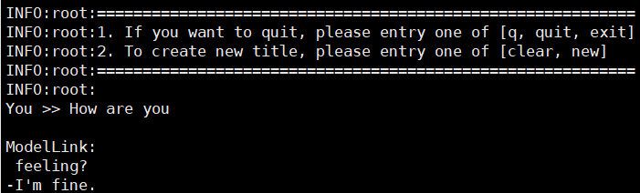

# Bloom
<p align="left">
        <b><a href="https://gitee.com/ascend/ModelLink/blob/modellink/examples/bloom/README.md">简体中文</a></b> |
        <b>English</b> 
    </p>
</p>

[TOC]


# Bloom-7B

## Training

Here's a hardware summary of pre-training Bloom-7B:

| Hardware |                      Value                      |
| :------: | :---------------------------------------------: |
|   NPU    |               8 x Ascend NPUs                   |

### Script

1. Clone the repository to your local server:
```shell
git clone https://gitee.com/ascend/ModelLink.git 
cd ModeLlink 
git checkout modellink
mkdir logs
mkdir ckpt
```

2. Build environment

```bash
# python3.8
conda create -n test python=3.8
conda activate test

# install torch and torch_npu 
pip install torch-2.1.0-cp38-cp38m-linux_aarch64.whl
pip install torch_npu-2.1.0.XXX-cp38-cp38m-linux_aarch64.whl
pip install apex-0.1_ascend*-cp38-cp38m-linux_aarch64.whl

# modify the path according to your own  ascend-toolkit path
source /usr/local/Ascend/ascend-toolkit/set_env.sh

# install AscendSpeed
git clone https://gitee.com/ascend/AscendSpeed.git
cd AscendSpeed
pip install -r requirements.txt 
pip3 install -e .
cd ..

# install other packages
pip install -r requirements.txt 
```

3. Prepare pretrained weights
Download the Bloom-7B checkpoint from [here](https://huggingface.co/bigscience/bloom-7b1/tree/main)

```shell
mkdir tokenizer
cd tokenizer
wget https://huggingface.co/bigscience/bloom/resolve/main/special_tokens_map.json
wget https://huggingface.co/bigscience/bloom/resolve/main/tokenizer.json
wget https://huggingface.co/bigscience/bloom/resolve/main/tokenizer_config.json
...
cd ..
```
In order to adapt to the Bloom-7B model, the following script is used to convert the model pre-training weights.
```shell
mkdir bloom-7b

SCRIPT_PATH=./tools/ckpt_convert/bloom/convert_weights_from_huggingface.py
python tools/checkpoint/util.py --model-type GPT \
                                --loader bloom-7b \
                                --saver megatron \
                                --target-tensor-parallel-size 8 \
                                --load-dir ../bloom-7b-hf \
                                --save-dir bloom-7b \
                                --tokenizer-model ../bloom-7b-hf/tokenizer.model
```


4. Prepare dataset

Download the Bloom-7B datasets from [here](https://huggingface.co/datasets/tatsu-lab/alpaca/resolve/main/data/train-00000-of-00001-a09b74b3ef9c3b56.parquet) 

```shell
# download datasets
mkdir enwiki_100k_datasets
cd enwiki_100k_datasets
wget https://huggingface.co/datasets/teven/enwiki_100k/resolve/main/data/train-00000-of-00006-67bcc7d401923db0.parquet
wget https://huggingface.co/datasets/teven/enwiki_100k/resolve/main/data/train-00001-of-00006-6b8562cbb05789a4.parquet
wget https://huggingface.co/datasets/teven/enwiki_100k/resolve/main/data/train-00002-of-00006-62d2b426a93b0912.parquet
wget https://huggingface.co/datasets/teven/enwiki_100k/resolve/main/data/train-00003-of-00006-36c3d6da04c724b6.parquet
wget https://huggingface.co/datasets/teven/enwiki_100k/resolve/main/data/train-00004-of-00006-48bdf99256dcfa5d.parquet
wget https://huggingface.co/datasets/teven/enwiki_100k/resolve/main/data/train-00005-of-00006-bcb3b3af8d7a4140.parquet
cd ..
```

```shell
# prepare datasets
python ./tools/preprocess_data.py \
  --input ./enwiki_100k_datasets/ \
  --tokenizer-name-or-path ./tokenizer \
  --output-prefix ./enwiki_100k_datasets/enwiki-100k \
  --worker 4 \
  --log-interval 1000 \
  --tokenizer-type PretrainedFromHF
```

5. Config Bloom-7B pre-training script : examples/bloom/pretrain_bloom_ptd_7B.sh 

```shell
# modify the script according to your own  ascend-toolkit path
source /usr/local/Ascend/ascend-toolkit/set_env.sh 

CKPT_SAVE_DIR="./ckpt"
DATA_PATH="./dataset_bloom-7B/bigscience_bloom-7b1_master_text_document"
TOKENIZER_PATH="./bloom-7B-hf/"
CKPT_LOAD_DIR="./bloom-7b"
```


6. Launch Bloom-7B  pre-training script: examples/bloom/pretrain_bloom_ptd_7B.sh 

```shell
bash examples/bloom/pretrain_bloom_ptd_7B.sh 
```


### Performance

#### Machine performance

The performance of Bloom-7B in **Ascend NPU** and **Reference**:

| Device | Model       | total Iterations | throughput rate (samples/s) | throughput rate (tokens/s/p) | single-step time (s/step) | 
|:----:|:---------:|:----:|:---------------------:|:---------------:|:----------------:|
| NPUs | Bloom 7b | 1000 | 7.95 | 2034 | 64.55
|  Reference  | Bloom 7B | 1000 | 9.894 |  2525 | 19.40 

#### Accuracy of the loss

NPU vs Reference loss.


NPU VS Reference relative error


## Inference Bloom-7B
Config Bloom-7B inference script: tasks/inference/generate_bloom_7b_ptd.sh
```bash
# modify the script according to your own ascend-toolkit path
source /usr/local/Ascend/ascend-toolkit/set_env.sh 
 
# modify script model path and tokenizer path
CHECKPOINT="your model save ckpt path"
TOKENIZER_PATH="your tokenizer path"
```
Launch Bloom-7B inference script: tasks/inference/generate_bloom_7b_ptd.sh
```bash
bash tasks/inference/generate_bloom_7b_ptd.sh
```
Some inference samples are as follows:


## Evaluation Bloom-7B
Config Bloom-7B evaluation script: tasks/evaluation/evaluate_bloom_7B_ptd.sh

```bash
source /usr/local/Ascend/ascend-toolkit/set_env.sh 

# modify script model path and tokenizer path
CHECKPOINT="your model save ckpt path"
TOKENIZER_PATH="your tokenizer path"
# configure task and data path
DATA_PATH="your dataset path"
TASK="your task"
```
Launch Bloom-7B evaluation script:

```bash
bash tasks/evaluation/evaluate_bloom_7B_ptd.sh
```

Evaluation results

|  dataset | subject_num | question_num | reference_acc |NPU acc|
|:---:|:-----------:|:------------:|:-------------:|:---:|
| MMLU |     57      |    14042     |    0.254    |0.251|


# Bloom-176B

## Training

BLOOM model is from: [A 176B-Parameter Open-Access Multilingual Language Model](https://arxiv.org/abs/2211.05100).

> Scao, Teven Le, et al. "Bloom: A 176b-parameter open-access multilingual language model." arXiv preprint arXiv:2211.05100 (2022).

Here's a hardware summary of pre-training Bloom-176B:

| **Hardware** | **Value**       |
| ------------ | --------------- |
| NPU          | 12x8 Ascend 910 |


## Script

1. Clone the repository to your local server

```shell
git clone https://gitee.com/ascend/ModelLink.git
cd ModelLink
```

2. Build enviroment

```bash
# python3.8
conda create -n test python=3.8
conda activate test

# install torch and torch_npu 
pip install torch-2.1.0-cp38-cp38m-linux_aarch64.whl
pip install torch_npu-2.1.0.XXX-cp38-cp38m-linux_aarch64.whl
pip install apex-0.1_ascend*-cp38-cp38m-linux_aarch64.whl

# modify the path according to your own  ascend-toolkit path
source /usr/local/Ascend/ascend-toolkit/set_env.sh

# install AscendSpeed
git clone https://gitee.com/ascend/AscendSpeed.git
cd AscendSpeed
pip install -r requirements.txt 
pip3 install -e .
cd ..

# install other packages
pip install -r requirements.txt 

3. Prepare pretrained weights

Download the Bloom-176B tokensizer from [here](https://huggingface.co/bigscience/bloom/tree/main).

```shell
mkdir tokenizer
cd tokenizer
wget https://huggingface.co/bigscience/bloom/resolve/main/special_tokens_map.json
wget https://huggingface.co/bigscience/bloom/resolve/main/tokenizer.json
wget https://huggingface.co/bigscience/bloom/resolve/main/tokenizer_config.json
cd ..
```
In order to adapt to the Bloom-176B model, the following script is used to convert the model pre-training weights.

```shell
#!/bin/bash

SCRIPT_PATH=./tools/ckpt_convert/bloom/convert_weights_from_huggingface.py
python $SCRIPT_PATH \
    --input-model-dir "your huggingface checkpoint path" \
    --output-model-dir "your megatron checkpoint path" \
    --tensor-model-parallel-size 8 \
    --pipeline-model-parallel-size 12 \
    --type 176B \
    --deepspeed \
    --partition-layers 6,6,6,6,6,6,6,6,6,6,6,4
```
4. Prepare dataset

Download the Bloom-176B datasets from [here](https://huggingface.co/datasets/teven/enwiki_100k). The downloaded dataset is in the parquet format by default.
You need to convert the dataset to the loose json format and preprocess the dataset.

```shell
# download datasets
mkdir enwiki_100k_datasets
cd enwiki_100k_datasets
wget https://huggingface.co/datasets/teven/enwiki_100k/resolve/main/data/train-00000-of-00006-67bcc7d401923db0.parquet
wget https://huggingface.co/datasets/teven/enwiki_100k/resolve/main/data/train-00001-of-00006-6b8562cbb05789a4.parquet
wget https://huggingface.co/datasets/teven/enwiki_100k/resolve/main/data/train-00002-of-00006-62d2b426a93b0912.parquet
wget https://huggingface.co/datasets/teven/enwiki_100k/resolve/main/data/train-00003-of-00006-36c3d6da04c724b6.parquet
wget https://huggingface.co/datasets/teven/enwiki_100k/resolve/main/data/train-00004-of-00006-48bdf99256dcfa5d.parquet
wget https://huggingface.co/datasets/teven/enwiki_100k/resolve/main/data/train-00005-of-00006-bcb3b3af8d7a4140.parquet
cd ..

# preprocess datasets
python ./tools/preprocess_data.py \
  --input ./enwiki_100k_datasets/ \
  --tokenizer-name-or-path ./tokenizer \
  --output-prefix ./enwiki_100k_datasets/enwiki-100k \
  --worker 4 \
  --log-interval 1000 \
  --tokenizer-type PretrainedFromHF
```

5. Config Bloom-176B pre-training script: examples/bloom/pretrain_bloom_176b.sh

```shell
# modify MASTER_ADDR to the IP address of the master node in the cluster.
# the master node is localhost, and the other nodes are the IP address of the master node, for example, 90.90.2.166
MASTER_ADDR=localhost

# modify the rank number of a node. The rank number of the master node is 0, and the rank number of other nodes increases in ascending order.
NODE_RANK=0

# modify the datasets path and tokenizer path
TOKENIZER_NAME_OR_PATH=/home/bloom_data/vocab_file/
DATA_PATH=/home/bloom_data/enwiki_100k/enwiki-100k_text_document
```

6. Launch Bloom-176B pre-training script: examples/bloom/pretrain_bloom_176b.sh

Run the examples/bloom/pretrain_bloom_176b.sh on all nodes in the cluster.

```shell
bash examples/bloom/pretrain_bloom_176b.sh
```

```text
When enable the FA, add '--use-flash-attn' and '--square-alibion-mask' to the script, and do not 
use '--is-instruction-dataset'.
```

## Performance

### Machine Performance

The performance of Bloom-176B in **Ascend NPU** and **Reference**:

| Devices   | Model      | total iterations | throughput rate (tokens/s/p) |
| --------- | ---------- | ---------------- | ---------------------------- |
| NPUs      | Bloom-176B | 1000             | 108                          |
| Reference | Bloom-176B | NA               | 107                          |

### Accuracy of the loss

NPU vs GPU loss. The loss curves of GPUs and NPUs basically coincide.


We reduce the number of layers of the model to six, the following figure shows the loss comparsion between the NPU 
and GPU on a single-node system. The average relative error is 0.1%, less than 2%, and the proportion of relative error less than 2% reaches 99.9%. The average absolute error is 0.04. The precision meets the requirements.


## Inference


## Evaluation 
