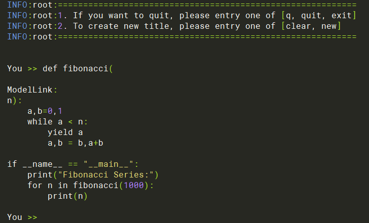

# CodeLlama  $\color{black}{\bf\tiny{【社区贡献模型】}}$
<p align="left">
        <b>简体中文</b> |
        <b><a href="README_en.md">English</a> </b> 
    </p>
</p>


#  目录

- [CodeLlama-34B](#codellama-34b)
  - [训练](#训练)
    - [脚本](#脚本)
    - [性能](#性能)
      - [吞吐](#吞吐)
  - [推理](#推理)
  - [评估](#评估)

# CodeLlama-34B

## 训练

CodeLlama-34B 训练的硬件配置如下:

|  硬件 |       配置        |
|:---:|:---------------:|
| NPU | 16 x Ascend NPUs |

### 脚本

1. 克隆仓库到本地服务器

    ```shell
    git clone https://gitee.com/ascend/ModelLink.git 
    git clone https://github.com/NVIDIA/Megatron-LM.git
    cd Megatron-LM
    git checkout -f bcce6f
    cp -r megatron ../ModelLink/
    cd ..
    cd ModelLink
    mkdir logs
    mkdir model_from_hf
    mkdir dataset
    mkdir ckpt
    ```

2. 搭建环境

    ```bash
    # python3.8
    conda create -n test python=3.8
    conda activate test

    # 安装 torch 和 torch_npu 
    pip install torch-2.2.0-cp38-cp38m-linux_aarch64.whl
    pip install torch_npu-2.2.0.XXX-cp38-cp38m-linux_aarch64.whl
    pip install apex-0.1_ascend*-cp38-cp38m-linux_aarch64.whl

    # 修改 ascend-toolkit 路径
    source /usr/local/Ascend/ascend-toolkit/set_env.sh

    # 安装加速库
    git clone https://gitee.com/ascend/AscendSpeed.git
    cd AscendSpeed
    git checkout 224ae35e8fc96778f957029d1371ddb623452a50
    pip install -r requirements.txt
    pip3 install -e .
    cd ..

    # 安装其余依赖库
    pip install -r requirements.txt 

    ```


3. （可选的）准备预训练权重

    从 [huggingface](https://huggingface.co/codellama/CodeLlama-34b-hf/tree/main) 下载预训练权重

    ```shell
    mkdir ./model_from_hf/CodeLlama-34B/
    cd ./model_from_hf/CodeLlama-34B/
    wget https://huggingface.co/codellama/CodeLlama-34b-hf/resolve/main/config.json
    wget https://huggingface.co/codellama/CodeLlama-34b-hf/resolve/main/generation_config.json
    wget https://huggingface.co/codellama/CodeLlama-34b-hf/resolve/main/pytorch_model-00001-of-00007.bin
    wget https://huggingface.co/codellama/CodeLlama-34b-hf/resolve/main/pytorch_model-00002-of-00007.bin
    wget https://huggingface.co/codellama/CodeLlama-34b-hf/resolve/main/pytorch_model-00003-of-00007.bin
    wget https://huggingface.co/codellama/CodeLlama-34b-hf/resolve/main/pytorch_model-00004-of-00007.bin
    wget https://huggingface.co/codellama/CodeLlama-34b-hf/resolve/main/pytorch_model-00005-of-00007.bin
    wget https://huggingface.co/codellama/CodeLlama-34b-hf/resolve/main/pytorch_model-00006-of-00007.bin
    wget https://huggingface.co/codellama/CodeLlama-34b-hf/resolve/main/pytorch_model-00007-of-00007.bin
    wget https://huggingface.co/codellama/CodeLlama-34b-hf/resolve/main/pytorch_model.bin.index.json
    wget https://huggingface.co/codellama/CodeLlama-34b-hf/resolve/main/special_tokens_map.json
    wget https://huggingface.co/codellama/CodeLlama-34b-hf/resolve/main/tokenizer.json
    wget https://huggingface.co/codellama/CodeLlama-34b-hf/resolve/main/tokenizer.model
    wget https://huggingface.co/codellama/CodeLlama-34b-hf/resolve/main/tokenizer_config.json
    cd ../../
    ```

4. 权重转换

    4.1 将 CodeLlama-34B 模型权重从 huggingface 格式转换为 megatron 格式
    ***（该场景一般用于使能开源的HuggingFace模型在Megatron上进行训练）***

    ```shell
    # 修改 ascend-toolkit 路径
    source /usr/local/Ascend/ascend-toolkit/set_env.sh
      
    python tools/checkpoint/convert_ckpt.py \
        --model-type GPT \
        --loader llama2_hf \
        --saver megatron \
        --target-tensor-parallel-size 8 \
        --target-pipeline-parallel-size 2 \
        --load-dir ./model_from_hf/CodeLlama-34B/ \
        --save-dir ./model_weights/CodeLlama-34B-Base-v0.1-tp8-pp2/ \
        --tokenizer-model ./model_from_hf/CodeLlama-34B/tokenizer.model \
        --params-dtype bf16
    ```
    如果为单机8卡推理或者评估任务，将`--target-pipeline-parallel-size`值设为`1`，将`--save-dir`值中的`pp2`改为`pp1`.

    4.2 任意并行切分策略的Megatron权重 格式转化为 HuggingFace权重
    ***（该场景一般用于将训练好的megatron模型重新转回HuggingFace格式）***

    ```shell
    # 请按照您的真实环境修改 set_env.sh 路径
    source /usr/local/Ascend/ascend-toolkit/set_env.sh
    python tools/checkpoint/convert_ckpt.py --model-type GPT \
        --loader megatron \
        --saver megatron \
        --save-model-type save_huggingface_llama \
        --load-dir ./model_weights/CodeLlama-34B-Base-v0.1-tp8-pp2/ \
        --target-tensor-parallel-size 1 \
        --target-pipeline-parallel-size 1 \
        --save-dir ./model_from_hf/CodeLlama-34B/     # <-- 需要填入原始HF模型路径，新权重会存于./model_from_hf/CodeLlama-34B/mg2hg/
    ```

5. 预训练
   
   5.1 准备数据集

    下载 CodeLlama-34B [数据集](https://huggingface.co/datasets/tatsu-lab/alpaca/resolve/main/data/train-00000-of-00001-a09b74b3ef9c3b56.parquet) 

    ```shell
    cd dataset/
    wget https://huggingface.co/datasets/tatsu-lab/alpaca/resolve/main/data/train-00000-of-00001-a09b74b3ef9c3b56.parquet
    cd ..

    mkdir ./dataset/CodeLlama-34B/
    python ./tools/preprocess_data.py \
        --input ./dataset/train-00000-of-00001-a09b74b3ef9c3b56.parquet \
        --tokenizer-name-or-path ./model_from_hf/CodeLlama-34B/ \
        --output-prefix ./dataset/CodeLlama-34B/alpaca \
        --workers 4 \
        --log-interval 1000 \
        --tokenizer-type PretrainedFromHF 
    ```

    5.2 预训练

    配置 CodeLlama-34B 训练脚本: examples/codellama/pretrain_codellama_34b_ptd_16p.sh

    ```shell
    # 修改 ascend-toolkit 路径
    source /usr/local/Ascend/ascend-toolkit/set_env.sh 

    CKPT_SAVE_DIR="./ckpt/CodeLlama-34B/"
    DATA_PATH="./dataset/CodeLlama-34B/alpaca_text_document"
    TOKENIZER_MODEL="./model_from_hf/CodeLlama-34B/tokenizer.model"
    CKPT_LOAD_DIR="./model_weights/CodeLlama-34B-Base-v0.1-tp8-pp2/" 
    ```

   启动 CodeLlama-34B 训练脚本: examples/codellama/pretrain_codellama_34b_ptd_16p.sh

    ```bash
    bash examples/codellama/pretrain_codellama_34b_ptd_16p.sh
    ```
    **注意**：如果使用多机训练，且没有设置数据共享，需要在训练启动脚本中增加`--no-shared-storage`参数，设置此参数之后将会根据分布式参数判断非主节点是否需要load数据，并检查相应缓存和生成数据。

6. 微调

    6.1 准备微调数据集
    
    下载微调数据集 [这里](https://huggingface.co/datasets/tatsu-lab/alpaca/resolve/main/data/train-00000-of-00001-a09b74b3ef9c3b56.parquet)

    ```shell
    # 下载数据集
    mkdir finetune_dataset
    cd ./finetune_dataset
    wget https://huggingface.co/datasets/tatsu-lab/alpaca/resolve/main/data/train-00000-of-00001-a09b74b3ef9c3b56.parquet
    cd ..

    # 处理微调数据集  
    mkdir ./finetune_dataset/CodeLlama-34B/
    python ./tools/preprocess_data.py \
        --input ./finetune_dataset/train-00000-of-00001-a09b74b3ef9c3b56.parquet \
        --tokenizer-name-or-path ./model_from_hf/CodeLlama-34B/ \
        --output-prefix ./finetune_dataset/CodeLlama-34B/alpaca \
        --workers 4 \
        --log-interval 1000 \
        --tokenizer-type PretrainedFromHF \
        --handler-name GeneralInstructionHandler \
        --append-eod
    ```

    6.2 全参微调

    全参微调的配置脚本基本和预训练脚本一致. *区别是数据集，以及增加训练参数`--is-instruction-dataset`和`--padded-vocab-size 32000`*

    增加微调参数`--finetune`，使微调从第一步开始。修改tokenizer参数，去掉`--tokenizer-type Llama2Tokenizer` 和`--tokenizer-model ${TOKENIZER_MODEL}`，更改为以下参数：

    ```bash
    DATA_PATH="./finetune_dataset/CodeLlama-34B/alpaca"
    TOKENIZER_PATH="./model_from_hf/CodeLlama-34B/"
    CKPT_SAVE_DIR="./ckpt/CodeLlama-34B/"
    CKPT_LOAD_DIR="./model_weights/CodeLlama-34B-Base-v0.1-tp8-pp2/" 
        --finetune \
        --is-instruction-dataset \
        --tokenizer-type PretrainedFromHF \
        --tokenizer-name-or-path ${TOKENIZER_PATH} \
        --tokenizer-not-use-fast \
        --padded-vocab-size 32000 \
    ```

### 性能

#### 吞吐

CodeLlama-34B 在 **昇腾芯片** 和 **参考芯片** 上的性能对比:

|  设备  |      模型      | 迭代数  | 样本吞吐 (samples/s) | token吞吐 (tokens/p/s) | 单步迭代时间 (s/step) | 
|:----:|:------------:|:----:|:------------------:|:--------------------:|:---------------:|
| NPUs | CodeLlama-34B | - | 3.27 | 837 | 313 |      
|  参考  | CodeLlama-34B | - |  2.97   | 762 | 344 |    


## 推理

配置CodeLlama-34B的推理脚本: examples/codellama/generate_codellama_34b_ptd.sh

```bash
# 根据您自己的 ascend-toolkit 路径，执行set_env.sh
source /usr/local/Ascend/ascend-toolkit/set_env.sh 
 
# 修改模型权重路径和词表路径
CHECKPOINT="./model_weights/CodeLlama-34B-Base-v0.1-tp8-pp1/"
TOKENIZER_PATH="./model_from_hf/CodeLlama-34B/"
```

然后可直接启动generate_codellama_34b_ptd.sh

```bash
bash examples/codellama/generate_codellama_34b_ptd.sh
```

推理的示例如下:



## 评估

我们使用human_eval基准来评估我们的模型。基准[下载](https://github.com/openai/human-eval/blob/master/data/HumanEval.jsonl.gz).

```shell
# 配置原始权重与词表的路径
CHECKPOINT=<origin-ckpt-path>
TOKENIZER_PATH=<tokenizer-path>
# 配置任务以及数据路径
DATA_PATH="./human_eval/"
TASK="human_eval"
```

```shell
bash ./examples/codellama/evaluate_codellama_34b_ptd.sh
```

<table>
  <thead>
    <tr>
      <th>任务</th>
      <th>模型</th>
      <th>昇腾值</th>
      <th>社区值</th>
    </tr>
  </thead>
  <tbody>
    <tr>
      <td><a href="https://huggingface.co/datasets/openai_humaneval">human_eval</a></td>
      <th>CodelLlama 34B</th>
      <td>0.4878</td>
      <td><a href="https://paperswithcode.com/sota/code-generation-on-humaneval">0.488</a></td>
    </tr>
  </tbody>
</table>
