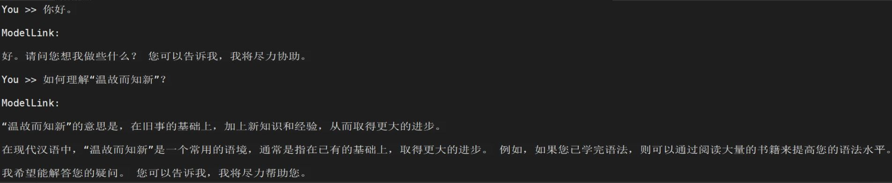

# Gemma  $\color{black}{\bf\tiny{【昇腾贡献模型】}}$

<p align="left">
        <b>简体中文</b> |
        <b><a href="README_en.md">English</a> </b> 
</p>

# 目录

- [Gemma-2B](#Gemma-2B)
  - [训练](#训练)
  - [脚本](#脚本)
  - [性能](#性能)
    - [吞吐](#吞吐)
  - [推理](#推理)
  - [评估](#评估)

- [Gemma-7B](#Gemma-7B)
  - [训练](#训练)
  - [脚本](#脚本)
  - [性能](#性能)
    - [吞吐](#吞吐)
  - [推理](#推理)
  - [评估](#评估)

# Gemma-2B

## 训练

Gemma-2B 训练的硬件配置:

| 硬件  |      配置      |
|:---:| :-------------: |
| NPU | 8 x Ascend NPUs |

### 脚本

1. 克隆仓库到本地服务器

    ```shell
    git clone https://gitee.com/ascend/ModelLink.git
    git clone https://github.com/NVIDIA/Megatron-LM.git
    cd Megatron-LM
    git checkout -f bcce6f
    cp -r megatron ../ModelLink/
    cd ..
    cd ModelLink
    mkdir logs
    mkdir model_from_hf
    mkdir dataset
    mkdir ckpt
    ```
2. 搭建环境

    ```bash
    # python3.8
    conda create -n test python=3.8
    conda activate test

    # 安装 torch 和 torch_npu
    pip install torch-2.2.0-cp38-cp38m-manylinux2014_aarch64.whl
    pip install torch_npu-2.2.0*-cp38-cp38m-linux_aarch64.whl
    pip install apex-0.1_ascend*-cp38-cp38m-linux_aarch64.whl

    # 安装加速库
    git clone https://gitee.com/ascend/AscendSpeed.git
    cd AscendSpeed
    git checkout 224ae35e8fc96778f957029d1371ddb623452a50
    pip install -r requirements.txt
    pip install -e .
    cd ..

    # 安装其余依赖库
    pip install -r requirements.txt
    ```
3. 下载 Gemma-2B 的 [预训练权重和词表](https://huggingface.co/google/gemma-2b/tree/main)

    ```bash
    mkdir ./model_from_hf/Gemma-2B/
    cd ./model_from_hf/Gemma-2B/
    wget https://huggingface.co/google/gemma-2b/resolve/main/config.json
    wget https://huggingface.co/google/gemma-2b/resolve/main/generation_config.json
    wget https://huggingface.co/google/gemma-2b/resolve/main/model-00001-of-00002.safetensors
    wget https://huggingface.co/google/gemma-2b/resolve/main/model-00002-of-00002.safetensors
    wget https://huggingface.co/google/gemma-2b/resolve/main/model.safetensors.index.json
    wget https://huggingface.co/google/gemma-2b/resolve/main/special_tokens_map.json
    wget https://huggingface.co/google/gemma-2b/resolve/main/tokenizer.json
    wget https://huggingface.co/google/gemma-2b/resolve/main/tokenizer.model
    wget https://huggingface.co/google/gemma-2b/resolve/main/tokenizer_config.json
    cd ../../
    ```
4. 权重转换

    将权重从 huggingface 格式转化为 megatron 格式
    ***（该场景一般用于使能开源的HuggingFace模型在Megatron上进行训练）***

    ```shell
    # 修改 ascend-toolkit 路径
    source /usr/local/Ascend/ascend-toolkit/set_env.sh

    python tools/checkpoint/convert_ckpt.py \
        --model-type GPT \
        --loader gemma_hf \
        --saver megatron \
        --target-tensor-parallel-size 1 \
        --target-pipeline-parallel-size 2 \
        --load-dir ./model_from_hf/Gemma-2B/ \
        --save-dir ./model_weights/Gemma-2B-v0.1-tp1-pp2/ \
        --tokenizer-model ./model_from_hf/Gemma-2B/tokenizer.model
    ```

   任意并行切分策略的Megatron权重 格式转化为 HuggingFace权重
   ***（该场景一般用于将训练好的megatron模型重新转回HuggingFace格式）***

    ```bash
    # 请按照您的真实环境修改 set_env.sh 路径
    source /usr/local/Ascend/ascend-toolkit/set_env.sh
    python tools/checkpoint/convert_ckpt.py \
        --model-type GPT \
        --loader megatron \
        --saver megatron \
        --save-model-type save_huggingface_gemma \
        --load-dir ./model_weights/Gemma-2B-v0.1-tp1-pp2/ \
        --target-tensor-parallel-size 1 \
        --target-pipeline-parallel-size 1 \
        --save-dir ./model_from_hf/Gemma-2B/     # 需要填入原始HF模型路径，新权重会存于./model_from_hf/Gemma-2B/mg2hg/
    ```
5. 准备数据集

    下载 Gemma-2B [数据集](https://huggingface.co/datasets/pleisto/wikipedia-cn-20230720-filtered/resolve/main/wikipedia-cn-20230720-filtered.json)

    ```shell
    # 下载数据
    cd ./dataset
    wget https://huggingface.co/datasets/pleisto/wikipedia-cn-20230720-filtered/resolve/main/wikipedia-cn-20230720-filtered.json
    cd ..

    # 处理数据
    mkdir ./dataset/Gemma-2B/
    python ./tools/preprocess_data.py \
        --input ./dataset/wikipedia-cn-20230720-filtered.json \
        --output-prefix ./dataset/Gemma-2B/wikipedia_cn \
        --tokenizer-type PretrainedFromHF \
        --tokenizer-name-or-path ./model_from_hf/Gemma-2B/ \
        --json-key completion \
        --workers 16 \
        --log-interval 1000
    ```
6. 预训练
   
    配置Gemma-2B 预训练脚本: examples/gemma/pretrain_gemma_2b_ptd.sh

    ```shell
    # 设置 ascend-toolkit 路径
    source /usr/local/Ascend/ascend-toolkit/set_env.sh 

    # 根据实际情况配置词表、数据集、模型参数保存路径
    CKPT_SAVE_DIR="./ckpt/Gemma-2B/"
    TOKENIZER_MODEL="./model_from_hf/Gemma-2B/"  #词表路径
    DATA_PATH="./dataset/Gemma-2B/wikipedia_cn_completion_document"  #数据集路径
    CKPT_LOAD_DIR="./model_weights/Gemma-2B-v0.1-tp1-pp2/"
    ```

    启动 Gemma-2B 预训练脚本: examples/gemma/pretrain_gemma_2b_ptd.sh

    ```shell
    bash examples/gemma/pretrain_gemma_2b_ptd.sh
    ```
    **注意**：如果使用多机训练，且没有设置数据共享，需要在训练启动脚本中增加`--no-shared-storage`参数，设置此参数之后将会根据分布式参数判断非主节点是否需要load数据，并检查相应缓存和生成数据。


7. 微调

    7.1 准备微调数据集
    下载微调数据集 [这里](https://huggingface.co/datasets/fnlp/moss-003-sft-data/tree/main)

    ```bash
    mkdir finetune_dataset
    cd ./finetune_dataset
    wget https://huggingface.co/datasets/fnlp/moss-003-sft-data/resolve/main/moss-003-sft-no-tools.jsonl.zip  --no-check-certificate
    unzip moss-003-sft-no-tools.jsonl.zip
    cd ..

    # 处理数据集  
    python tools/preprocess_data.py \
        --input ./finetune_dataset/moss-003-sft-no-tools.jsonl \
        --output-prefix ./finetune_dataset/Gemma-2B/moss \
        --tokenizer-type PretrainedFromHF \
        --tokenizer-name-or-path ./model_from_hf/Gemma-2B/ \
        --tokenizer-not-use-fast \
        --handler-name MOSSInstructionHandler
    ```
   
    7.2 全参微调

    全参微调的配置脚本基本和预训练脚本一致. *区别是数据集，以及增加训练参数--is-instruction-dataset*

    增加微调参数--finetune，使微调从第一步开始。

    ```bash
    CKPT_SAVE_DIR="./ckpt/Gemma-2B/"
    DATA_PATH="./finetune_dataset/Gemma-2B/moss"
    TOKENIZER_PATH="./model_from_hf/Gemma-2B/"
    CKPT_LOAD_DIR="./model_weights/Gemma-2B-v0.1-tp1-pp2/" 
    
        --finetune \
        --is-instruction-dataset \
        --tokenizer-not-use-fast \
    ```
   
### 性能

#### 吞吐

Gemma-2B 在 **昇腾芯片** 和 **参考芯片** 上的性能对比：

|  设备  |    模型    | tokens吞吐 (tokens/s/p) |
|:----:|:--------:|:---------------------:|
| NPUs | Gemma-2B |         6821          |
|  参考  | Gemma-2B |         7602          |


## 推理

配置 Gemma-2B 推理脚本：examples/gemma/generate_gemma_2b_ptd.sh

```bash
# ascend-toolkit 路径
source /usr/local/Ascend/ascend-toolkit/set_env.sh

# 修改模型权重路径和词表路径
CHECKPOINT="./model_weights/Gemma-2B-v0.1-tp1-pp2/"
TOKENIZER_PATH="./model_from_hf/Gemma-2B/"
```

启动Gemma-2B推理脚本

```bash
bash examples/gemma/generate_gemma_2b_ptd.sh
```

## 评估

使用[MMLU数据集](https://huggingface.co/datasets/cais/mmlu)评估模型.

配置Gemma-2b评估脚本: examples/gemma/evaluate_gemma_2b_ptd.sh

```bash
# ascend-toolkit 路径
source /usr/local/Ascend/ascend-toolkit/set_env.sh 

# 修改模型参数路径和词表路径
TOKENIZER_PATH="./model_from_hf/Gemma-2B/"  #词表路径
CHECKPOINT="./model_weights/Gemma-2B-v0.1-tp1-pp2/"  #模型路径

# 配置任务和数据集路径
DATA_PATH="./mmlu/data/test/"
TASK="mmlu"
```

启动评估

```bash
bash examples/gemma/evaluate_gemma_2b_ptd.sh
```

| 数据集 | 总学科数 | 总问题数 | 参考准确率 | NPU准确率 |
|:---:|:---:|:---:|:-----:|:------:|
| MMLU | 57 | 14042 | 39.7  |  39.4  |


# Gemma-7B

## 训练

Gemma-7B 训练的硬件配置:

| 硬件 |      配置      |
| :--: | :-------------: |
| NPU | 8 x Ascend NPUs |

### 脚本

1. 克隆仓库到本地服务器

    ```shell
    git clone https://gitee.com/ascend/ModelLink.git
    git clone https://github.com/NVIDIA/Megatron-LM.git
    cd Megatron-LM
    git checkout -f bcce6f
    cp -r megatron ../ModelLink/
    cd ..
    cd ModelLink
    mkdir logs
    mkdir model_from_hf
    mkdir dataset
    mkdir ckpt
    ```
2. 搭建环境

    ```bash
    # python3.8
    conda create -n test python=3.8
    conda activate test

    # 安装 torch 和 torch_npu
    pip install torch-2.2.0-cp38-cp38m-manylinux2014_aarch64.whl
    pip install torch_npu-2.2.0*-cp38-cp38m-linux_aarch64.whl
    pip install apex-0.1_ascend*-cp38-cp38m-linux_aarch64.whl

    # 安装加速库
    git clone https://gitee.com/ascend/AscendSpeed.git
    cd AscendSpeed
    git checkout 224ae35e8fc96778f957029d1371ddb623452a50
    pip install -r requirements.txt
    pip install -e .
    cd ..

    # 安装其余依赖库
    pip install -r requirements.txt
    ```
3. 下载 Gemma-7B 的 [预训练权重和词表](https://huggingface.co/Gemma/Gemma-7B/tree/main)

    ```bash
    mkdir ./model_from_hf/Gemma-7B/
    cd ./model_from_hf/Gemma-7B/
    wget https://huggingface.co/google/gemma-7b/resolve/main/config.json
    wget https://huggingface.co/google/gemma-7b/resolve/main/generation_config.json
    wget https://huggingface.co/google/gemma-7b/resolve/main/model-00001-of-00004.safetensors
    wget https://huggingface.co/google/gemma-7b/resolve/main/model-00002-of-00004.safetensors
    wget https://huggingface.co/google/gemma-7b/resolve/main/model-00003-of-00004.safetensors
    wget https://huggingface.co/google/gemma-7b/resolve/main/model-00004-of-00004.safetensors
    wget https://huggingface.co/google/gemma-7b/resolve/main/model.safetensors.index.json
    wget https://huggingface.co/google/gemma-7b/resolve/main/special_tokens_map.json
    wget https://huggingface.co/google/gemma-7b/resolve/main/tokenizer.json
    wget https://huggingface.co/google/gemma-7b/resolve/main/tokenizer.model
    wget https://huggingface.co/google/gemma-7b/resolve/main/tokenizer_config.json
    cd ../../
    ```
4. 权重转换

    将权重从 huggingface 格式转化为 megatron 格式
    ***（该场景一般用于使能开源的HuggingFace模型在Megatron上进行训练）***

    ```shell
    # 修改 ascend-toolkit 路径
    source /usr/local/Ascend/ascend-toolkit/set_env.sh

    python tools/checkpoint/convert_ckpt.py \
        --model-type GPT \
        --loader gemma_hf \
        --saver megatron \
        --target-tensor-parallel-size 8 \
        --target-pipeline-parallel-size 1 \
        --load-dir ./model_from_hf/Gemma-7B/ \
        --save-dir ./model_weights/Gemma-7B-v0.1-tp8-pp1/ \
        --tokenizer-model ./model_from_hf/Gemma-7B/tokenizer.model
    ```

    任意并行切分策略的Megatron权重 格式转化为 HuggingFace权重
    ***（该场景一般用于将训练好的megatron模型重新转回HuggingFace格式）***

    ```bash
    # 请按照您的真实环境修改 set_env.sh 路径
    source /usr/local/Ascend/ascend-toolkit/set_env.sh
    python tools/checkpoint/convert_ckpt.py \
        --model-type GPT \
        --loader megatron \
        --saver megatron \
        --save-model-type save_huggingface_gemma \
        --load-dir ./model_weights/Gemma-7B-v0.1-tp8-pp1/ \
        --target-tensor-parallel-size 1 \
        --target-pipeline-parallel-size 1 \
        --save-dir ./model_from_hf/Gemma-7B/     # 需要填入原始HF模型路径，新权重会存于./model_from_hf/Gemma-7B/mg2hg/
    ```
5. 准备数据集

    下载 Gemma-7B [数据集](https://huggingface.co/datasets/pleisto/wikipedia-cn-20230720-filtered/resolve/main/wikipedia-cn-20230720-filtered.json)

    ```shell
    # 下载数据
    cd ./dataset
    wget https://huggingface.co/datasets/pleisto/wikipedia-cn-20230720-filtered/resolve/main/wikipedia-cn-20230720-filtered.json
    cd ..

    # 处理数据
    mkdir ./dataset/Gemma-7B/
    python ./tools/preprocess_data.py \
        --input ./dataset/wikipedia-cn-20230720-filtered.json \
        --output-prefix ./dataset/Gemma-7B/wikipedia_cn \
        --tokenizer-type PretrainedFromHF \
        --tokenizer-name-or-path ./model_from_hf/Gemma-7B/ \
        --json-key completion \
        --workers 16 \
        --log-interval 1000
    ```
6. 预训练

    配置Gemma-7B 预训练脚本: examples/gemma/pretrain_gemma_7b_ptd.sh

    ```shell
    # 设置 ascend-toolkit 路径
    source /usr/local/Ascend/ascend-toolkit/set_env.sh 

    # 根据实际情况配置词表、数据集、模型参数保存路径
    CKPT_SAVE_DIR="./ckpt/Gemma-7B/"
    TOKENIZER_MODEL="./model_from_hf/Gemma-7B/"  #词表路径
    DATA_PATH="./dataset/Gemma-7B/wikipedia_cn_completion_document"  #数据集路径
    CKPT_LOAD_DIR="./model_weights/Gemma-7B-v0.1-tp8-pp1/"
    ```

    启动 Gemma-7B 预训练脚本: examples/gemma/pretrain_gemma_7b_ptd.sh

    ```shell
    bash examples/gemma/pretrain_gemma_7b_ptd.sh
    ```
    **注意**：如果使用多机训练，且没有设置数据共享，需要在训练启动脚本中增加`--no-shared-storage`参数，设置此参数之后将会根据分布式参数判断非主节点是否需要load数据，并检查相应缓存和生成数据。


7. 微调

    7.1 准备微调数据集
    下载微调数据集 [这里](https://huggingface.co/datasets/fnlp/moss-003-sft-data/tree/main)

    ```bash
    mkdir finetune_dataset
    cd ./finetune_dataset
    wget https://huggingface.co/datasets/fnlp/moss-003-sft-data/resolve/main/moss-003-sft-no-tools.jsonl.zip  --no-check-certificate
    unzip moss-003-sft-no-tools.jsonl.zip
    cd ..

    # 处理数据集  
    python tools/preprocess_data.py \
        --input ./finetune_dataset/moss-003-sft-no-tools.jsonl \
        --output-prefix ./finetune_dataset/Gemma-7B/moss \
        --tokenizer-type PretrainedFromHF \
        --tokenizer-name-or-path ./model_from_hf/Gemma-7B/ \
        --tokenizer-not-use-fast \
        --handler-name MOSSInstructionHandler
    ```
   
    7.2 全参微调

    全参微调的配置脚本基本和预训练脚本一致. *区别是数据集，以及增加训练参数--is-instruction-dataset*

    增加微调参数--finetune，使微调从第一步开始。

    ```bash
    CKPT_SAVE_DIR="./ckpt/Gemma-7B/"
    DATA_PATH="./finetune_dataset/Gemma-7B/moss"
    TOKENIZER_PATH="./model_from_hf/Gemma-7B/"
    CKPT_LOAD_DIR="./model_weights/Gemma-7B-v0.1-tp8-pp1/" 
    
        --finetune \
        --is-instruction-dataset \
        --tokenizer-not-use-fast \
    ```
  
    7.3 Lora微调

    Lora微调的脚本配置是在全参微调脚本基础上加上lora参数，如下所示:
    
    ```bash
        --lora-target-modules query_key_value dense dense_h_to_4h dense_4h_to_h \
        --lora-r 16 \
        --lora-alpha 32 \
    ```
   
    如果模型的词表变化了，可以加上以下参数（词表不变不建议添加）

    ```bash
        --lora-modules-to-save word_embeddings output_layer \
    ```
   
    添加下列参数，用于从上一个检查点恢复Lora模型继续训练:

    ```bash
        --load ${ORIGIN_CHECKPOINT}  \
        --lora-load ${LORA_CHECKPOINT} \
    ```
   
    启动Lora微调脚本: examples/gemma/tune_gemma_7b_ptd.sh
    
    ```shell
    bash examples/gemma/tune_gemma_7b_ptd.sh
    ```
   
### 性能

#### 吞吐

Gemma-7B 在 **昇腾芯片** 和 **参考芯片** 上的性能对比：

|  设备  |   模型    | tokens吞吐 (tokens/s/p) |
|:------:|:-------:|:---------------------:|
|  NPUs  | Gemma-7B |         2938          |
|  参考  | Gemma-7B |         2607          |


## 推理

配置 Gemma-7B 推理脚本：examples/gemma/generate_gemma_7b_ptd.sh

```bash
# ascend-toolkit 路径
source /usr/local/Ascend/ascend-toolkit/set_env.sh

# 修改模型权重路径和词表路径
CHECKPOINT="./model_weights/Gemma-7B-v0.1-tp8-pp1/"
TOKENIZER_PATH="./model_from_hf/Gemma-7B/"
```

配置 Gemma-7B lora推理脚本: examples/gemma/generate_gemma_7b_lora_ptd.sh

```bash
# 修改lora权重路径
CHECKPOINT_LORA="your lora model directory path"
```

启动Gemma-7B推理脚本

```bash
bash examples/gemma/generate_gemma_7b_ptd.sh
```

启动Gemma-7B lora推理脚本

```bash
bash examples/gemma/generate_gemma_7b_lora_ptd.sh
```

Lora推理的示例如下:


## 评估

使用[MMLU数据集](https://huggingface.co/datasets/cais/mmlu)评估模型.

配置Gemma-7B评估脚本: examples/gemma/evaluate_gemma_7b_ptd.sh

```bash
# ascend-toolkit 路径
source /usr/local/Ascend/ascend-toolkit/set_env.sh 

# 修改模型参数路径和词表路径
TOKENIZER_PATH="./model_from_hf/Gemma-7B/"  #词表路径
CHECKPOINT="./model_weights/Gemma-7B-v0.1-tp8-pp1/"  #模型路径

# 配置任务和数据集路径
DATA_PATH="./mmlu/data/test/"
TASK="mmlu"
```

启动评估

```bash
bash examples/gemma/evaluate_gemma_7b_ptd.sh
```

| 数据集 | 总学科数 | 总问题数 | 参考准确率 | NPU准确率 |
|:---:|:---:|:---:|:-----:|:------:|
| MMLU | 57 | 14042 | 52.2  |  52.2  |
