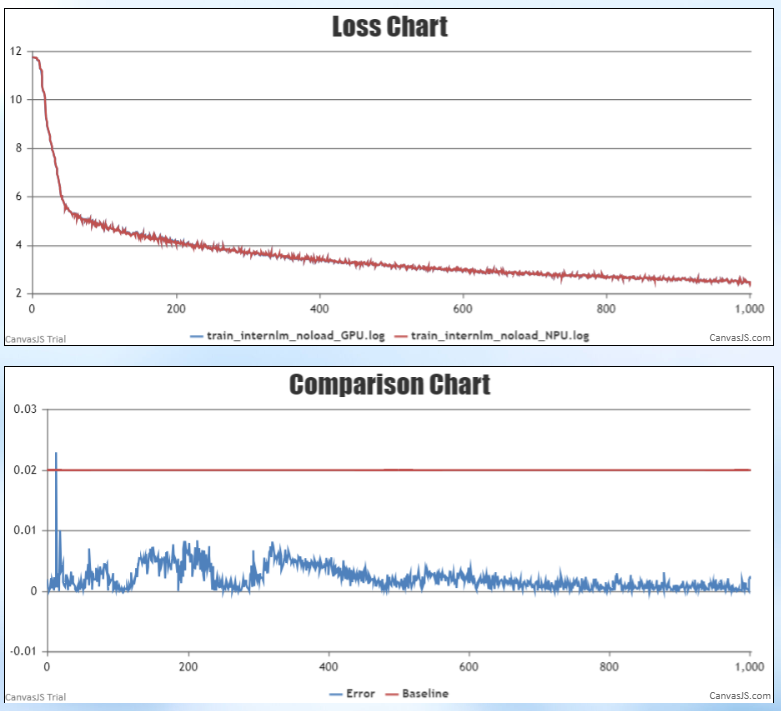
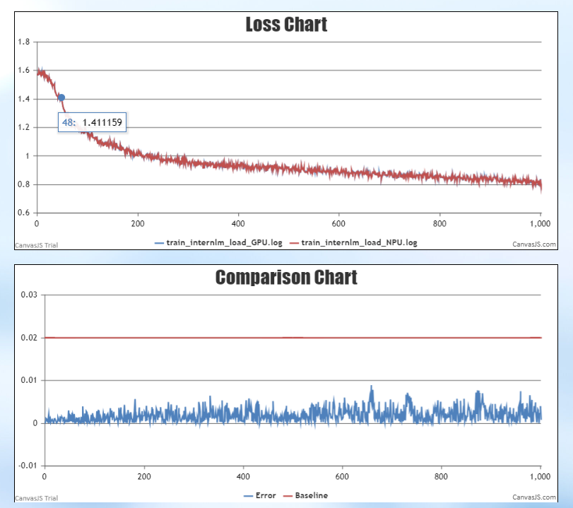
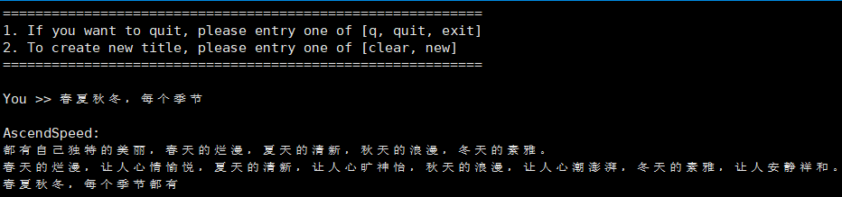
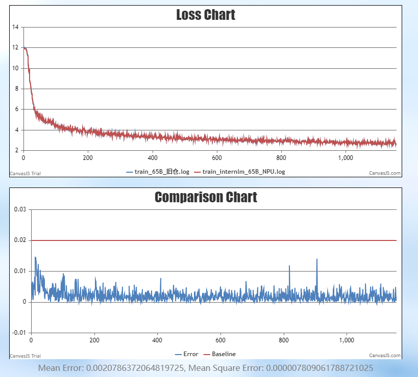

# Intern-LM
<p align="left">
        <b>简体中文</b> |
        <b><a href="https://gitee.com/ascend/AscendSpeed/blob/master/examples/intern/README_en.md">English</a> </b> 
    </p>
</p>

# 目录

- [Internlm-7B](#internlm-7b)
  - [训练](#训练)
    - [脚本](#脚本)
    - [性能](#性能)
      - [吞吐](#吞吐)
      - [精度](#精度)
    - [推理](#推理)
    - [评估](#评估)
- [Internlm-65B](#internlm-65b)
  - [训练](#训练)
    - [脚本](#脚本)
    - [性能](#性能)
      - [吞吐](#吞吐)
      - [精度](#精度)

# InternLM-7B

## 训练

InternLM-7B 训练的硬件配置如下:

|  硬件 |       配置        |
|:---:|:---------------:|
| NPU | 8 x Ascend NPUs |


### 脚本

1. 拷贝仓库到本地服务器
```shell
git clone https://gitee.com/ascend/ModelLink.git 
cd ModeLlink 
git checkout modellink 
mkdir logs
mkdir ckpt
```

2. 搭建环境

```bash
# python3.8
conda create -n test python=3.8
conda activate test

# 安装 torch 和 torch_npu 
pip install torch-2.1.0-cp38-cp38m-linux_aarch64.whl
pip install torch_npu-2.1.0.XXX-cp38-cp38m-linux_XXX.whl
pip install apex-0.1_ascend*-cp38-cp38m-linux_aarch64.whl

# 修改 ascend-toolkit 路径
source /usr/local/Ascend/ascend-toolkit/set_env.sh 

# 安装加速库
git clone https://gitee.com/ascend/AscendSpeed.git
cd AscendSpeed
pip install -r requirements.txt 
pip3 install -e .
cd ..

# 安装其余依赖库
pip install -r requirements.txt 
```

3. 下载 Internlm-7B [词表文件](https://huggingface.co/internlm/internlm-7b/tree/main)

```shell
#!/bin/bash
mkdir -p dataset/internlm
cd ./dataset/internlm
wget https://huggingface.co/internlm/internlm-7b/resolve/main/config.json
wget https://huggingface.co/internlm/internlm-7b/resolve/main/generation_config.json
wget https://huggingface.co/internlm/internlm-7b/resolve/main/special_tokens_map.json
wget https://huggingface.co/internlm/internlm-7b/resolve/main/tokenization_internlm.py
wget https://huggingface.co/internlm/internlm-7b/resolve/main/tokenizer.model
wget https://huggingface.co/internlm/internlm-7b/resolve/main/tokenizer_config.json
cd ../..
```

4. 下载 Internlm-7B [数据集](https://huggingface.co/datasets/tatsu-lab/alpaca/resolve/main/data/train-00000-of-00001-a09b74b3ef9c3b56.parquet) 

```shell
cd dataset/
wget https://huggingface.co/datasets/tatsu-lab/alpaca/resolve/main/data/train-00000-of-00001-a09b74b3ef9c3b56.parquet
cd ..
```

```shell
#!/bin/bash
source /usr/local/Ascend/ascend-toolkit/set_env.sh 
python ./tools/preprocess_data.py \
    --input ./dataset/train-00000-of-00001-a09b74b3ef9c3b56.parquet \
    --tokenizer-name-or-path ./dataset/internlm \
    --output-prefix ./dataset/alpaca \
    --workers 4 \
    --log-interval 1000  \
    --tokenizer-type PretrainedFromHF  \
    --handler-name AlpacaPretrainHandler  \
    --tokenizer-not-use-fast \
    --append-eod
```

5. 权重格式转换

下载 Internlm-7B [权重](https://huggingface.co/internlm/internlm-7b/tree/main) 


```shell
mkdir model_from_hf
cd ./model_from_hf
# 必须安装 git-lfs
git clone https://huggingface.co/internlm/internlm-7b
cd ..
```

将模型权重从 huggingface 格式转换为 ModelLink 可以处理的格式
```shell
mkdir model_weights
SCRIPT_PATH=./tools/ckpt_convert/llama/convert_weights_from_huggingface.py
python $SCRIPT_PATH \
    --input-model-dir ./model_from_hf/internlm-7b/ \
    --output-model-dir ./model_weights \
    --tensor-model-parallel-size 8 \
    --pipeline-model-parallel-size 1 \
    --type 7B \
    --bias \
    --merge-mlp
```

6. 配置 Internlm-7B 预训练脚本

```shell
# 修改 ascend-toolkit 路径
source /usr/local/Ascend/ascend-toolkit/set_env.sh 
# 修改数据集，词表，权重等路径
CKPT_SAVE_DIR="your model ckpt save path"
TOKENIZER_PATH="your tokenizer path"#词表路径
DATA_PATH="your data path" #数据集路径
```

7. 启动 Internlm-7B 预训练脚本

```shell
bash examples/intern/pretrain_internlm_7b_ptd.sh 
```


### 性能

#### 吞吐

Internlm-7B 在 **昇腾芯片** 和 **参考芯片** 上的性能对比：

| 设备 | 模型          | 总迭代数 | 样本吞吐 (samples/s) | token吞吐 (tokens/p/s) | 单步迭代时间 (s/step) | 
|----|-------------|------|--------------------|----------------------|-----------------|
| NPUs | Internlm-7B | 1000 | 11.18             | 2864                 | 5.72        |
| 参考 | Internlm-7B | - | -              | 4078                 |  -            | 


#### 精度

NPU vs 参考 （无预训练权重） loss 对比和相对误差


NPU vs 参考 （有预训练权重） loss 对比和相对误差


#### 推理
<a href="https://gitee.com/ascend/AscendSpeed/blob/master/examples/intern/generate_internlm_7b_deepspeed.sh">推理脚本</a>：
examples/intern/generate_internlm_7b_ptd.sh 
```
bash examples/intern/generate_lnternlm_7b_ptd.sh
```
推理举例：


#### 评估
<a href="https://gitee.com/ascend/AscendSpeed/blob/master/tasks/evaluation/eval_internlm.sh">评估脚本</a>:
tasks/evaluation/eval_internlm.sh 
```
bash  tasks/evaluation/eval_internlm.sh
```
InternLM-7B在**Ascend NPU**中的评测表现：

| 任务                                                  | 模型        | 昇腾值  | 社区值  |
|-----------------------------------------------------|-----------|------|------|
| [MMLU](https://huggingface.co/datasets/cais/mmlu) | Internlm-7B  | 48.7 | [51.0](https://huggingface.co/internlm/internlm-7b) | 

# InternLM-65B

## 训练

InternLM-65B 训练的硬件配置如下:

|  硬件 |       配置        |
|:---:|:---------------:|
| NPU | 32 x Ascend NPUs |


### 脚本

1. 拷贝仓库到本地服务器
```shell
git clone https://gitee.com/ascend/ModelLink.git 
cd ModeLlink 
git checkout modellink 
mkdir logs
mkdir ckpt
cd ..
```

2. 搭建环境

```bash
# python3.8
conda create -n test python=3.8
conda activate test

# 安装 torch 和 torch_npu 
pip install torch-2.1.0-cp38-cp38m-linux_aarch64.whl
pip install torch_npu-2.1.0.XXX-cp38-cp38m-linux_XXX.whl
pip install apex-0.1_ascend*-cp38-cp38m-linux_aarch64.whl

# 修改 ascend-toolkit 路径
source /usr/local/Ascend/ascend-toolkit/set_env.sh 

# 安装加速库
git clone https://gitee.com/ascend/AscendSpeed.git
cd AscendSpeed
pip install -r requirements.txt 
pip3 install -e .
cd ..

# 安装其余依赖库
pip install -r requirements.txt 
```

3. 下载 [词表文件](https://huggingface.co/internlm/internlm-7b/tree/main)

```shell
#!/bin/bash
mkdir -p dataset/internlm
cd ./dataset/internlm
wget https://huggingface.co/internlm/internlm-7b/resolve/main/config.json
wget https://huggingface.co/internlm/internlm-7b/resolve/main/generation_config.json
wget https://huggingface.co/internlm/internlm-7b/resolve/main/special_tokens_map.json
wget https://huggingface.co/internlm/internlm-7b/resolve/main/tokenization_internlm.py
wget https://huggingface.co/internlm/internlm-7b/resolve/main/tokenizer.model
wget https://huggingface.co/internlm/internlm-7b/resolve/main/tokenizer_config.json
cd ../..
```

4. 下载 Internlm-65B [数据集](https://huggingface.co/datasets/tatsu-lab/alpaca/resolve/main/data/train-00000-of-00001-a09b74b3ef9c3b56.parquet) 

```shell
cd dataset/
wget https://huggingface.co/datasets/tatsu-lab/alpaca/resolve/main/data/train-00000-of-00001-a09b74b3ef9c3b56.parquet
cd ..
```

```shell
#!/bin/bash
source /usr/local/Ascend/ascend-toolkit/set_env.sh 
python ./tools/preprocess_data.py \
    --input ./dataset/train-00000-of-00001-a09b74b3ef9c3b56.parquet \
    --tokenizer-name-or-path ./dataset/internlm \
    --output-prefix ./dataset/alpaca \
    --workers 4 \
    --log-interval 1000  \
    --tokenizer-type PretrainedFromHF  \
    --handler-name AlpacaPretrainHandler  \
    --tokenizer-not-use-fast \
    --append-eod
```

5. 配置 Internlm-65B 预训练脚本

```shell
# 修改 ascend-toolkit 路径
source /usr/local/Ascend/ascend-toolkit/set_env.sh 
# 修改数据集，词表，权重等路径
CKPT_SAVE_DIR="your model ckpt save path"
TOKENIZER_PATH="your tokenizer path"#词表路径
DATA_PATH="your data path" #数据集路径
```

6. 启动 Internlm-65B 预训练脚本

```shell
bash examples/intern/pretrain_internlm_65b_ptd.sh 
```


### 性能

#### 吞吐

Internlm-65B 在 **昇腾芯片** 和 **参考芯片** 上的性能对比：

| 设备 | 模型          | 总迭代数 | 样本吞吐 (samples/p/s) | token吞吐 (tokens/p/s) | 单步迭代时间 (s/step) | 
|----|-------------|------|--------------------|----------------------|-----------------|
| NPUs | Internlm-65B |  |      5.25      |            336    |     24.4     | 
| Reference | Internlm-65B | - | -              | 414                 | -            | 


#### 精度

NPU vs 参考 （无预训练权重） loss 对比和相对误差
