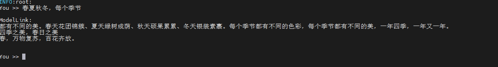

# Intern-LM
<p align="left">
        <b><a href="https://gitee.com/ascend/Modellink/blob/modellink/examples/intern/README.md">简体中文</a></b> |
        <b>English</b> 
    </p>
</p>

#  Contents

- [Contents](#contents)
- [Internlm-7B](#internlm-7b)
  - [Training](#training)
    - [Script](#script)
    - [Performance](#performance)
      - [Machine performance](#machine-performance)
  - [Inference](#Inference)
  - [Evaluation](#Evaluation)
- [Contents](#contents)
- [Internlm-65B](#internlm-65b)
  - [Training](#training)
    - [Script](#script)
    - [Performance](#performance)
      - [Machine performance](#machine-performance)

# InternLM-7B

## Training

Here's a hardware summary of pre-training InternLM-7B:

| Hardware |                      Value                      |
| :------: | :---------------------------------------------: |
|   NPU    |               8 x Ascend NPUs                   |

### Script

1. Clone the repository to your local server:
```shell
git clone https://gitee.com/ascend/ModelLink.git 
cd ModeLlink 
mkdir logs
mkdir ckpt
```

2. Build environment

```bash
# python3.8
conda create -n test python=3.8
conda activate test

# install torch and torch_npu 
pip install torch-2.1.0-cp38-cp38m-linux_aarch64.whl
pip install torch_npu-2.1.0.XXX-cp38-cp38m-linux_XXX.whl
pip install apex-0.1_ascend*-cp38-cp38m-linux_aarch64.whl

# modify the path according to your own  ascend-toolkit path
source /usr/local/Ascend/ascend-toolkit/set_env.sh 

# install AscendSpeed
git clone https://gitee.com/ascend/AscendSpeed.git
cd AscendSpeed
pip install -r requirements.txt 
pip3 install -e .
cd ..

# install other packages
pip install -r requirements.txt 
```


3. Download the Internlm-7B tokenizer model and file from [here](https://huggingface.co/internlm/internlm-7b/tree/main) 

```shell
#!/bin/bash
mkdir -p dataset/internlm
cd ./dataset/internlm
wget https://huggingface.co/internlm/internlm-7b/resolve/main/config.json
wget https://huggingface.co/internlm/internlm-7b/resolve/main/generation_config.json
wget https://huggingface.co/internlm/internlm-7b/resolve/main/special_tokens_map.json
wget https://huggingface.co/internlm/internlm-7b/resolve/main/tokenization_internlm.py
wget https://huggingface.co/internlm/internlm-7b/resolve/main/tokenizer.model
wget https://huggingface.co/internlm/internlm-7b/resolve/main/tokenizer_config.json
cd ../..
```

4. Prepare dataset. Download the Internlm-7B datasets from [here](https://huggingface.co/datasets/tatsu-lab/alpaca/resolve/main/data/train-00000-of-00001-a09b74b3ef9c3b56.parquet) 

```shell
cd dataset/
wget https://huggingface.co/datasets/tatsu-lab/alpaca/resolve/main/data/train-00000-of-00001-a09b74b3ef9c3b56.parquet
cd ..
```

```shell
#!/bin/bash
source /usr/local/Ascend/ascend-toolkit/set_env.sh 
python ./tools/preprocess_data.py \
    --input ./dataset/train-00000-of-00001-a09b74b3ef9c3b56.parquet \
    --tokenizer-name-or-path ./dataset/internlm \
    --output-prefix ./dataset/alpaca \
    --workers 4 \
    --log-interval 1000  \
    --tokenizer-type PretrainedFromHF  \
    --handler-name AlpacaPretrainHandler  \
    --tokenizer-not-use-fast \
    --append-eod
```

5. Weights convert

Download the Internlm-7B checkpoint from [here](https://huggingface.co/internlm/internlm-7b/tree/main) 
```shell
mkdir model_from_hf
cd ./model_from_hf
# you must install git-lfs
git clone https://huggingface.co/internlm/internlm-7b
cd ..
```

In order to adapt to the internlm-7B model, the following script is used to convert the model pre-training weights.
```shell
mkdir model_weights
python tools/checkpoint/util.py --model-type GPT \
                                --loader llama2_hf \
                                --saver megatron \
                                --target-tensor-parallel-size 8 \
                                --target-pipeline-parallel-size 1 \
                                --load-dir ./model_from_hf/internlm-7b/ \
                                --save-dir ./model_weights \
                                --tokenizer-model ./intern-7b-hf/tokenizer.model \
                                --add-qkv-bias \
                                --add-dense-bias
```

6. Config Internlm-7B pre-training script.

```shell
# modify the script according to your own  ascend-toolkit path
source /usr/local/Ascend/ascend-toolkit/set_env.sh 
# modify script orign dataset path according to your own dataset path
CKPT_SAVE_DIR="your model ckpt save path"
CKPT_LOAD_DIR="your init model load path"
TOKENIZER_PATH="./model_from_hf/internlm-7b/tokenizer.model"  #tokenizer path
DATA_PATH="./dataset/alpaca/alpaca_text_document"  #processed dataset
```

7. Launch Internlm-7B pre-training script.

```shell
bash examples/intern/pretrain_internlm_7b_ptd.sh 
```


### Performance

#### Machine performance

The performance of Internlm-7B in **Ascend NPU** and **Reference**:

| Device | Model       | total Iterations | throughput rate (samples/s) | throughput rate (tokens/s/p) | single-step time (s/step) | 
|----|-------------|------|--------------------|----------------------|-----------------|
| NPUs | Internlm-7B | 1000 | 10.85            | 2776                 | 5.90            | 
| benchmarks | Internlm-7B | 1000 | 11.14               | 2854                 |  5.74         | 


#### Inference
Inference script</a>：
tasks/inference/generate_lnternlm_7b_ptd.sh
```
bash ./tasks/inference/generate_lnternlm_7b_ptd.sh
```

Inference case:


#### Evaluation
Evaluation script</a>:
tasks/evaluation/eval_internlm.sh 
```
bash  tasks/evaluation/eval_internlm.sh
```
The evaluation performance of LLaMA-7B/13B in **Ascend NPU**:

| Task    | Model     | NPU  | Benchmark |
|-----------------------------------------------------|-----------|------|------|
| [MMLU](https://huggingface.co/datasets/cais/mmlu) | Internlm-7B  | 48.7 | [51.0](https://huggingface.co/internlm/internlm-7b) | 

# InternLM-65B

## Training

Here's a hardware summary of pre-training InternLM-65B:

| Hardware |                      Value                      |
| :------: | :---------------------------------------------: |
|   NPU    |               32 x Ascend NPUs                   |

### Script

1. Clone the repository to your local server:
```shell
git clone https://gitee.com/ascend/ModelLink.git 
cd ModeLlink 
mkdir logs
mkdir ckpt
```

2. Build environment

```bash
# python3.8
conda create -n test python=3.8
conda activate test

# install torch and torch_npu 
pip install torch-2.1.0-cp38-cp38m-linux_aarch64.whl
pip install torch_npu-2.1.0.XXX-cp38-cp38m-linux_XXX.whl
pip install apex-0.1_ascend*-cp38-cp38m-linux_aarch64.whl

# modify the path according to your own  ascend-toolkit path
source /usr/local/Ascend/ascend-toolkit/set_env.sh 

# install AscendSpeed
git clone https://gitee.com/ascend/AscendSpeed.git
cd AscendSpeed
pip install -r requirements.txt 
pip3 install -e .
cd ..

# install other packages
pip install -r requirements.txt 
```

3. Download tokenizer model and file from [here](https://huggingface.co/internlm/internlm-7b/tree/main) 

```shell
#!/bin/bash
mkdir -p dataset/internlm
cd ./dataset/internlm
wget https://huggingface.co/internlm/internlm-7b/resolve/main/config.json
wget https://huggingface.co/internlm/internlm-7b/resolve/main/generation_config.json
wget https://huggingface.co/internlm/internlm-7b/resolve/main/special_tokens_map.json
wget https://huggingface.co/internlm/internlm-7b/resolve/main/tokenization_internlm.py
wget https://huggingface.co/internlm/internlm-7b/resolve/main/tokenizer.model
wget https://huggingface.co/internlm/internlm-7b/resolve/main/tokenizer_config.json
cd ../..
```

4. Prepare dataset. Download the Internlm-65B datasets from [here](https://huggingface.co/datasets/tatsu-lab/alpaca/resolve/main/data/train-00000-of-00001-a09b74b3ef9c3b56.parquet) 

```shell
cd dataset/
wget https://huggingface.co/datasets/tatsu-lab/alpaca/resolve/main/data/train-00000-of-00001-a09b74b3ef9c3b56.parquet
cd ..
```

```shell
#!/bin/bash
source /usr/local/Ascend/ascend-toolkit/set_env.sh 
python ./tools/preprocess_data.py \
    --input ./dataset/train-00000-of-00001-a09b74b3ef9c3b56.parquet \
    --tokenizer-name-or-path ./dataset/internlm \
    --output-prefix ./dataset/alpaca \
    --workers 4 \
    --log-interval 1000  \
    --tokenizer-type PretrainedFromHF  \
    --handler-name AlpacaPretrainHandler  \
    --tokenizer-not-use-fast \
    --append-eod
```

5. Config Internlm-65B pre-training script.

```shell
# modify the script according to your own  ascend-toolkit path
source /usr/local/Ascend/ascend-toolkit/set_env.sh 
# modify script orign dataset path according to your own dataset path
TOKENIZER_PATH=./dataset/internlm  #tokenizer path
DATA=./dataset/alpaca_text_document  #processed dataset
CHECKPOINT=./model_weights/
```

6. Launch Internlm-65B pre-training script.

```shell
bash examples/intern/pretrain_internlm_65b_ptd.sh 
```


### Performance

#### Machine performance

The performance of Internlm-65B in **Ascend NPU** and **Reference**:

| Device | Model       | total Iterations | throughput rate (samples/s/p) | throughput rate (tokens/s/p) | single-step time (s/step) | 
|----|-------------|------|--------------------|----------------------|-----------------|
| NPUs | Internlm-65B |  |          5.33 |             341   |   48       | 
| Reference | Internlm-65B | - | -              | 414                 | -            | 
