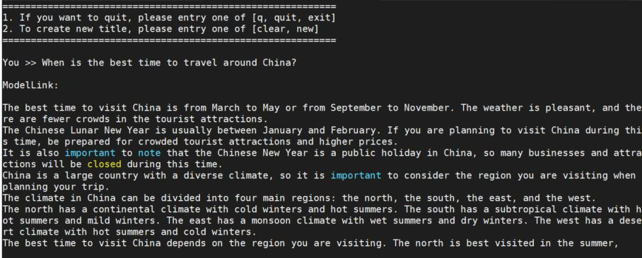
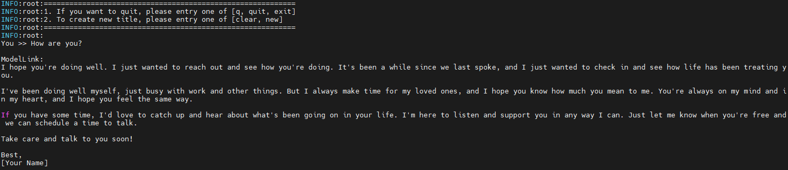
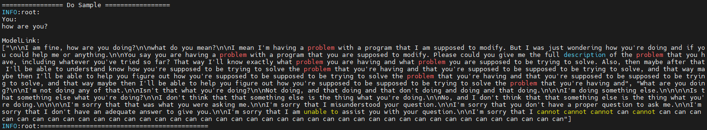
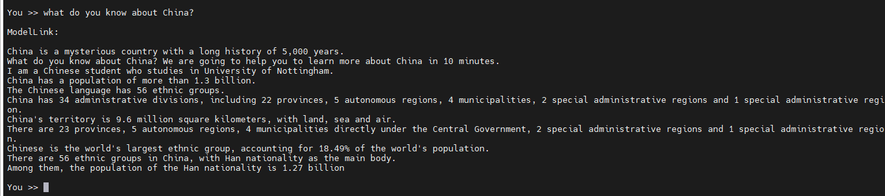

# LLaMA2

<p align="left">
        <b>简体中文</b> |
        <b><a href="README_en.md">English</a> </b> 
</p>

# 目录

- [LLAMA2-7B](#LLAMA2-7B)
  - [训练](#训练)
  - [脚本](#脚本)
  - [性能](#性能)
    - [吞吐](#吞吐)
  - [推理](#推理-7B)
  - [评估](#评估-7B)

- [LLaMA2-13B](#LLaMA2-13B)
  - [训练](#训练)
  - [脚本](#脚本)
  - [性能](#性能)
    - [吞吐](#吞吐)
  - [推理](#推理)
  - [评估](#评估)

- [LLaMA2-34B/70B](#LLaMA2-34B/70B)
  - [训练](#训练-2)
    - [脚本](#脚本-2)
    - [性能](#性能-2)
      - [吞吐](#吞吐-2)
  - [推理](#推理-2)
  - [评估](#评估-2)


# LLAMA2-7B

## 训练

LLAMA2-7B 训练的硬件配置:

| 硬件 |      配置      |
| :--: | :-------------: |
| NPU | 8 x Ascend NPUs |

### 脚本

1. 拷贝代码仓到本地服务器

   ```shell
   git clone https://gitee.com/ascend/ModelLink.git 
   cd ModelLink
    mkdir logs
    mkdir ckpt
   pip install -r requirements.txt
   cd ..
   ```
2. 搭建环境

   ```bash
   # python3.8
   conda create -n test python=3.8
   conda activate test
   
   # 安装 torch 和 torch_npu
   pip install torch-2.1.0-cp38-cp38m-manylinux2014_aarch64.whl
   pip install torch_npu-2.1.0*-cp38-cp38m-linux_aarch64.whl
   pip install apex-0.1_ascend*-cp38-cp38m-linux_aarch64.whl

   # 修改 ascend-toolkit 路径
   source /usr/local/Ascend/ascend-toolkit/set_env.sh 
   
   # 安装加速库
   git clone https://gitee.com/ascend/AscendSpeed.git
   cd AscendSpeed
   pip install -r requirements.txt 
   pip3 install -e .
   cd ..
   
   # 安装其余依赖库
   pip install -r requirements.txt 
   ```
3. 下载 LLAMA2-7B 的 [预训练权重和词表](https://huggingface.co/daryl149/llama-2-7b-hf/tree/main)

   ```shell
     #!/bin/bash
     mkdir -p llama-2-7b-hf
     cd llama-2-7b-hf
     wget https://huggingface.co/daryl149/llama-2-7b-hf/resolve/main/config.json
     wget https://huggingface.co/daryl149/llama-2-7b-hf/resolve/main/generation_config.json
     wget https://huggingface.co/daryl149/llama-2-7b-hf/resolve/main/pytorch_model-00001-of-00002.bin
     wget https://huggingface.co/daryl149/llama-2-7b-hf/resolve/main/pytorch_model-00002-of-00002.bin
     wget https://huggingface.co/daryl149/llama-2-7b-hf/resolve/main/pytorch_model.bin.index.json
     wget https://huggingface.co/daryl149/llama-2-7b-hf/resolve/main/special_tokens_map.json
     wget https://huggingface.co/daryl149/llama-2-7b-hf/resolve/main/tokenizer.json
     wget https://huggingface.co/daryl149/llama-2-7b-hf/resolve/main/tokenizer.model
     wget https://huggingface.co/daryl149/llama-2-7b-hf/resolve/main/tokenizer_config.json
     cd ..
   ```

4. 权重转换

   4.1 将权重从 huggingface 格式转化为 magatron 格式
   ***（该场景一般用于使能开源的HuggingFace模型在Megatron上进行训练）***

   ```bash
    cd ModelLink
    # 修改 ascend-toolkit 路径
    source /usr/local/Ascend/ascend-toolkit/set_env.sh
   
    # 权重格式转换
    python tools/checkpoint/convert_ckpt.py --model-type GPT \
                                    --loader llama2_hf \
                                    --saver megatron \
                                    --target-tensor-parallel-size 8 \
                                    --target-pipeline-parallel-size 1 \
                                    --load-dir ../llama-2-7b-hf \
                                    --save-dir {your megatron ckpt save path} \
                                    --tokenizer-model ../llama-2-7b-hf/tokenizer.model
   cd ..
   ```

   4.2 任意并行切分策略的 Megatron 权重 格式转化为 HuggingFace权重
   ***（该场景一般用于将训练好的megatron模型重新转回HuggingFace格式）***
```shell
cd ModelLink/
# 请按照您的真实环境修改 set_env.sh 路径
source /usr/local/Ascend/ascend-toolkit/set_env.sh
python tools/checkpoint/convert_ckpt.py --model-type GPT \
    --loader megatron \
    --saver megatron \
    --save-model-type save_huggingface_llama \
    --load-dir ../llama27B-v0.1-pt8-pp1 \
    --target-tensor-parallel-size 1 \
    --target-pipeline-parallel-size 1 \
    --save-dir ../llama27B_downloaded     # <-- 需要填入原始HF模型路径，新权重会存于../llama27B_downloaded/mg2hg
```

   权重转换适用于预训练、微调、推理和评估，根据任务不同调整参数`target-tensor-parallel-size`和`target-pipeline-parallel-size`。

5. 预训练


   5.1 准备数据集

   下载 LLaMA2-7B [数据集](https://huggingface.co/datasets/tatsu-lab/alpaca/resolve/main/data/train-00000-of-00001-a09b74b3ef9c3b56.parquet)

   ```shell
     # 下载数据
     mkdir dataset_llama2
     cd ./dataset_llama2
     wget https://huggingface.co/datasets/tatsu-lab/alpaca/resolve/main/data/train-00000-of-00001-a09b74b3ef9c3b56.parquet
     cd ..
     cd ModelLink
     # 处理数据                           
     python ./tools/preprocess_data.py \
       --input ../dataset_llama2/train-00000-of-00001-a09b74b3ef9c3b56.parquet \
       --tokenizer-name-or-path ../llama-2-7b-hf \
       --output-prefix ../dataset_llama2/alpaca \
       --workers 4 \
       --log-interval 1000 \
       --tokenizer-type PretrainedFromHF
    cd .. 
   ```
   5.2 预训练
   ```shell
    cd ModelLink
    # 设置 ascend-toolkit 路径
    source /usr/local/Ascend/ascend-toolkit/set_env.sh 

    # 根据实际情况配置词表、数据集、模型参数保存路径
    CKPT_SAVE_DIR="your model ckpt save path"
    TOKENIZER_MODEL=./llama-2-7b-hf/tokenizer.model  #词表路径
    DATA_PATH=./dataset_llama2/alpaca_text_document  #数据集路径
   ```
   
   多机运行增加参数--overlap-grad-reduce

   启动 LLaMA2-7B 预训练脚本: examples/llama2/pretrain_llama2_7b_ptd.sh

   ```shell
    bash examples/llama2/pretrain_llama2_7b_ptd.sh
   ```

   **注意**：如果使用多机训练，需要设置多机数据共享，非主节点通过数据共享读取主节点数据。或者，直接将主节点生成的数据复制到非主节点。

6. 微调

   6.1 准备微调数据集
   下载微调数据集 [这里](https://huggingface.co/datasets/tatsu-lab/alpaca/resolve/main/data/train-00000-of-00001-a09b74b3ef9c3b56.parquet)

   ```shell
   # 下载数据集
   mkdir finetune_dataset
   cd ./finetune_dataset
   wget https://huggingface.co/datasets/tatsu-lab/alpaca/resolve/main/data/train-00000-of-00001-a09b74b3ef9c3b56.parquet
   cd ..
   
   # 处理微调数据集                            
   python ./tools/preprocess_data.py \
     --input ./dataset_llama2/train-00000-of-00001-a09b74b3ef9c3b56.parquet \
     --tokenizer-name-or-path ./llama-2-7b-hf \
     --output-prefix ./finetune_dataset/alpaca \
     --workers 4 \
     --log-interval 1000 \
     --tokenizer-type PretrainedFromHF \
     --handler-name GeneralInstructionHandler \
     --append-eod
   ```

   6.2 全参微调
   全参微调的配置脚本基本和预训练脚本一致. *区别是数据集，以及增加训练参数--is-instruction-dataset*

   增加微调参数--finetune，增加预训练权重加载参数--load，使微调从第一步开始。修改tokenizer参数，去掉--tokenizer-type Llama2Tokenizer 和--tokenizer-model ${TOKENIZER_MODEL}，更改为以下参数：

   ```bash
   DATA_PATH=./finetune_dataset/alpaca
   TOKENIZER_PATH=./llama-2-7b-hf
   CKPT_PATH=./ckpt
   --load ${CKPT_PATH} \
   --finetune \
   --is-instruction-dataset \
   --tokenizer-type PretrainedFromHF \
   --tokenizer-name-or-path ${TOKENIZER_PATH} \
   --tokenizer-not-use-fast \
   ```
   

   6.3 Lora微调
   Lora微调的脚本配置是在全参微调脚本基础上加上lora参数，如下所示:

   ```bash
       --lora-target-modules query_key_value dense proj dense_4h_to_h \
       --lora-r 16 \
       --lora-alpha 32 \
   ```

   如果模型的词表变化了，可以加上以下参数（词表不变不建议添加）

   ```bash
     --lora-modules-to-save word_embeddings output_layer \
   ```

   启动Lora微调脚本: examples/llama2/tune_llama2_7b_ptd.sh

   ```shell
    bash examples/llama2/tune_llama2_7b_ptd.sh
   ```

### 性能

#### 吞吐

LLaMA2-7B 在 **昇腾芯片** 和 **参考芯片** 上的性能对比：

| 设备 |   模型   | 迭代数 | 样本吞吐 (samples/step) | tokens吞吐 (tokens/s/p) | 单步迭代时间 (s/step) | 浮点计算数 (TFLOPs/s) |
| :--: | :-------: | :----: |:-------------------:|:---------------------:|:---------------:| :-------------------: |
| NPUs | LLaMA2-7B |  1024  |        5.63         |         2730          |      2.84       |        131.96        |
| 参考 | LLaMA2-7B |  1024  |        5.63         |         2884          |      2.84       |        131.96        |


## 推理-7B

配置llama2-7B 推理脚本: examples/llama2/generate_llama2_7b_ptd.sh

```bash
# 根据您自己的 ascend-toolkit 路径，执行set_env.sh
source /usr/local/Ascend/ascend-toolkit/set_env.sh 
 
# 修改模型权重路径和词表路径
CHECKPOINT="your model directory path"
TOKENIZER_PATH="your tokenizer directory path"
TOKENIZER_MODEL="your tokenizer.model file path"
```

配置 LLaMA2-7B lora推理脚本: examples/llama2/generate_llama2_7b_lora_ptd.sh

```bash
# 修改lora权重路径
CHECKPOINT_LORA="your lora model directory path"
```

启动llama2-7B 推理脚本

```bash
bash examples/llama2/generate_llama2_7b_ptd.sh
```

启动llama2-7B lora推理脚本
```bash
bash examples/llama2/generate_llama2_7b_lora_ptd.sh
```

推理的示例如下:


## 评估-7B

使用 MMLU数据集评估模型. 数据集下载路径 [这里](https://huggingface.co/datasets/cais/mmlu). 
配置llama2-7B 评估脚本: examples/llama2/evaluate_llama2_7B_ptd.sh

```bash
# ascend-toolkit 路径
source /usr/local/Ascend/ascend-toolkit/set_env.sh 

# 修改模型参数路径和词表路径
TOKENIZER_PATH=./llama2-7b-hf/  #词表路径
CHECKPOINT=./llama2-7b-tp8pp1  #模型路径
# 配置任务和数据集路径
DATA_PATH="./mmlu/data/test/"
TASK="mmlu"
```

启动评估

```bash
bash examples/llama2/evaluate_llama2_7B_ptd.sh
```
评估结果如下
```text
                           学科名             问题数  参考准确率 NPU准确率     准确率差异
17                     public_relations         110  0.563636  0.554545      0.009091
44                         econometrics         114  0.368421  0.377193      0.008772
30               electrical_engineering         145  0.503448  0.510345      0.006897
5                       world_religions         171  0.701754  0.707602      0.005848
25               high_school_us_history         204  0.647059  0.651961      0.004902
45                          human_aging         223  0.596413  0.600897      0.004484
38                            marketing         234  0.709402  0.713675      0.004274
55            high_school_world_history         237  0.620253  0.624473      0.004219
31           high_school_microeconomics         238  0.420168  0.424370      0.004202
7                             nutrition         306  0.503268  0.500000      0.003268
56                  high_school_biology         310  0.541935  0.545161      0.003226
20                           philosophy         311  0.569132  0.565916      0.003215
24               elementary_mathematics         378  0.291005  0.293651      0.002646
22               high_school_psychology         545  0.645872  0.647706      0.001835
12                     professional_law        1534  0.339635  0.340939      0.001304
13                        miscellaneous         783  0.679438  0.678161      0.001277
6                       moral_scenarios         895  0.221229  0.222346      0.001117
37  high_school_government_and_politics         193  0.694301  0.694301      0.000000
54                           prehistory         324  0.555556  0.555556      0.000000
53                    us_foreign_policy         100  0.700000  0.700000      0.000000
39                high_school_geography         198  0.626263  0.626263      0.000000
40                     security_studies         245  0.522449  0.522449      0.000000
41                high_school_chemistry         203  0.408867  0.408867      0.000000
52                   clinical_knowledge         265  0.513208  0.513208      0.000000
49              professional_psychology         612  0.482026  0.482026      0.000000
42                           management         103  0.679612  0.679612      0.000000
43                        jurisprudence         108  0.583333  0.583333      0.000000
51                    computer_security         100  0.560000  0.560000      0.000000
50                   conceptual_physics         235  0.417021  0.417021      0.000000
35                      human_sexuality         131  0.526718  0.526718      0.000000
46                             virology         166  0.439759  0.439759      0.000000
47                       moral_disputes         346  0.514451  0.514451      0.000000
48                              anatomy         135  0.459259  0.459259      0.000000
36                      college_physics         102  0.215686  0.215686      0.000000
0            high_school_macroeconomics         390  0.420513  0.420513      0.000000
34                  high_school_physics         151  0.311258  0.311258      0.000000
33             college_computer_science         100  0.420000  0.420000      0.000000
2                     international_law         121  0.636364  0.636364      0.000000
3                   college_mathematics         100  0.330000  0.330000      0.000000
4                      college_medicine         173  0.410405  0.410405      0.000000
8                high_school_statistics         216  0.314815  0.314815      0.000000
9                      medical_genetics         100  0.450000  0.450000      0.000000
10                    college_chemistry         100  0.290000  0.290000      0.000000
11              professional_accounting         282  0.411348  0.411348      0.000000
14                            sociology         201  0.601990  0.601990      0.000000
15                professional_medicine         272  0.452206  0.452206      0.000000
16                    logical_fallacies         163  0.521472  0.521472      0.000000
18                      college_biology         144  0.506944  0.506944      0.000000
19         high_school_european_history         165  0.575758  0.575758      0.000000
21                     abstract_algebra         100  0.280000  0.280000      0.000000
23         high_school_computer_science         100  0.430000  0.430000      0.000000
26                     machine_learning         112  0.375000  0.375000      0.000000
27                            astronomy         152  0.500000  0.500000      0.000000
1                          formal_logic         126  0.222222  0.222222      0.000000
29              high_school_mathematics         270  0.259259  0.259259      0.000000
32                      business_ethics         100  0.450000  0.450000      0.000000
28                         global_facts         100  0.380000  0.380000      0.000000
```
|  数据集 | 总学科数  |总问题数  |参考准确率|NPU准确率|
|:---:|:---:|:---:|:---:|:---:|
| MMLU | 57| 14042 |0.4691|0.4698|


# LLaMA2-13B

## 训练

LLaMA2-13B 训练的硬件配置:

|  硬件 |       配置        |
|:---:|:---------------:|
| NPU | 8 x Ascend NPUs |

### 脚本

1. 拷贝代码仓到本地服务器
    ```shell
    git clone https://gitee.com/ascend/ModelLink.git 
    cd ModelLink 
    mkdir logs
    mkdir ckpt
    ```

2. 搭建环境
   
    ```bash
    # python3.8
    conda create -n test python=3.8
    conda activate test
    
    # 安装 torch 和 torch_npu
    pip install torch-2.1.0-cp38-cp38m-manylinux2014_aarch64.whl
    pip install torch_npu-2.1.0*-cp38-cp38m-linux_aarch64.whl
    pip install apex-0.1_ascend*-cp38-cp38m-linux_aarch64.whl
    
    # 修改 ascend-toolkit 路径
    source /usr/local/Ascend/ascend-toolkit/set_env.sh 
   
    # 安装加速库
    git clone https://gitee.com/ascend/AscendSpeed.git
    cd AscendSpeed
    pip install -r requirements.txt 
    pip3 install -e .
    cd ..
   
    # 安装其余依赖库
    pip install -r requirements.txt 
    ```

3. 下载 LLaMA2-13B 的 [预训练权重和词表](https://huggingface.co/NousResearch/Llama-2-13b-hf/tree/main) 
   
    ```bash
    git lfs install
    git clone https://huggingface.co/NousResearch/Llama-2-13b-hf
    ```

4. 权重转换

   4.1 将权重从 huggingface 格式转化为 magatron 格式
   ***（该场景一般用于使能开源的HuggingFace模型在Megatron上进行训练）***
```bash
# 修改 ascend-toolkit 路径
source /usr/local/Ascend/ascend-toolkit/set_env.sh

# 权重格式转换
python tools/checkpoint/convert_ckpt.py --model-type GPT \
    --loader llama2_hf \
    --saver megatron \
    --target-tensor-parallel-size 8 \
    --load-dir ./llama2-13b-hf \
    --target-pipeline-parallel-size 1 \
    --save-dir ./llama2-13b-hf-tp8 \
    --tokenizer-model ./llama2-13b-hf/tokenizer.model
```
  4.2 任意并行切分策略的 Megatron 权重 格式转化为 HuggingFace权重
  ***（该场景一般用于将训练好的megatron模型重新转回HuggingFace格式）***
```shell
cd ModelLink/
# 请按照您的真实环境修改 set_env.sh 路径
source /usr/local/Ascend/ascend-toolkit/set_env.sh
python tools/checkpoint/convert_ckpt.py --model-type GPT \
    --loader megatron \
    --saver megatron \
    --save-model-type save_huggingface_llama \
    --load-dir ../llama213B-v0.1-pt8-pp1 \
    --target-tensor-parallel-size 1 \
    --target-pipeline-parallel-size 1 \
    --save-dir ../llama213B_downloaded     # <-- 需要填入原始HF模型路径，新权重会存于../llama213B_downloaded/mg2hg
```

   权重转换适用于预训练、微调、推理和评估，根据任务不同调整参数`target-tensor-parallel-size`和`target-pipeline-parallel-size`。

5. 预训练

5.1 准备数据集

下载 LLaMA2-13B [数据集](https://huggingface.co/datasets/tatsu-lab/alpaca/resolve/main/data/train-00000-of-00001-a09b74b3ef9c3b56.parquet) 
   
```shell
     # 下载数据
     mkdir dataset_llama2
     cd ./dataset_llama2
     wget https://huggingface.co/datasets/tatsu-lab/alpaca/resolve/main/data/train-00000-of-00001-a09b74b3ef9c3b56.parquet
     cd ..

     # 处理数据                           
     python ./tools/preprocess_data.py \
       --input ./dataset_llama2/train-00000-of-00001-a09b74b3ef9c3b56.parquet \
       --tokenizer-name-or-path ./llama-2-13b-hf \
       --output-prefix ./dataset_llama2/alpaca \
       --workers 4 \
       --log-interval 1000 \
       --tokenizer-type PretrainedFromHF
   ```
   5.2 用ptd模式预训练
   配置LLaMA2-13B PTD 预训练脚本: examples/llama2/pretrain_llama2_13B_ptd_8p.sh

   ```shell
    # 设置 ascend-toolkit 路径
    source /usr/local/Ascend/ascend-toolkit/set_env.sh 

    # 根据实际情况配置词表、数据集、模型参数加载和保存路径
    LOAD_CHECKPOINT_PATH="your init model load path"
    SAVE_CHECKPOINT_PATH="your model ckpt save path"
    TOKENIZER_MODEL=./llama-2-13b-hf/tokenizer.model  #词表路径
    DATA_PATH=./dataset_llama2/alpaca_text_document  #数据集路径
   ```

   多机运行增加参数--overlap-grad-reduce

   启动 LLaMA2-13B PTD预训练脚本: examples/llama2/pretrain_llama2_13B_ptd_8p.sh

   ```shell
    bash examples/llama2/pretrain_llama2_13B_ptd_8p.sh
   ```

   **注意**：如果使用多机训练，需要设置多机数据共享，非主节点通过数据共享读取主节点数据。或者，直接将主节点生成的数据复制到非主节点。

6. 微调

   6.1 准备微调数据集 \
   下载微调数据集 [这里](https://huggingface.co/datasets/tatsu-lab/alpaca/resolve/main/data/train-00000-of-00001-a09b74b3ef9c3b56.parquet)

   ```shell
   # 下载数据集
   mkdir finetune_dataset
   cd ./finetune_dataset
   wget https://huggingface.co/datasets/tatsu-lab/alpaca/resolve/main/data/train-00000-of-00001-a09b74b3ef9c3b56.parquet
   cd ..

   # 处理微调数据集
   python ./tools/preprocess_data.py \
     --input ./dataset_llama2/train-00000-of-00001-a09b74b3ef9c3b56.parquet \
     --tokenizer-name-or-path ./llama-2-13b-hf \
     --output-prefix ./finetune_dataset/alpaca \
     --workers 4 \
     --log-interval 1000 \
     --tokenizer-type PretrainedFromHF \
     --handler-name GeneralInstructionHandler \
     --append-eod
   ```

   6.2 全参微调
   全参微调的配置脚本基本和预训练脚本一致. *区别是数据集，以及增加训练参数--is-instruction-dataset*

   增加微调参数--finetune，增加预训练权重加载参数--load，使微调从第一步开始。修改tokenizer参数，去掉--tokenizer-type Llama2Tokenizer 和--tokenizer-model ${TOKENIZER_MODEL}，更改为以下参数：

   ```bash
   DATA_PATH=./finetune_dataset/alpaca
   TOKENIZER_PATH=./llama-2-13b-hf
   CKPT_PATH=./ckpt
   --load ${CKPT_PATH} \
   --finetune \
   --is-instruction-dataset \
   --tokenizer-type PretrainedFromHF \
   --tokenizer-name-or-path ${TOKENIZER_PATH} \
   --tokenizer-not-use-fast \
   ```

   6.3 Lora微调
   Lora微调的脚本配置是在全参微调脚本基础上加上lora参数，如下所示:

   ```bash
       --lora-target-modules query_key_value dense proj dense_4h_to_h \
       --lora-r 16 \
       --lora-alpha 32 \
   ```

   如果模型的词表变化了，可以加上以下参数（词表不变不建议添加）

   ```bash
     --lora-modules-to-save word_embeddings output_layer \
   ```
   
   启动Lora微调脚本: examples/llama2/tune_llama2_13b_ptd.sh

   ```shell
    bash examples/llama2/tune_llama2_13b_ptd.sh
   ```

### 性能

#### 吞吐

LLaMA2-13B 在 **昇腾芯片** 和 **参考芯片** 上的性能对比：

|  设备  |     模型     | 迭代数  | 样本吞吐 (samples/p/s) | tokens吞吐 (tokens/s/p) | 单步迭代时间 (s/step) | 浮点计算数 (TFLOPs/s) |
|:----:|:----------:|:----:|:------------------:|:---------------------:|:---------------:|:----------------:|
| NPUs | LLaMA2-13B |       5000       |       3.027        |         1550          |      5.285      |      133.77      |
|  参考  | LLaMA2-13B |        --        |         --         |         1750          |       --        |        --        |


## 推理

我们在Llama2 13B中支持推理来生成文本。
推理不同于预训练，比如我们需要加载预训练检查点和输出样本的长度:

配置 LLaMA2-13B 推理脚本: examples/llama2/generate_llama2_13b_ptd.sh

```shell
# 修改模型权重路径以及词表路径
CHECKPOINT=./llama2-13b-tp8-pp1/
TOKENIZER_PATH=./llama2-13b-hf/
```
配置 LLaMA2-13B lora推理脚本: examples/llama2/generate_llama2_13b_lora_ptd.sh

```bash
# 修改lora权重路径
CHECKPOINT_LORA="your lora model directory path"
```
启动推理脚本
```shell
bash ./examples/llama2/generate_llama2_13b_ptd.sh
```
启动lora推理脚本
```shell
bash ./examples/llama2/generate_llama2_13b_lora_ptd.sh
```
推理结果示例如下:



## 评估

我们使用boolq基准来评估我们的模型。基准[下载](https://huggingface.co/datasets/boolq).

```shell
    # 配置权重以及词表路径
    CHECKPOINT=./llama2-13b-tp8-pp1/
    TOKENIZER_PATH=./llama2-13b-hf/
```

```shell
bash examples/llama2/evaluate_llama2_13B_ptd.sh
```

<table>
  <thead>
    <tr>
      <th>任务</th>
      <th>验证集</th>
      <th>模型</th>
      <th>昇腾值</th>
      <th>社区值</th>
    </tr>
  </thead>
  <tbody>
    <tr>
      <td><a href="https://huggingface.co/datasets/boolq">Boolq</a></td>
      <td>Test</td>
      <th>Llama2 13B</th>
      <td>0.821</td>
      <td><a href="https://paperswithcode.com/sota/question-answering-on-boolq">0.817</a></td>
    </tr>
  </tbody>
</table>

# LLaMA2-34B/70B

## 训练-2

LLaMA2-34B/70B 训练的硬件配置:


| 模型  | 硬件   |        配置        |
|:---:|:----:|:----------------:|
| 34B | NPU  | 16 x Ascend NPUs |
| 70B | NPU  | 64 x Ascend NPUs |

### 脚本-2

1. 拷贝仓库到本地服务器:
    ```shell
    git clone https://gitee.com/ascend/ModelLink.git 
    cd ModelLink
    mkdir logs
    mkdir ckpt
    ```

2. 搭建环境
    
```bash
# python3.8
conda create -n test python=3.8
conda activate test

# 安装 torch 和 torch_npu 
pip install torch-2.1.0-cp38-cp38m-linux_aarch64.whl
pip install torch_npu-2.1.0.XXX-cp38-cp38m-linux_aarch64.whl
pip install apex-0.1_ascend*-cp38-cp38m-linux_aarch64.whl

# 修改 ascend-toolkit 路径
source /usr/local/Ascend/ascend-toolkit/set_env.sh

# 安装加速库
git clone https://gitee.com/ascend/AscendSpeed.git
cd AscendSpeed
pip install -r requirements.txt 
pip3 install -e .
cd ..

# 安装其余依赖库
pip install -r requirements.txt 
```

3. 准备预训练权重和词表

    Llama-2-70B的权重下载[here](https://huggingface.co/meta-llama/Llama-2-70b-hf)
    ```shell
    #!/bin/bash
    mkdir -p llama2-70b-hf
    cd llama2-70b-hf
    wget https://huggingface.co/meta-llama/Llama-2-70b-hf/blob/main/config.json
    wget https://huggingface.co/meta-llama/Llama-2-70b-hf/blob/main/generation_config.json
    wget https://huggingface.co/meta-llama/Llama-2-70b-hf/blob/main/pytorch_model-00001-of-00015.bin
    wget https://huggingface.co/meta-llama/Llama-2-70b-hf/blob/main/pytorch_model-00002-of-00015.bin
    wget https://huggingface.co/meta-llama/Llama-2-70b-hf/blob/main/pytorch_model-00003-of-00015.bin
    wget https://huggingface.co/meta-llama/Llama-2-70b-hf/blob/main/pytorch_model-00004-of-00015.bin
    wget https://huggingface.co/meta-llama/Llama-2-70b-hf/blob/main/pytorch_model-00005-of-00015.bin
    wget https://huggingface.co/meta-llama/Llama-2-70b-hf/blob/main/pytorch_model-00006-of-00015.bin
    wget https://huggingface.co/meta-llama/Llama-2-70b-hf/blob/main/pytorch_model-00007-of-00015.bin   
    wget https://huggingface.co/meta-llama/Llama-2-70b-hf/blob/main/pytorch_model-00008-of-00015.bin
    wget https://huggingface.co/meta-llama/Llama-2-70b-hf/blob/main/pytorch_model-00009-of-00015.bin
    wget https://huggingface.co/meta-llama/Llama-2-70b-hf/blob/main/pytorch_model-00010-of-00015.bin
    wget https://huggingface.co/meta-llama/Llama-2-70b-hf/blob/main/pytorch_model-00011-of-00015.bin
    wget https://huggingface.co/meta-llama/Llama-2-70b-hf/blob/main/pytorch_model-00012-of-00015.bin   
    wget https://huggingface.co/meta-llama/Llama-2-70b-hf/blob/main/pytorch_model-00013-of-00015.bin
    wget https://huggingface.co/meta-llama/Llama-2-70b-hf/blob/main/pytorch_model-00014-of-00015.bin
    wget https://huggingface.co/meta-llama/Llama-2-70b-hf/blob/main/pytorch_model-00015-of-00015.bin   
    wget https://huggingface.co/meta-llama/Llama-2-70b-hf/blob/main/pytorch_model.bin.index.json
    wget https://huggingface.co/meta-llama/Llama-2-70b-hf/blob/main/special_tokens_map.json
    wget https://huggingface.co/meta-llama/Llama-2-70b-hf/blob/main/tokenizer.json
    wget https://huggingface.co/meta-llama/Llama-2-70b-hf/blob/main/tokenizer.model
    wget https://huggingface.co/meta-llama/Llama-2-70b-hf/blob/main/tokenizer_config.json
    cd ..
    ```

    LLaMA2-34B权重未开源，我们使用 CodeLlama-34B 的权重和LLaMA2-70B的词表.

    CodeLlama-34B 的权重下载[here](https://huggingface.co/codellama/CodeLlama-34b-Instruct-hf/tree/main).
    ```bash
    #!/bin/bash
    mkdir -p codellama-34b-hf
    cd codellama-34b-hf
    wget https://huggingface.co/codellama/CodeLlama-34b-Instruct-hf/resolve/main/config.json
    wget https://huggingface.co/codellama/CodeLlama-34b-Instruct-hf/resolve/main/generation_config.json
    wget https://huggingface.co/codellama/CodeLlama-34b-Instruct-hf/resolve/main/pytorch_model-00001-of-00007.bin
    wget https://huggingface.co/codellama/CodeLlama-34b-Instruct-hf/resolve/main/pytorch_model-00002-of-00007.bin
    wget https://huggingface.co/codellama/CodeLlama-34b-Instruct-hf/resolve/main/pytorch_model-00003-of-00007.bin
    wget https://huggingface.co/codellama/CodeLlama-34b-Instruct-hf/resolve/main/pytorch_model-00004-of-00007.bin
    wget https://huggingface.co/codellama/CodeLlama-34b-Instruct-hf/resolve/main/pytorch_model-00005-of-00007.bin
    wget https://huggingface.co/codellama/CodeLlama-34b-Instruct-hf/resolve/main/pytorch_model-00006-of-00007.bin
    wget https://huggingface.co/codellama/CodeLlama-34b-Instruct-hf/resolve/main/pytorch_model-00007-of-00007.bin
    wget https://huggingface.co/codellama/CodeLlama-34b-Instruct-hf/resolve/main/pytorch_model.bin.index.json
    cd ..
    ```
    Llama-2-70B 的词表，下载[here](https://huggingface.co/meta-llama/Llama-2-70b-hf).
    ```bash
    #!/bin/bash
    mkdir -p llama2-70b-hf
    cd llama2-70b-hf
    wget https://huggingface.co/meta-llama/Llama-2-70b-hf/blob/main/special_tokens_map.json
    wget https://huggingface.co/meta-llama/Llama-2-70b-hf/blob/main/tokenizer.json
    wget https://huggingface.co/meta-llama/Llama-2-70b-hf/blob/main/tokenizer.model
    wget https://huggingface.co/meta-llama/Llama-2-70b-hf/blob/main/tokenizer_config.json
    cd ..
    ```

4. 权重转换

4.1 将Llama-2-70B权重从huggingface格式转换为Megatron格式
***（该场景一般用于使能开源的HuggingFace模型在Megatron上进行训练）***
  ```bash
    # 配置 ascend-toolkit 路径
    source /usr/local/Ascend/ascend-toolkit/set_env.sh

    # 权重格式转换
    python tools/checkpoint/convert_ckpt.py \
    --model-type GPT \
    --loader llama2_hf \
    --saver megatron \
    --target-tensor-parallel-size 8 \
    --target-pipeline-parallel-size 4 \
    --load-dir ./llama2-70b-hf/ \
    --save-dir ./load_ckpt \
    --tokenizer-model ./llama2-70b-hf/tokenizer.model \
    --params-dtype bf16 
  ```

4.2 将Llama-2-34B权重从huggingface格式转换为megatron格式
***（该场景一般用于使能开源的HuggingFace模型在Megatron上进行训练）***
    ```bash
    # 配置 ascend-toolkit 路径
    source /usr/local/Ascend/ascend-toolkit/set_env.sh
    
    # 转换megatron权重
    python tools/checkpoint/util.py --model-type GPT \
     --loader llama2_hf \
     --saver megatron \
     --target-tensor-parallel-size 8 \
     --target-pipeline-parallel-size 4 \
     --load-dir ./codellama-34b-hf \
     --save-dir ./load_ckpt \
     --tokenizer-model ./llama2-70b-hf/tokenizer.model \
     --params-dtype bf16 
    ```

4.3 将Llama-2-70B权重从megatron格式转换为huggingface格式
***（该场景一般用于将训练好的megatron模型重新转回HuggingFace格式）***
```shell
cd ModelLink/
# 请按照您的真实环境修改 set_env.sh 路径
source /usr/local/Ascend/ascend-toolkit/set_env.sh
python tools/checkpoint/convert_ckpt.py --model-type GPT \
    --loader megatron \
    --saver megatron \
    --save-model-type save_huggingface_llama \
    --load-dir ../llama270B-v0.1-pt8-pp1 \
    --target-tensor-parallel-size 1 \
    --target-pipeline-parallel-size 1 \
    --save-dir ../llama270B_downloaded     # <-- 需要填入原始HF模型路径，新权重会存于../llama270B_downloaded/mg2hg
```
4.4 将Llama-2-34B权重从megatron格式转换为huggingface格式
***（该场景一般用于将训练好的megatron模型重新转回HuggingFace格式）***
```shell
cd ModelLink/
# 请按照您的真实环境修改 set_env.sh 路径
source /usr/local/Ascend/ascend-toolkit/set_env.sh
python tools/checkpoint/convert_ckpt.py --model-type GPT \
    --loader megatron \
    --saver megatron \
    --save-model-type save_huggingface_llama \
    --load-dir ../llama234B-v0.1-pt8-pp1 \
    --target-tensor-parallel-size 1 \
    --target-pipeline-parallel-size 1 \
    --save-dir ../llama234B_downloaded     # <-- 需要填入原始HF模型路径，新权重会存于../llama234B_downloaded/mg2hg
```

    权重转换适用于预训练、微调、推理和评估，根据任务不同调整参数`target-tensor-parallel-size`和`target-pipeline-parallel-size`。

5. 预训练

    5.1 准备预训练数据集

    有两个数据集可以使用: Alpaca 和 Moss. 

    1. Alpaca 数据集
        
       下载 [Alpaca数据集](https://huggingface.co/datasets/tatsu-lab/alpaca/resolve/main/data/train-00000-of-00001-a09b74b3ef9c3b56.parquet)
    ```shell
    # 下载数据集
    mkdir dataset_llama2
    cd ./dataset_llama2
    wget https://huggingface.co/datasets/tatsu-lab/alpaca/resolve/main/data/train-00000-of-00001-a09b74b3ef9c3b56.parquet
    cd ..
    
    # 处理数据集                              
    python ./tools/preprocess_data.py \
    --input ./dataset_llama2/train-00000-of-00001-a09b74b3ef9c3b56.parquet \
    --tokenizer-name-or-path ./llama2-70b-hf \
    --output-prefix ./dataset_llama2/alpaca \
    --workers 4 \
    --log-interval 1000 \
    --tokenizer-type PretrainedFromHF
    ```
   
    2. Moss 数据集

       下载 [MOSS数据集](https://huggingface.co/datasets/fnlp/moss-003-sft-data/tree/main) 
        
    ```shell
    # 下载数据集
    mkdir dataset_llama2
    cd ./dataset_llama2
    wget https://huggingface.co/datasets/fnlp/moss-003-sft-data/resolve/main/moss-003-sft-no-tools.jsonl.zip --no-check-certificate
    unzip moss-003-sft-no-tools.jsonl.zip
    cd ..
    
    # 处理数据集                              
    python tools/preprocess_data.py \
    --input ./dataset_llama2/moss-003-sft-no-tools.jsonl \
    --output-prefix ./dataset_llama2/moss \
    --tokenizer-type PretrainedFromHF \
    --tokenizer-name-or-path ./llama2-70b-hf \
    --tokenizer-not-use-fast \
    --handler-name MOSSInstructionHandler
    ```
   
    4.2 使用ptd模式预训练

    LLaMA2-34B: examples/llama2/pretrain_llama2_34B_ptd_16p.sh 
    ```shell
    # 设置 ascend-toolkit 路径
    source /usr/local/Ascend/ascend-toolkit/set_env.sh 
    
    # 配置词表，数据集等路径
    TOKENIZER_MODEL=./llama2-34b-hf/tokenizer.model   #词表路径
    DATA_PATH=./dataset_llama2/alpaca_text_document  #数据集路径
    ```

    LLaMA2-70B: examples/llama2/pretrain_llama2_70b_ptd.sh
    ```shell
    # 配置 ascend-toolkit 路径
    source /usr/local/Ascend/ascend-toolkit/set_env.sh 
    
    # 配置相关路径
    TOKENIZER_MODEL=./llama2-70b-hf/tokenizer.model  #词表路径
    DATA_PATH=./dataset_llama2/alpaca_text_document  #数据集路径
    ```
    
    启动预训练脚本

    LLaMA2-34B: examples/llama2/pretrain_llama2_34B_ptd_16p.sh
    ```shell
    bash examples/llama2/pretrain_llama2_34B_ptd_16p.sh
    ```
    LLaMA2-70B: examples/llama2/pretrain_llama2_70b_ptd.sh
    ```shell
    bash examples/llama2/pretrain_llama2_70b_ptd.sh
    ```

    **注意**：如果使用多机训练，需要设置多机数据共享，非主节点通过数据共享读取主节点数据。或者，直接将主节点生成的数据复制到非主节点。

6. 微调

   6.1 准备微调数据集
   下载微调数据集 [这里](https://huggingface.co/datasets/tatsu-lab/alpaca/resolve/main/data/train-00000-of-00001-a09b74b3ef9c3b56.parquet)

   ```shell
   # 下载数据集
   mkdir finetune_dataset
   cd ./finetune_dataset
   wget https://huggingface.co/datasets/tatsu-lab/alpaca/resolve/main/data/train-00000-of-00001-a09b74b3ef9c3b56.parquet
   cd ..
   
   # 处理微调数据集                            
   python ./tools/preprocess_data.py \
     --input ./dataset_llama2/train-00000-of-00001-a09b74b3ef9c3b56.parquet \
     --tokenizer-name-or-path ./llama-2-70b-hf \
     --output-prefix ./finetune_dataset/alpaca \
     --workers 4 \
     --log-interval 1000 \
     --tokenizer-type PretrainedFromHF \
     --handler-name GeneralInstructionHandler \
     --append-eod
   ```

   6.2 全参微调
   全参微调的配置脚本基本和预训练脚本一致. *区别是数据集，以及增加训练参数--is-instruction-dataset*

   增加微调参数--finetune，增加预训练权重加载参数--load，使微调从第一步开始。修改tokenizer参数，去掉--tokenizer-type Llama2Tokenizer 和--tokenizer-model ${TOKENIZER_MODEL}，更改为以下参数：

   ```bash
   DATA_PATH=./finetune_dataset/alpaca
   TOKENIZER_PATH=./llama-2-70b-hf #词表路径
   CKPT_PATH=./ckpt
   --load ${CKPT_PATH} \
   --finetune \
   --is-instruction-dataset \
   --tokenizer-type PretrainedFromHF \
   --tokenizer-name-or-path ${TOKENIZER_PATH} \
   --tokenizer-not-use-fast \
   ```

   6.3 Lora微调
   Lora微调的脚本配置是在全参微调脚本基础上加上lora参数，如下所示:

   ```bash
       --lora-target-modules query_key_value dense proj dense_4h_to_h \
       --lora-r 16 \
       --lora-alpha 32 \
   ```

   如果模型的词表变化了，可以加上以下参数（词表不变不建议添加）

   ```bash
     --lora-modules-to-save word_embeddings output_layer \
   ```

   启动llama2-34B Lora微调脚本: examples/llama2/tune_llama2_34b_ptd.sh

   ```shell
    bash examples/llama2/tune_llama2_34b_ptd.sh
   ```
   
   启动llama2-70B Lora微调脚本: examples/llama2/tune_llama2_70b_ptd.sh

   ```shell
    bash examples/llama2/tune_llama2_70b_ptd.sh
   ```

### 性能-2

#### 吞吐-2

LLaMA2-34B/70B 在 **昇腾芯片** 和 **参考芯片** 上的性能对比

|  设备  |     模型     |  token吞吐率 (tokens/s/p) |  
|:----:|:----------:|:---------------------:|
| NPUs | LLaMA2-34B |          690          |
|  参考  | LLaMA2-34B |          796          |
| NPUs | LLaMA2-70B |          350          |
|  参考  | LLaMA2-70B |          339          |


## 推理-2

我们支持使用 LLaMA2-34B/70B 进行文本生成的推理，我们需要加载预训练权重：

配置推理脚本

LLaMA2-34B:`examples/llama2/generate_llama2_34B_ptd.sh`。

LLaMA2-70B:`examples/llama2/generate_llama2_70b_ptd.sh`。

```shell
# 修改模型权重路径和分词器路径
CHECKPOINT=<checkpoint-path>
TOKENIZER_PATH=<tokenizer-path>
```

配置lora推理脚本

LLaMA2-34B:`examples/llama2/generate_llama2_34b_lora_ptd.sh`。

LLaMA2-70B:`examples/llama2/generate_llama2_70b_lora_ptd.sh`。

```bash
# 修改lora权重路径
CHECKPOINT_LORA="your lora model directory path"
```

LLaMA2-34B启动推理:
```shell
bash ./examples/llama2/generate_llama2_34B_ptd.sh
```
LLaMA2-34B启动lora推理:
```shell
bash ./examples/llama2/generate_llama2_34b_lora_ptd.sh
```
LLaMA2-70B启动推理:
```shell
bash ./examples/llama2/generate_llama2_70b_ptd.sh
```
LLaMA2-70B启动lora推理:
```shell
bash ./examples/llama2/generate_llama2_70b_lora_ptd.sh
```

LLaMA2-34B推理样例:



LLaMA2-70B推理样例：


## 评估-2

BoolQ数据集评估样例. 数据集[here](https://huggingface.co/datasets/boolq)
下载Dev部分[here](https://storage.googleapis.com/boolq/dev.jsonl) 放在“boolq_dev”文件夹.

配置评估脚本:

LLaMA2-34B:`examples/llama2/evaluate_llama2_34B_ptd.sh`.

LLaMA2-70B:`examples/llama2/evaluate_llama2_70B_ptd.sh`.

```shell
# 修改模型权重路径和分词器路径
CHECKPOINT=<checkpoint-path>
TOKENIZER_PATH=<tokenizer-path>
```

LLaMA2-34B评估:
```shell
bash examples/llama2/evaluate_llama2_34B_ptd.sh
```
LLaMA2-70B评估:
```shell
bash examples/llama2/evaluate_llama2_70B_ptd.sh
```

BoolQ 数据集评估结果:

<table>
  <thead>
    <tr>
      <th>Task</th>
      <th>Subset</th>
      <th>Model</th>
      <th>NPU</th>
      <th>Benchmark</th>
    </tr>
  </thead>
  <tbody>
    <tr>
      <td><a href="https://huggingface.co/datasets/boolq">BoolQ</a></td>
      <td>dev</td>
      <th>Llama2-70b</th>
      <td>0.859</td>
      <td><a href="https://paperswithcode.com/sota/question-answering-on-boolq">(Llama2-70b test) 0.85</a></td>
    </tr>
    <tr>
      <td><a href="https://huggingface.co/datasets/boolq">BoolQ</a></td>
      <td>dev</td>
      <th>Llama2-34b</th>
      <td>0.651</td>
      <td><a href="https://hub.opencompass.org.cn/dataset-detail/BoolQ">(AquilaChat2-34B test) 0.571</a></td>
    </tr>
  </tbody>
</table>
