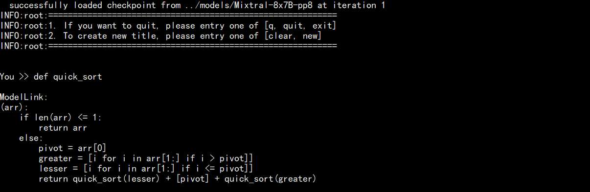

# Mixtral

<p align="left">
        <b>简体中文</b> |
        <b><a href="README_en.md">English</a> </b> 
</p>

# 目录

- [8x7B](#8x7B)
  - [硬件要求](#硬件要求)
  - [准备工作](#准备工作)
  - [数据处理](#数据处理)
  - [模型转换](#模型转换)
  - [模型训练](#模型训练)
  - [模型性能](#模型性能)
    - [吞吐](#吞吐)
  - [模型推理](#模型推理)
  - [模型评估](#模型评估)


# 8x7B

## 硬件要求

训练的最低硬件配置:

| 硬件 |      配置      |
| :--: | :-------------: |
| NPU | 16 x Ascend NPUs |

推理的推荐硬件配置:

| 硬件 |      配置      |
| :--: | :-------------: |
| NPU | 8 x Ascend NPUs |

## 准备工作

1. 拷贝代码仓到本地服务器

   ```shell
    git clone https://gitee.com/ascend/ModelLink.git
   ```
2. 搭建环境

   ```bash
    # python3.8
    conda create -n test python=3.8
    conda activate test
   
    # 安装 torch 和 torch_npu
    pip install torch-2.1.0-cp38-cp38m-manylinux2014_aarch64.whl
    pip install torch_npu-2.1.0*-cp38-cp38m-linux_aarch64.whl
    pip install apex-0.1_ascend*-cp38-cp38m-linux_aarch64.whl

    cd ModelLink
    mkdir logs
    pip install -r requirements.txt
    cd ..

    # 安装加速库
    source /usr/local/Ascend/ascend-toolkit/set_env.sh
    git clone https://gitee.com/ascend/AscendSpeed.git
    cd AscendSpeed
    pip3 install -e .
    cd ..
   ```
3. 下载 Mixtral-8x7B 的 [预训练权重和词表](https://huggingface.co/mistralai/Mixtral-8x7B-v0.1/tree/main)（*建议仅下载使用safetensors格式的权重*）
    
    ```shell
     #!/bin/bash
     git lfs install
     git clone https://huggingface.co/mistralai/Mixtral-8x7B-v0.1
    ```

   将权重从 Huggingface 格式转化为 Megatron 格式 

   ```bash
    cd ModelLink
    # 修改 ascend-toolkit 路径
    source /usr/local/Ascend/ascend-toolkit/set_env.sh
   
    # 权重格式转换
    python tools/checkpoint/convert_ckpt.py --model-type GPT \
        --loader mixtral_hf \
        --saver mixtral \
        --load-dir ../Mixtral-8x7B-v0.1 \
        --save-dir {your megatron ckpt save path} \
        --tokenizer-model ../Mixtral-8x7B-v0.1/tokenizer.model \
        --target-tensor-parallel-size 1 \
        --target-pipeline-parallel-size 8 \
        --target-expert-parallel-size 2 \
        --params-dtype bf16 
   cd ..
   ```

## 数据处理

1. 准备数据集

下载[Alpaca-GPT4 中文数据集](https://huggingface.co/datasets/silk-road/alpaca-data-gpt4-chinese/tree/main)

```shell
mkdir dataset
cd ./dataset

# wget不通的话也可手动自行下载
wget https://huggingface.co/datasets/silk-road/alpaca-data-gpt4-chinese/blob/main/Alpaca_data_gpt4_zh.jsonl

cd ../ModelLink
```


2. 数据前处理
```shell                          
python ./tools/preprocess_data.py \
    --input ../dataset/Alpaca_data_gpt4_zh.jsonl \
    --output-prefix ../dataset/alpaca \
    --tokenizer-type PretrainedFromHF \
    --tokenizer-name-or-path ../Mixtral-8x7B-v0.1 \
    --append-eod \
    --tokenizer-not-use-fast \
    --handler-name GeneralInstructionHandler \
    --workers 4
```

## 模型转换
1. HuggingFace权重 --> 任意并行切分策略的Megatron权重
    ***（该场景一般用于使能开源的HuggingFace模型在Megatron上进行训练）***
    ```bash
    # 修改 ascend-toolkit 路径
    source /usr/local/Ascend/ascend-toolkit/set_env.sh
   
    # HF 转 tp1-pp8-ep2
    python tools/checkpoint/convert_ckpt.py --model-type GPT \
        --loader mixtral_hf \
        --saver mixtral \
        --load-dir ../Mixtral-8x7B-v0.1 \
        --save-dir {your megatron ckpt save path} \
        --tokenizer-model ../Mixtral-8x7B-v0.1/tokenizer.model \
        --target-tensor-parallel-size 1 \
        --target-pipeline-parallel-size 8 \
        --target-expert-parallel-size 2 \
        --params-dtype bf16 
    ```
2. 任意并行切分策略的Megatron权重 --> 任意并行切分策略的Megatron权重
    ***（该场景一般用于重新配置切分后模型的权重，比如在双机16卡 EP2-PP8策略下训练完了，想在单机8卡 TP8上进行推理）***
    ```bash
    # 修改 ascend-toolkit 路径
    source /usr/local/Ascend/ascend-toolkit/set_env.sh
   
    # tp1-pp8-ep2 转 tp1-pp8-ep1
    python tools/checkpoint/convert_ckpt.py --model-type GPT \
        --loader mixtral_mg \
        --saver mixtral \
        --load-dir ../Mixtral-8x7B-v0.1-ep2-pp8 \
        --save-dir {your megatron ckpt save path} \
        --target-tensor-parallel-size 8 \
        --target-pipeline-parallel-size 1 \
        --target-expert-parallel-size 1 
    ```
3. 任意并行切分策略的Megatron权重 --> HuggingFace权重
    ***（该场景一般用于将训练好的megatron模型重新转回HuggingFace格式）***
    ```bash
    # 修改 ascend-toolkit 路径
    source /usr/local/Ascend/ascend-toolkit/set_env.sh
   
    # tp1-pp8-ep2 转 HF
    python tools/checkpoint/convert_ckpt.py --model-type GPT \
        --loader mixtral_mg \
        --saver mixtral \
        --save-model-type huggingface \
        --load-dir ../Mixtral-8x7B-v0.1-ep2-pp8 \
        --save-dir ../Mixtral-8x7B-v0.1 \    # <-- 需要填入原始HF模型路径，新权重会存于../Mixtral-8x7B-v0.1/mg2hg
    ```

## 模型训练
配置 Mixtral-8x7B 预训练脚本: ***examples/mixtral/pretrain_mixtral_8x7b_ptd.sh***

1. 预训练
    ```shell

    # 设置 ascend-toolkit 路径
    source /usr/local/Ascend/ascend-toolkit/set_env.sh 

    # 根据实际情况配置词表、数据集、模型参数保存路径
    DATA_PATH="your data path"
    TOKENIZER_MODEL="your tokenizer path"
    CKPT_SAVE_DIR="your model save ckpt path"

    # 根据分布式集群实际情况配置分布式参数
    GPUS_PER_NODE=8
    MASTER_ADDR="your master node IP"
    MASTER_PORT=6000
    NNODES=2
    NODE_RANK="current node id"
    WORLD_SIZE=$(($GPUS_PER_NODE * $NNODES))

    # 训练并行策略
    TP=1
    PP=8
    EP=2

    # 上文样例中使用了alpaca的指令微调数据集，因此需要加上此参数
    # 如若使用预训练数据集如wiki则不需要加
    DATA_ARGS="
        ...
        --is-instruction-dataset
        ...
    "
    ```

    启动 Mixtral-8x7B 预训练脚本: ***examples/pretrain_mixtral_8x7b_ptd.sh***

    ```shell
    bash examples/mixtral/pretrain_mixtral_8x7b_ptd.sh
    ```
2. 指令微调

    微调的配置脚本基本和预训练脚本pretrain_mixtral_8x7b_ptd.sh一致. *区别是是否加载模型、使用指令微调数据*
    ```shell
    # 使能微调数据集开关
    --is-instruction-dataset
    # 根据实际情况配置模型参数加载路径
    CKPT_LOAD_DIR="your init model load path"
    --load ${CKPT_LOAD_DIR}
    ```

## 模型性能

### 吞吐

Mixtral-8x7B 在双机16卡上(ep2 pp8) **昇腾芯片** 和 **参考芯片** 上的性能对比：
*(当节点够多的情况下，ep越大吞吐越大，这里并非为最佳性能，仅供参考)*

| 设备 |   模型   | 迭代数 | 样本吞吐 (samples/step) | tokens吞吐 (tokens/s/p) | 单步迭代时间 (s/step) |
| :--: | :-------: | :----: |:-------------------:|:---------------------:|:-------------------: |
| NPUs | Mixtral-8x7B |  1000  |  4.11  |  1053.6  |  31.13  |
| 参考 | Mixtral-8x7B |  1000  |  4.45   |   1139.3   |  28.76   |


## 模型推理

首先需要配置推理脚本: ***examples/mixtral/generate_mixtral_8x7b_ptd.sh***

```bash
# 根据您自己的 ascend-toolkit 路径，执行set_env.sh
source /usr/local/Ascend/ascend-toolkit/set_env.sh 

# 修改模型权重路径和词表路径
CHECKPOINT="your model ckpt path"
TOKENIZER_MODEL="your tokenizer path"

# 根据实际加载的模型权重修改并行配置
MASTER_ADDR=localhost
MASTER_PORT=6000
NNODES=1
NODE_RANK=0
GPUS_PER_NODE=8
TP=8
PP=1

# 注意
该文档中使用的Mixtral-8x7B-v0.1模型为L0模型，只有续写能力，推理不带任何模板并且容易出现重复或回答不停止的情况。

如若想要有较好的人机对话能力，请使用Mixtral-8x7B-Instruct-v0.1模型，该模型为指令遵从度训练后需要配合模板使用，基本操作同上，仅启动入口有变化：
torchrun $DISTRIBUTED_ARGS inference.py
```

然后可直接启动

```bash
bash examples/mixtral/generate_mixtral_8x7b_ptd.sh
```

推理的示例如下:


## 模型评估

使用 MMLU数据集评估模型. 数据集下载路径 [这里](https://huggingface.co/datasets/cais/mmlu). 
配置评估脚本: examples/mixtral/evaluate_mixtral_8x7b_ptd.sh

```bash
# ascend-toolkit 路径
source /usr/local/Ascend/ascend-toolkit/set_env.sh 

# 修改模型参数路径和词表路径
TOKENIZER_PATH=../Mixtral-8x7B-v0.1/          #词表路径
CHECKPOINT=../Mixtral-8x7B-v0.1-tp8pp1        #模型路径
# 配置任务和数据集路径
DATA_PATH="./mmlu/test/"
TASK="mmlu"
```

启动评估

```bash
bash examples/mixtral/evaluate_mixtral_8x7b_ptd.sh
```
评估结果如下

| 数据集 | 总问题数 | 参考准确率 | NPU准确率 |
|:---:|:---:|:---:|:---:|
| MMLU | 14042 | 0.658 | 0.660 |
