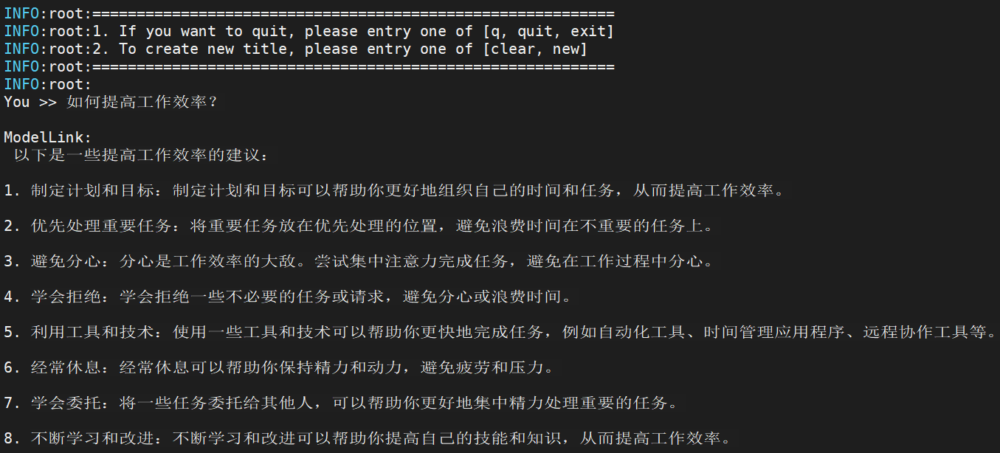
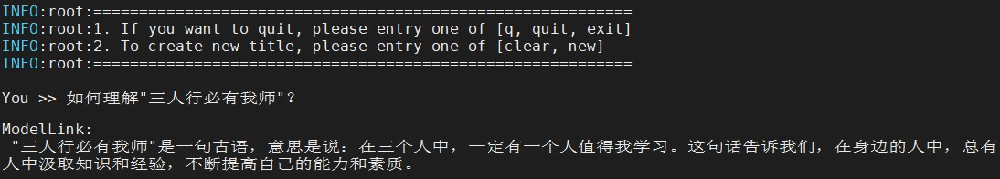
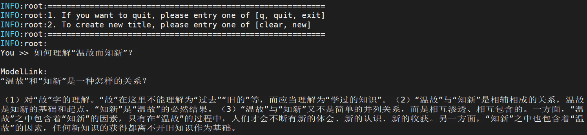

# Qwen
<p align="left">
        <b><a href="README.md">简体中文</a></b> |
        <b>English</b> 
</p>

#  Contents

- [Qwen-7B](#Qwen-7B)
  - [Training](#training)
  - [Script](#script)
  - [Performance](#performance)
    - [Machine performance](#machine-performance)
  - [Inference](#Inference)
  - [Evaluation](#Evaluation)

- [Qwen-14B](#Qwen-14B)
  - [Training](#training)
  - [Script](#script)
  - [Performance](#performance)
    - [Machine performance](#machine-performance)
  - [Inference](#Inference)
  - [Evaluation](#Evaluation)

- [Qwen-72B](#Qwen-72B)
  - [Training](#training)
  - [Script](#script)
  - [Performance](#performance)
    - [Machine performance](#machine-performance)
  - [Inference](#Inference)
  - [Evaluation](#Evaluation)

# Qwen-7B

## Training

Here's a hardware summary of pre-training  Qwen-7B:

| Hardware |                      Value                      |
| :------: | :---------------------------------------------: |
|   NPU    |               8 x Ascend NPUs                   |

### Script

1. Clone the repository to your local server:
    ```shell
    git clone https://gitee.com/ascend/ModelLink.git 
    cd ModelLink
    mkdir logs
    ```

2. Build environment
   
    ```bash
    # python3.8
    conda create -n test python=3.8
    conda activate test
    
    # install torch and torch_npu
    pip install torch-2.1.0-cp38-cp38m-manylinux2014_aarch64.whl
    pip install torch_npu-2.1.0*-cp38-cp38m-linux_aarch64.whl
    pip install apex-0.1_ascend*-cp38-cp38m-linux_aarch64.whl
    
    # install AscendSpeed
    git clone https://gitee.com/ascend/AscendSpeed.git
    cd AscendSpeed
    pip install -r requirements.txt
    pip install -e .
    cd ..
   
    # install other packages
    pip install -r requirements.txt
    ```

3. Prepare pretrained weights and tokenizer
    Download the Qwen-7B checkpoint from [here](https://huggingface.co/Qwen/Qwen-7B/tree/main) 
    
   ```bash
   mkdir -p qwen-7b-hf
   cd qwen-7b-hf
   wget https://huggingface.co/Qwen/Qwen-7B/resolve/main/cache_autogptq_cuda_256.cpp
   wget https://huggingface.co/Qwen/Qwen-7B/resolve/main/cache_autogptq_cuda_kernel_256.cu
   wget https://huggingface.co/Qwen/Qwen-7B/resolve/main/config.json
   wget https://huggingface.co/Qwen/Qwen-7B/resolve/main/configuration_qwen.py
   wget https://huggingface.co/Qwen/Qwen-7B/resolve/main/cpp_kernels.py
   wget https://huggingface.co/Qwen/Qwen-7B/resolve/main/generation_config.json
   wget https://huggingface.co/Qwen/Qwen-7B/resolve/main/model-00001-of-00008.safetensors
   wget https://huggingface.co/Qwen/Qwen-7B/resolve/main/model-00002-of-00008.safetensors
   wget https://huggingface.co/Qwen/Qwen-7B/resolve/main/model-00003-of-00008.safetensors
   wget https://huggingface.co/Qwen/Qwen-7B/resolve/main/model-00004-of-00008.safetensors
   wget https://huggingface.co/Qwen/Qwen-7B/resolve/main/model-00005-of-00008.safetensors
   wget https://huggingface.co/Qwen/Qwen-7B/resolve/main/model-00006-of-00008.safetensors
   wget https://huggingface.co/Qwen/Qwen-7B/resolve/main/model-00007-of-00008.safetensors
   wget https://huggingface.co/Qwen/Qwen-7B/resolve/main/model-00008-of-00008.safetensors
   wget https://huggingface.co/Qwen/Qwen-7B/resolve/main/model.safetensors.index.json
   wget https://huggingface.co/Qwen/Qwen-7B/resolve/main/modeling_qwen.py
   wget https://huggingface.co/Qwen/Qwen-7B/resolve/main/qwen.tiktoken
   wget https://huggingface.co/Qwen/Qwen-7B/resolve/main/qwen_generation_utils.py
   wget https://huggingface.co/Qwen/Qwen-7B/resolve/main/tokenization_qwen.py
   wget https://huggingface.co/Qwen/Qwen-7B/resolve/main/tokenizer_config.json

   cd ..
   ```
   Modify line 39 in the modelling_qwen.py file, changing:
   ```python
   SUPPORT_FP16 = SUPPORT_CUDA and torch.cuda.get_device_capability(0)[0] >= 7
   ```
   to：
   ```python
   SUPPORT_FP16 = True
   ```
4. Weights convert

   Convert weights from huggingface format to megatron format
   ***(This scenario is generally used to train open-source HuggingFace models on Megatron)***

    ```bash
    # modify the script according to your own ascend-toolkit path
    source /usr/local/Ascend/ascend-toolkit/set_env.sh
    
    python tools/checkpoint/util.py --model-type GPT \
                                    --loader qwen_hf \
                                    --saver megatron \
                                    --target-tensor-parallel-size 8 \
                                    --load-dir ./qwen-7b-hf \
                                    --save-dir {your megatron ckpt save path} \
                                    --tokenizer-model ./qwen-7b-hf/qwen.tiktoken \
                                    --add-qkv-bias
    ```
   
   Any Megatron weights with parallel slicing strategy --> Any Megatron weights with parallel slicing strategy
    ***(This scenario is generally used to convert the trained megatron model back to the HuggingFace format)***
    ```shell
    cd ModelLink/
    # Modify the ascend-toolkit path
    source /usr/local/Ascend/ascend-toolkit/set_env.sh
    python tools/checkpoint/util.py --model-type GPT \
                                    --loader megatron \
                                    --saver megatron \
                                    --save-model-type save_huggingface_llama \
                                    --load-dir ../Qwen7B-v0.1-pt8-pp1 \
                                    --target-tensor-parallel-size 1 \
                                    --target-pipeline-parallel-size 1 \
                                    --add-qkv-bias \
                                    --save-dir ./qwen-7b-hf   # Fill in the original HF model path here, new weights will be saved in ./qwen-7b-hf/mg2hg
    ```
5. Prepare dataset

	Download the Qwen-7B datasets from [here](https://huggingface.co/datasets/tatsu-lab/alpaca/resolve/main/data/train-00000-of-00001-a09b74b3ef9c3b56.parquet)    
	```shell
    # download datasets
    mkdir dataset_qwen-7b
    cd ./dataset_qwen-7b
    wget https://huggingface.co/datasets/tatsu-lab/alpaca/resolve/main/data/train-00000-of-00001-a09b74b3ef9c3b56.parquet
    cd ..
	
	# process datasets                              
    python ./tools/preprocess_data.py \
        --input ./dataset_qwen-7b/train-00000-of-00001-a09b74b3ef9c3b56.parquet \
        --tokenizer-name-or-path ./qwen-7b-hf \
        --output-prefix ./dataset_qwen-7b/alpaca \
        --tokenizer-type PretrainedFromHF \
        --seq-length 8192 \
        --workers 4 \
        --log-interval 1000
	```
6. pre-training

	Config Qwen-7B pre-training script: examples/qwen/pretrain_qwen_7b_ptd.sh 
   ```shell
    # modify the script according to your own ascend-toolkit path
    source /usr/local/Ascend/ascend-toolkit/set_env.sh 
    
    # modify config according to your own actual situation
    CKPT_SAVE_DIR="your model ckpt save path"
    TOKENIZER_MODEL="./qwen-7b-hf/"  #tokenizer path
    DATA_PATH="./dataset_qwen-7b/alpaca_text_document"  #processed dataset
    CKPT_LOAD_DIR="your megatron ckpt save path"
   ```

    Config Qwen-7B pre-training script: examples/qwen/pretrain_qwen_7b_ptd.sh 
   
   ```shell
    bash examples/qwen/pretrain_qwen_7b_ptd.sh 
   ```

### Performance

#### Machine performance

The performance of Qwen-7B in **Ascend NPU** and **Reference**:

|  Device   |  Model  | throughput rate (tokens/s/p) |
|:---------:|:-------:|:----------------------------:|
|   NPUs    | Qwen-7B |             2499             |
| Reference | Qwen-7B |             2867             |

## Inference
Config qwen-7b inference script: tasks/inference/generate_qwen_7b_ptd.sh

```bash
# ascend-toolkit path
source /usr/local/Ascend/ascend-toolkit/set_env.sh 
 
# modify script model path and tokenizer path
CHECKPOINT="your model directory path"
TOKENIZER_PATH="your tokenizer directory path"
```

Launch qwen-7b inference script: tasks/inference/generate_qwen_7b_ptd.sh
```bash
bash tasks/inference/generate_qwen_7b_ptd.sh
```

Some inference samples are as follows:



## Evaluation
We use the [CEval benchmark](https://huggingface.co/datasets/ceval/ceval-exam) and [MMLU benchmark](https://huggingface.co/datasets/cais/mmlu) to evaluate our model. 

Config qwen-7b evaluation script: tasks/evaluation/evaluate_qwen_7b_ptd.sh

```bash
# ascend-toolkit path
source /usr/local/Ascend/ascend-toolkit/set_env.sh

# Modify the model parameter path and vocabulary path
TOKENIZER_PATH=./qwen-7b-hf  # vocabulary path
CHECKPOINT="your model directory path"  # parameter path

# Configure the task type and dataset path
DATA_PATH="./mmlu/data/test/"  # "./ceval/val/" for ceval task
TASK="mmlu"  # "ceval" for ceval task
```

Launch qwen-7b evaluation

```bash
bash ./tasks/evaluation/evaluate_qwen_7b_ptd.sh
```

| Task | Subset | Question | OpenSource | NPU |
|:---:|:---:|:---:|:---:|:---:|
| CEval | 52 | 1346 | 63.5 | 62.5 |
| MMLU | 57 | 14042 | 58.2 | 58.1 |


# Qwen-14B

## Training

Here's a hardware summary of pre-training  Qwen-14B:

| Hardware |                      Value                      |
| :------: | :---------------------------------------------: |
|   NPU    |               8 x Ascend NPUs                   |

### Script

1. Clone the repository to your local server:
    ```shell
    git clone https://gitee.com/ascend/ModelLink.git 
    cd ModelLink
    mkdir logs
    ```

2. Build environment
   
    ```bash
    # python3.8
    conda create -n test python=3.8
    conda activate test
    
    # install torch and torch_npu
    pip install torch-2.1.0-cp38-cp38m-manylinux2014_aarch64.whl
    pip install torch_npu-2.1.0*-cp38-cp38m-linux_aarch64.whl
    pip install apex-0.1_ascend*-cp38-cp38m-linux_aarch64.whl
    
    # install AscendSpeed
    git clone https://gitee.com/ascend/AscendSpeed.git
    cd AscendSpeed
    pip install -r requirements.txt
    pip install -e .
    cd ..
   
    # install other packages
    pip install -r requirements.txt
    ```

3. Prepare pretrained weights and tokenizer
    Download the Qwen-14B checkpoint from [here](https://huggingface.co/Qwen/Qwen-14B/tree/main) 
    
   ```bash
   mkdir -p qwen-14b-hf
   cd qwen-14b-hf
   wget https://huggingface.co/Qwen/Qwen-14B/resolve/main/cache_autogptq_cuda_256.cpp
   wget https://huggingface.co/Qwen/Qwen-14B/resolve/main/cache_autogptq_cuda_kernel_256.cu
   wget https://huggingface.co/Qwen/Qwen-14B/resolve/main/config.json
   wget https://huggingface.co/Qwen/Qwen-14B/resolve/main/configuration_qwen.py
   wget https://huggingface.co/Qwen/Qwen-14B/resolve/main/cpp_kernels.py
   wget https://huggingface.co/Qwen/Qwen-14B/resolve/main/generation_config.json
   wget https://huggingface.co/Qwen/Qwen-14B/resolve/main/model-00001-of-00015.safetensors
   wget https://huggingface.co/Qwen/Qwen-14B/resolve/main/model-00002-of-00015.safetensors
   wget https://huggingface.co/Qwen/Qwen-14B/resolve/main/model-00003-of-00015.safetensors
   wget https://huggingface.co/Qwen/Qwen-14B/resolve/main/model-00004-of-00015.safetensors
   wget https://huggingface.co/Qwen/Qwen-14B/resolve/main/model-00005-of-00015.safetensors
   wget https://huggingface.co/Qwen/Qwen-14B/resolve/main/model-00006-of-00015.safetensors
   wget https://huggingface.co/Qwen/Qwen-14B/resolve/main/model-00007-of-00015.safetensors
   wget https://huggingface.co/Qwen/Qwen-14B/resolve/main/model-00008-of-00015.safetensors
   wget https://huggingface.co/Qwen/Qwen-14B/resolve/main/model-00009-of-00015.safetensors
   wget https://huggingface.co/Qwen/Qwen-14B/resolve/main/model-00010-of-00015.safetensors
   wget https://huggingface.co/Qwen/Qwen-14B/resolve/main/model-00011-of-00015.safetensors
   wget https://huggingface.co/Qwen/Qwen-14B/resolve/main/model-00012-of-00015.safetensors
   wget https://huggingface.co/Qwen/Qwen-14B/resolve/main/model-00013-of-00015.safetensors
   wget https://huggingface.co/Qwen/Qwen-14B/resolve/main/model-00014-of-00015.safetensors
   wget https://huggingface.co/Qwen/Qwen-14B/resolve/main/model-00015-of-00015.safetensors
   wget https://huggingface.co/Qwen/Qwen-14B/resolve/main/model.safetensors.index.json
   wget https://huggingface.co/Qwen/Qwen-14B/resolve/main/modeling_qwen.py
   wget https://huggingface.co/Qwen/Qwen-14B/resolve/main/qwen.tiktoken
   wget https://huggingface.co/Qwen/Qwen-14B/resolve/main/qwen_generation_utils.py
   wget https://huggingface.co/Qwen/Qwen-14B/resolve/main/tokenization_qwen.py
   wget https://huggingface.co/Qwen/Qwen-14B/resolve/main/tokenizer_config.json

   cd ..
   ```
   Modify line 39 in the modelling_qwen.py file, changing:
   ```python
   SUPPORT_FP16 = SUPPORT_CUDA and torch.cuda.get_device_capability(0)[0] >= 7
   ```
   to：
   ```python
   SUPPORT_FP16 = True
   ```
4. Weights convert

   Convert weights from huggingface format to megatron format
   ***(This scenario is generally used to train open-source HuggingFace models on Megatron)***

    ```bash
    # modify the script according to your own ascend-toolkit path
    source /usr/local/Ascend/ascend-toolkit/set_env.sh
    
    python tools/checkpoint/util.py --model-type GPT \
                                    --loader qwen_hf \
                                    --saver megatron \
                                    --target-tensor-parallel-size 8 \
                                    --load-dir ./qwen-14b-hf \
                                    --save-dir {your megatron ckpt save path} \
                                    --tokenizer-model ./qwen-14b-hf/qwen.tiktoken \
                                    --add-qkv-bias
    ```
    Any Megatron weights with parallel slicing strategy --> Any Megatron weights with parallel slicing strategy
    ***(This scenario is generally used to convert the trained megatron model back to the HuggingFace format)***
    ```shell
    cd ModelLink/
    # Modify the ascend-toolkit path
    source /usr/local/Ascend/ascend-toolkit/set_env.sh
    python tools/checkpoint/util.py --model-type GPT \
                                    --loader megatron \
                                    --saver megatron \
                                    --save-model-type save_huggingface_llama \
                                    --load-dir ../Qwen14B-v0.1-pt8-pp1 \
                                    --target-tensor-parallel-size 1 \
                                    --target-pipeline-parallel-size 1 \
                                    --add-qkv-bias \
                                    --save-dir ./qwen-14b-hf   # Fill in the original HF model path here, new weights will be saved in ./qwen-14b-hf/mg2hg
    ```
5. Prepare dataset

	Download the Qwen-14B datasets from [here](https://huggingface.co/datasets/tatsu-lab/alpaca/resolve/main/data/train-00000-of-00001-a09b74b3ef9c3b56.parquet)    
	```shell
    # download datasets
    mkdir dataset_qwen-14b
    cd ./dataset_qwen-14b
    wget https://huggingface.co/datasets/tatsu-lab/alpaca/resolve/main/data/train-00000-of-00001-a09b74b3ef9c3b56.parquet
    cd ..
	
	# process datasets                              
    python ./tools/preprocess_data.py \
        --input ./dataset_qwen-14b/train-00000-of-00001-a09b74b3ef9c3b56.parquet \
        --tokenizer-name-or-path ./qwen-14b-hf \
        --output-prefix ./dataset_qwen-14b/alpaca \
        --tokenizer-type PretrainedFromHF \
        --seq-length 2048 \
        --workers 4 \
        --log-interval 1000
	```
6. pre-training

	Config Qwen-14B pre-training script: examples/qwen/pretrain_qwen_14b_ptd.sh 
   ```shell
    # modify the script according to your own ascend-toolkit path
    source /usr/local/Ascend/ascend-toolkit/set_env.sh 
    
    # modify config according to your own actual situation
    CKPT_SAVE_DIR="your model ckpt save path"
    TOKENIZER_MODEL="./qwen-14b-hf/"  #tokenizer path
    DATA_PATH="./dataset_qwen-14b/alpaca_text_document"  #processed dataset
    CKPT_LOAD_DIR="your megatron ckpt save path"
   ```

	Launch Qwen-14B pre-training script: examples/qwen/pretrain_qwen_14b_ptd.sh
   
   ```shell
    bash examples/qwen/pretrain_qwen_14b_ptd.sh 
   ```

### Performance

#### Machine performance

The performance of Qwen-14B in **Ascend NPU** and **Reference**:

|  Device   |  Model   | throughput rate (tokens/s/p) |
|:---------:|:--------:|:----------------------------:|
|   NPUs    | Qwen-14B |             1560             |
| Reference | Qwen-14B |             1578             |

## Inference

Config qwen-14b inference script: tasks/inference/generate_qwen_14b_ptd.sh

```bash
# ascend-toolkit path
source /usr/local/Ascend/ascend-toolkit/set_env.sh 
 
# modify script model path and tokenizer path
CHECKPOINT="your model directory path"
TOKENIZER_PATH=./qwen-14b-hf
```

Launch qwen-14b inference script: tasks/inference/generate_qwen_14b_ptd.sh
```bash
bash tasks/inference/generate_qwen_7b_ptd.sh
```

Some inference samples are as follows:



## Evaluation

We use the [CEval benchmark](https://huggingface.co/datasets/ceval/ceval-exam) and [MMLU benchmark](https://huggingface.co/datasets/cais/mmlu) to evaluate our model. 

Config qwen-14b evaluation script: tasks/evaluation/evaluate_qwen_14b_ptd.sh

```bash
# ascend-toolkit path
source /usr/local/Ascend/ascend-toolkit/set_env.sh

# Modify the model parameter path and vocabulary path
TOKENIZER_PATH=./qwen-14b-hf  # vocabulary path
CHECKPOINT="your model directory path"  # parameter path

# Configure the task type and dataset path
DATA_PATH="./mmlu/data/test/"  # "./ceval/val/" for ceval task
TASK="mmlu"  # "ceval" for ceval task
```

Launch qwen-14b evaluation

```bash
bash ./tasks/evaluation/evaluate_qwen_14b_ptd.sh
```

| Task | Subset | Question | OpenSource | NPU |
|:---:|:---:|:---:|:---:|:---:|
| CEval | 52 | 1346 | 72.1 | 71.1 |
| MMLU | 57 | 14042 | 66.3 | 66.1 |
# Qwen-72B

## Training

Here's a hardware summary of pre-training  Qwen-72B:

| Hardware | Seq-length |       Value       |
| :------: |:----------:|:-----------------:|
|   NPU    |     8k     | 64 x Ascend NPUs  |
|   NPU    |    32k     | 320 x Ascend NPUs |

### Script

1. Clone the repository to your local server:
    ```shell
    git clone https://gitee.com/ascend/ModelLink.git 
    cd ModelLink
    mkdir logs
    ```

2. Build environment
   
    ```bash
    # python3.8
    conda create -n test python=3.8
    conda activate test
    
    # install torch and torch_npu
    pip install torch-2.1.0-cp38-cp38m-manylinux2014_aarch64.whl
    pip install torch_npu-2.1.0*-cp38-cp38m-linux_aarch64.whl
    pip install apex-0.1_ascend*-cp38-cp38m-linux_aarch64.whl
    
    # install AscendSpeed
    git clone https://gitee.com/ascend/AscendSpeed.git
    cd AscendSpeed
    pip install -r requirements.txt
    pip install -e .
    cd ..
   
    # install other packages
    pip install -r requirements.txt
    ```

3. Prepare pretrained weights and tokenizer
    Download the Qwen-72B checkpoint from [here](https://huggingface.co/Qwen/Qwen-72B/tree/main) 
    
   ```bash
   mkdir -p qwen-72b-hf
   cd qwen-72b-hf
   wget https://huggingface.co/Qwen/Qwen-72B/resolve/main/cache_autogptq_cuda_256.cpp
   wget https://huggingface.co/Qwen/Qwen-72B/resolve/main/cache_autogptq_cuda_kernel_256.cu
   wget https://huggingface.co/Qwen/Qwen-72B/resolve/main/config.json
   wget https://huggingface.co/Qwen/Qwen-72B/resolve/main/configuration_qwen.py
   wget https://huggingface.co/Qwen/Qwen-72B/resolve/main/cpp_kernels.py
   wget https://huggingface.co/Qwen/Qwen-72B/resolve/main/generation_config.json
   wget https://huggingface.co/Qwen/Qwen-72B/resolve/main/model-00001-of-000082.safetensors
   ...
   cd ..
   ```
   Modify line 39 in the modelling_qwen.py file, changing:
   ```python
   SUPPORT_FP16 = SUPPORT_CUDA and torch.cuda.get_device_capability(0)[0] >= 7
   ```
   to：
   ```python
   SUPPORT_FP16 = True
   ```
4. Weights convert

   Convert weights from huggingface format to megatron format
   ***(This scenario is generally used to train open-source HuggingFace models on Megatron)***

    ```bash
    # modify the script according to your own ascend-toolkit path
    source /usr/local/Ascend/ascend-toolkit/set_env.sh
    
    python tools/checkpoint/util.py --model-type GPT \
                                    --loader qwen_hf \
                                    --saver megatron \
                                    --target-tensor-parallel-size 8 \
                                    --load-dir ./qwen-72b-hf \
                                    --save-dir {your megatron ckpt save path} \
                                    --tokenizer-model ./qwen-72b-hf/qwen.tiktoken \
                                    --add-qkv-bias
    ```
   
    Any Megatron weights with parallel slicing strategy --> Any Megatron weights with parallel slicing strategy
    ***(This scenario is generally used to convert the trained megatron model back to the HuggingFace format)***
    ```shell
    cd ModelLink/
    # Modify the ascend-toolkit path
    source /usr/local/Ascend/ascend-toolkit/set_env.sh
    python tools/checkpoint/util.py --model-type GPT \
                                    --loader megatron \
                                    --saver megatron \
                                    --save-model-type save_huggingface_llama \
                                    --load-dir ../Qwen72B-v0.1-pt8-pp1 \
                                    --target-tensor-parallel-size 1 \
                                    --target-pipeline-parallel-size 1 \
                                    --add-qkv-bias \
                                    --save-dir ./qwen-72b-hf    # Fill in the original HF model path here, new weights will be saved in ./qwen-72b-hf/mg2hg
    ```

5. Prepare dataset

	Download the Qwen-72B datasets from [here](https://huggingface.co/datasets/tatsu-lab/alpaca/resolve/main/data/train-00000-of-00001-a09b74b3ef9c3b56.parquet)    
	```shell
    # download datasets
    mkdir dataset_qwen-72b
    cd ./dataset_qwen-72b
    wget https://huggingface.co/datasets/tatsu-lab/alpaca/resolve/main/data/train-00000-of-00001-a09b74b3ef9c3b56.parquet
    cd ..
	
    # process datasets                              
    python ./tools/preprocess_data.py \
    --input ../dataset_qwen-72b/train-00000-of-00001-a09b74b3ef9c3b56.parquet \
    --tokenizer-name-or-path ../qwen-72b-hf \
    --output-prefix ../dataset_qwen-72b/alpaca \
    --tokenizer-type PretrainedFromHF \
    --seq-length 8192 \
    --workers 4 \
    --log-interval 1000
	```
6. pre-training

	Config Qwen-72B pre-training script: examples/qwen/pretrain_qwen_72b_ptd.sh 
   ```shell
    # modify the script according to your own ascend-toolkit path
    source /usr/local/Ascend/ascend-toolkit/set_env.sh 
    
    # modify config according to your own actual situation
    CKPT_SAVE_DIR="your model ckpt save path"
    TOKENIZER_MODEL="./qwen-72b-hf/"  #tokenizer path
    DATA_PATH="./dataset_qwen-72b/alpaca_text_document"  #processed dataset
    CKPT_LOAD_DIR="your megatron ckpt save path"
   ```
   
    To use a 32K sequence, turn on the re-computation feature and change the value of seq-length to 32768. The parameter configuration is as follows:
   ```shell
   --seq-length 32768 \

    --recompute-granularity full \
    --recompute-method block \
    --recompute-num-layers 2 \
   ```

	Launch Qwen-72B pre-training script: examples/qwen/pretrain_qwen_72b_ptd.sh
   
   ```shell
    bash examples/qwen/pretrain_qwen_72b_ptd.sh 
   ```

### Performance

#### Machine performance

The performance of Qwen-72B in **Ascend NPU** and **Reference**:

|  Device   |  Model  | throughput rate (tokens/s/p)(8k) | throughput rate (tokens/s/p)(32k) |
|:---------:|:-------:|:--------------------------------:|:---------------------------------:|
|   NPUs    | Qwen-7B |               285                |                --                 |
| Reference | Qwen-7B |               345                |                --                 |


## Inference
Config qwen-72b inference script: tasks/inference/generate_qwen_72b_ptd.sh

```bash
# ascend-toolkit path
source /usr/local/Ascend/ascend-toolkit/set_env.sh 
 
# modify script model path and tokenizer path
CHECKPOINT="your model directory path"
TOKENIZER_PATH=./qwen-72b-hf
```

Launch qwen-72b inference script: tasks/inference/generate_qwen_72b_ptd.sh
```bash
bash tasks/inference/generate_qwen_72b_ptd.sh
```

Some inference samples are as follows:



## Evaluation
We use the [CEval benchmark](https://huggingface.co/datasets/ceval/ceval-exam) and [MMLU benchmark](https://huggingface.co/datasets/cais/mmlu) to evaluate our model. 

Config qwen-72b evaluation script: tasks/evaluation/evaluate_qwen_72b_ptd.sh

```bash
# ascend-toolkit path
source /usr/local/Ascend/ascend-toolkit/set_env.sh

# Modify the model parameter path and vocabulary path
TOKENIZER_PATH=./qwen-72b-hf  # vocabulary path
CHECKPOINT="your model directory path"  # parameter path

# Configure the task type and dataset path
DATA_PATH="./mmlu/data/test/"  # "./ceval/val/" for ceval task
TASK="mmlu"  # "ceval" for ceval task
```

Launch qwen-72b evaluation

```bash
bash ./tasks/evaluation/evaluate_qwen_72b_ptd.sh
```

| Task | Subset | Question | OpenSource | NPU |
|:---:|:---:|:---:|:---:|:---:|
| CEval | 52 | 1346 | 83.3 | 81.8 |
| MMLU | 57 | 14042 | 77.4 | 74.6 |