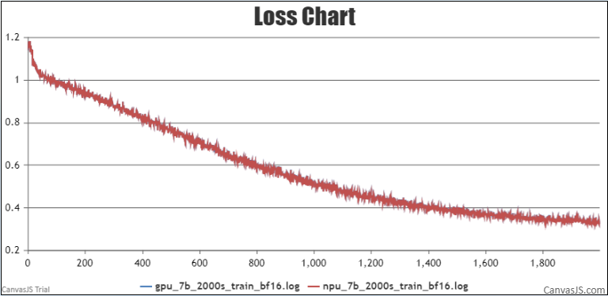
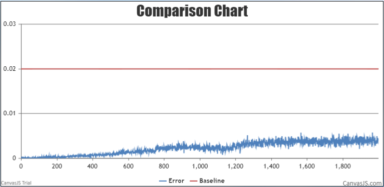

# Qwen
<p align="left">
        <b><a href="https://gitee.com/ascend/ModelLink/blob/modellink/examples/qwen/README.md">简体中文</a></b> |
        <b>English</b> 
</p>

#  Contents

- [Qwen-7B](#contents)
  - [Training](#pre-training)
  - [Script](#script)
  - [Performance](#performance)
    - [Machine performance](#machine-performance)
    - [Accuracy of the loss](#accuracy-of-the-loss)

# Qwen-7B

## Training

Here's a hardware summary of pre-training  Qwen-7B:

| Hardware |                      Value                      |
| :------: | :---------------------------------------------: |
|   NPU    |               8 x Ascend NPUs                   |

### Script

1. Clone the repository to your local server:
    ```shell
    git clone https://gitee.com/ascend/ModelLink.git 
    cd ModelLink
    git checkout modellink
    ```

2. Build environment
   
    ```bash
    # python3.8
    conda create -n test python=3.8
    conda activate test
    
    # install torch and torch_npu
    pip install torch-2.1.0-cp38-cp38m-manylinux2014_aarch64.whl
    pip install torch_npu-2.1.0*-cp38-cp38m-linux_aarch64.whl
    pip install apex-0.1_ascend*-cp38-cp38m-linux_aarch64.whl
    
    # install AscendSpeed
    git clone https://gitee.com/ascend/AscendSpeed.git
    cd AscendSpeed
    pip install -r requirements.txt
    pip3 install -e .
    cd ..
   
    # install other packages
    pip install -r requirements.txt
    ```

3. Prepare pretrained weights and tokenizer
    Download the Qwen-7B checkpoint from [here](https://huggingface.co/Qwen/Qwen-7B/tree/main) 
    
   ```bash
   mkdir -p qwen-7b-hf
   cd qwen-7b-hf
   wget https://huggingface.co/Qwen/Qwen-7B/resolve/main/cache_autogptq_cuda_256.cpp
   wget https://huggingface.co/Qwen/Qwen-7B/resolve/main/cache_autogptq_cuda_kernel_256.cu
   wget https://huggingface.co/Qwen/Qwen-7B/resolve/main/config.json
   wget https://huggingface.co/Qwen/Qwen-7B/resolve/main/configuration_qwen.py
   wget https://huggingface.co/Qwen/Qwen-7B/resolve/main/cpp_kernels.py
   wget https://huggingface.co/Qwen/Qwen-7B/resolve/main/generation_config.json
   wget https://huggingface.co/Qwen/Qwen-7B/resolve/main/model-00001-of-00008.safetensors
   wget https://huggingface.co/Qwen/Qwen-7B/resolve/main/model-00002-of-00008.safetensors
   wget https://huggingface.co/Qwen/Qwen-7B/resolve/main/model-00003-of-00008.safetensors
   wget https://huggingface.co/Qwen/Qwen-7B/resolve/main/model-00004-of-00008.safetensors
   wget https://huggingface.co/Qwen/Qwen-7B/resolve/main/model-00005-of-00008.safetensors
   wget https://huggingface.co/Qwen/Qwen-7B/resolve/main/model-00006-of-00008.safetensors
   wget https://huggingface.co/Qwen/Qwen-7B/resolve/main/model-00007-of-00008.safetensors
   wget https://huggingface.co/Qwen/Qwen-7B/resolve/main/model-00008-of-00008.safetensors
   wget https://huggingface.co/Qwen/Qwen-7B/resolve/main/model.safetensors.index.json
   wget https://huggingface.co/Qwen/Qwen-7B/resolve/main/modeling_qwen.py
   wget https://huggingface.co/Qwen/Qwen-7B/resolve/main/qwen.tiktoken
   wget https://huggingface.co/Qwen/Qwen-7B/resolve/main/qwen_generation_utils.py
   wget https://huggingface.co/Qwen/Qwen-7B/resolve/main/tokenization_qwen.py
   wget https://huggingface.co/Qwen/Qwen-7B/resolve/main/tokenizer_config.json

   cd ..
   ```
4. Prepare dataset

	Download the Qwen-7B datasets from [here](https://huggingface.co/datasets/tatsu-lab/alpaca/resolve/main/data/train-00000-of-00001-a09b74b3ef9c3b56.parquet)    
	```shell
    # download datasets
    mkdir dataset_qwen-7b
    cd ./dataset_qwen-7b
    wget https://huggingface.co/datasets/tatsu-lab/alpaca/resolve/main/data/train-00000-of-00001-a09b74b3ef9c3b56.parquet
    cd ..
	
	# process datasets                              
    python ./tools/preprocess_data.py \
    --input ../dataset_qwen-7b/train-00000-of-00001-a09b74b3ef9c3b56.parquet \
    --tokenizer-name-or-path ../qwen-7b-hf \
    --output-prefix ../dataset_qwen-7b/alpaca \
    --tokenizer-type PretrainedFromHF \
    --seq-length 8192 \
    --workers 4 \
    --log-interval 1000 \
 
    cd .. 
	```

5. fine-tuning

	Config Qwen-7B pre-training script: examples/qwen/pretrain_qwen_7b_ptd.sh 
   ```shell
    # modify the script according to your own ascend-toolkit path
    source /usr/local/Ascend/ascend-toolkit/set_env.sh 
    
    # modify config according to your own actual situation
    CKPT_SAVE_DIR="your model ckpt save path"
    TOKENIZER_MODEL="./qwen-7b-hf/"  #tokenizer path
    DATA_PATH="./dataset_qwen-7b/alpaca_text_document"  #processed dataset
    CKPT_LOAD_DIR="./qwen-7b-mt/"
   ```

	Launch Qwen-7B  pre-training script: examples/qwen/pretrain_qwen_7b_ptd.sh
   
   ```shell
    bash examples/qwen/pretrain_qwen_7b_ptd.sh 
   ```

### Performance

#### Machine performance

The performance of Qwen-7B in **Ascend NPU** and **Reference**:

|  Device   |  Model  | total Iterations | throughput rate (tokens/s/p) |
|:---------:|:-------:|:----------------:|:----------------------------:|
|   NPUs    | Qwen-7B |       2000       |             2499             |
| Reference | Qwen-7B |       2000       |             2867             |


#### Accuracy of the loss

NPU vs Reference loss.



NPU vs Reference loss relative error.


