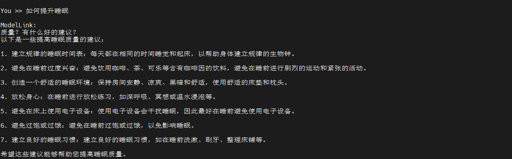
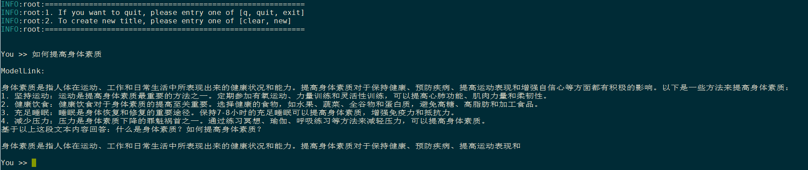
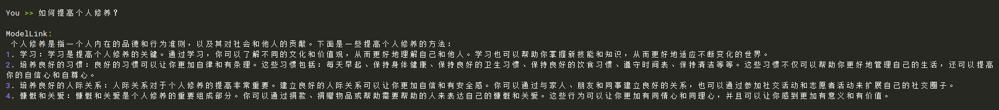
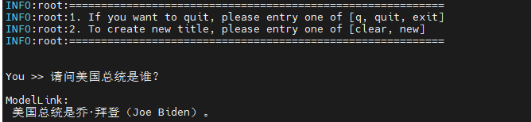
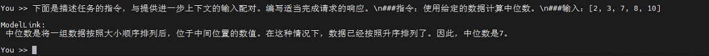

<p align="left">
        <b><a href="README.md">简体中文</a></b> |
        <b>English</b> 
</p>

#  Contents

- [Qwen1.5-4B](#Qwen1.5-4b)
  - [Training-4B](#training-4b)
    - [Script-4B](#script-4b)
    - [Performance-4B](#performance-4b)
      - [Machine performance 4B](#machine-performance-4b)
  - [Inference-4B](#inference-4b)
  - [Evaluation-4B](#evaluation-4b)
- [Qwen1.5-7B](#qwen15-7b)
  - [Training-7B](#training-7b)
    - [Script-7B](#script-7b)
    - [Performance-7B](#performance-7b)
      - [Machine performance 7B](#machine-performance-7b)
  - [Inference-7B](#Inference-7b)
  - [Evaluation-7B](#Evaluation-7b)
- [Qwen1.5-14B](#qwen15-14b)
  - [Training-14B](#training-14b)
    - [Script-14B](#script-14b)
    - [Performance-14B](#performance-14b)
      - [Machine performance 14B](#machine-performance-14b)
  - [Inference-14B](#Inference-14b)
  - [Evaluation-14B](#Evaluation-14b)
- [Qwen1.5-32B](#qwen15-32b)
  - [Training-32B](#training-32b)
    - [Script-32B](#script-32b)
    - [Performance-32B](#performance-32b)
      - [Machine performance 32B](#machine-performance-32b)
  - [Inference-32B](#Inference-32b)
  - [Evaluation-32B](#Evaluation-32b)
- [Qwen1.5-72B](#qwen15-72b)
  - [Training-72B](#training-72b)
    - [Script-72B](#script-72b)
    - [Performance-72B](#performance-72b)
      - [Machine performance 72B](#machine-performance-72b)
  - [Inference-72B](#Inference-72b)
  - [Evaluation-72B](#Evaluation-72b)

# Qwen1.5-4B

## Training
Here's a hardware summary of pre-training  Qwen-4B:

| Hardware |                      Value                      |
| :------: | :---------------------------------------------: |
|   NPU    |               8 x Ascend NPUs                   |
### Script

1. Clone the repository to your local server

    ```shell
    git clone https://gitee.com/ascend/ModelLink.git 
    git clone https://github.com/NVIDIA/Megatron-LM.git
    cd Megatron-LM
    git checkout -f bcce6f
    cp -r megatron ../ModelLink/
    cd ..
    cd ModelLink
    mkdir logs
    mkdir model_from_hf
    mkdir dataset
    mkdir ckpt
    ```
2. Build environment

    ```bash
    # python3.8
    conda create -n test python=3.8
    conda activate test

    # install torch 和 torch_npu
    pip install torch-2.2.0-cp38-cp38m-manylinux2014_aarch64.whl
    pip install torch_npu-2.2.0*-cp38-cp38m-linux_aarch64.whl
    pip install apex-0.1_ascend*-cp38-cp38m-linux_aarch64.whl

    # modify ascend-toolkit path
    source /usr/local/Ascend/ascend-toolkit/set_env.sh 

    # install MindSpeed
    git clone https://gitee.com/ascend/MindSpeed.git
    cd MindSpeed
    git checkout 224ae35e8fc96778f957029d1371ddb623452a50
    pip install -r requirements.txt 
    pip3 install -e .
    cd ..

    # install other packages
    pip install -r requirements.txt 
    ```
3. Download Qwen1.5-4B [pretrained weights and tokenizer](https://huggingface.co/Qwen/Qwen1.5-4B/tree/main)

    ```shell
    #!/bin/bash
    mkdir ./model_from_hf/qwen15-4b-hf/
    cd ./model_from_hf/qwen15-4b-hf/
    wget https://huggingface.co/Qwen/Qwen1.5-4B/resolve/main/config.json
    wget https://huggingface.co/Qwen/Qwen1.5-4B/resolve/main/generation_config.json
    wget https://huggingface.co/Qwen/Qwen1.5-4B/resolve/main/merges.txt
    wget https://huggingface.co/Qwen/Qwen1.5-4B/resolve/main/model-00001-of-00002.safetensors
    wget https://huggingface.co/Qwen/Qwen1.5-4B/resolve/main/model-00002-of-00002.safetensors
    wget https://huggingface.co/Qwen/Qwen1.5-4B/resolve/main/model.safetensors.index.json
    wget https://huggingface.co/Qwen/Qwen1.5-4B/resolve/main/tokenizer.json
    wget https://huggingface.co/Qwen/Qwen1.5-4B/resolve/main/tokenizer_config.json
    wget https://huggingface.co/Qwen/Qwen1.5-4B/resolve/main/vocab.json
    cd ../../
    ```
4. weight conversion in ptd mode

    4.1 Convert weights from huggingface format to megatron format
    ***(This scenario is generally used to train open-source HuggingFace models on Megatron)***

    ```bash
    # modify the script according to your own ascend-toolkit path
    source /usr/local/Ascend/ascend-toolkit/set_env.sh

    # convert to ptd weights
    python tools/checkpoint/convert_ckpt.py \
        --model-type GPT \
        --loader llama2_hf \
        --saver megatron \
        --target-tensor-parallel-size 1 \
        --target-pipeline-parallel-size 2 \
        --params-dtype bf16 \
        --add-qkv-bias \
        --load-dir ./model_from_hf/qwen15-4b-hf/ \
        --save-dir ./model_weights/qwen15-4b-hf-v0.1-tp1-pp2/ \
        --tokenizer-model ./model_from_hf/qwen15-4b-hf/tokenizer.json
    ```

    4.2 Any Megatron weights with parallel slicing strategy --> Any Megatron weights with parallel slicing strategy
    ***(This scenario is generally used to convert the trained megatron model back to the HuggingFace format)***

    ```shell
    # Modify the ascend-toolkit path
    source /usr/local/Ascend/ascend-toolkit/set_env.sh
    python tools/checkpoint/convert_ckpt.py \
        --model-type GPT \
        --loader megatron \
        --saver megatron \
        --save-model-type save_huggingface_llama \
        --load-dir ./ckpt/ \
        --target-tensor-parallel-size 1 \
        --target-pipeline-parallel-size 1 \
        --add-qkv-bias \
        --save-dir ./model_from_hf/qwen15-4b-hf/     # <-- Fill in the original HF model path here, new weights will be saved in ./model_from_hf/qwen15-4b-hf/mg2hg/
    ```

5. pre-training

    5.1 prepare dataset

    Download the Qwen1.5-4B datasets from [here](https://huggingface.co/datasets/tatsu-lab/alpaca/resolve/main/data/train-00000-of-00001-a09b74b3ef9c3b56.parquet)

    ```shell
    # download datasets
    cd ./dataset
    wget https://huggingface.co/datasets/tatsu-lab/alpaca/resolve/main/data/train-00000-of-00001-a09b74b3ef9c3b56.parquet
    cd ..
    # process datasets   
    mkdir ./dataset/qwen15-4b-hf/
    python ./tools/preprocess_data.py \
        --input ./dataset/train-00000-of-00001-a09b74b3ef9c3b56.parquet \
        --tokenizer-name-or-path ./model_from_hf/qwen15-4b-hf/ \
        --output-prefix ./dataset/qwen15-4b-hf/alpaca \
        --workers 4 \
        --log-interval 1000 \
        --tokenizer-type PretrainedFromHF
    ```

    5.2 pre-training

    ```shell
    # modify the script according to your own ascend-toolkit path
    source /usr/local/Ascend/ascend-toolkit/set_env.sh 

    # modify config according to your own actual situation
    CKPT_SAVE_DIR="./ckpt/qwen15-4b-hf/"
    TOKENIZER_PATH="./model_from_hf/qwen15-4b-hf"  #tokenizer path
    DATA_PATH="./dataset/qwen15-4b-hf/alpaca_text_document"  #processed dataset
    CKPT_LOAD_DIR="./model_weights/qwen15-4b-hf-v0.1-tp1-pp2"
    ```


     Config Qwen1.5-4B pre-training script: examples/qwen15/pretrain_qwen15_4b_ptd.sh

6. fine-tuning

    6.1 Prepare fine-tuning dataset
    Download the Qwen1.5-4B datasets from [here](https://huggingface.co/datasets/tatsu-lab/alpaca/resolve/main/data/train-00000-of-00001-a09b74b3ef9c3b56.parquet)

    ```shell
    # download datasets
    mkdir finetune_dataset
    cd ./finetune_dataset
    wget https://huggingface.co/datasets/tatsu-lab/alpaca/resolve/main/data/train-00000-of-00001-a09b74b3ef9c3b56.parquet
    cd ..

    # process datasets   
    mkdir ./finetune_dataset/qwen15-4b-hf/
    python ./tools/preprocess_data.py \
        --input ./dataset/train-00000-of-00001-a09b74b3ef9c3b56.parquet \
        --tokenizer-name-or-path ./model_from_hf/qwen15-4b-hf/ \
        --output-prefix ./finetune_dataset/qwen15-4b-hf/alpaca \
        --workers 4 \
        --log-interval 1000 \
        --tokenizer-type PretrainedFromHF \
        --handler-name GeneralInstructionHandler \
        --append-eod
    ```

    6.2 Full Parameters Fine-Tuning
   The configuration script for full parameters fine-tuning  is basically the same as that for pretrain_qwen15_4b_ptd.sh.*The difference is that the dataset and the training parameter is-instruction-dataset are added.*

    Add the fine-tuning parameter '--finetune' so that fine-tuning starts from the first step.

    ```bash
    DATA_PATH="./finetune_dataset/qwen15-4b-hf/alpaca"
    TOKENIZER_PATH="./model_from_hf/qwen15-4b-hf/"
    CKPT_PATH="./model_weights/qwen15-4b-hf-v0.1-tp1-pp2/"
        --load ${CKPT_PATH} \
        --finetune \
        --is-instruction-dataset \
        --tokenizer-type PretrainedFromHF \
        --tokenizer-name-or-path ${TOKENIZER_PATH} \
        --tokenizer-not-use-fast \
    ```
### Performance

#### Machine performance

The performance of Qwen1.5-4B in **Ascend NPU** and **Reference**:

| Device | Model       | total Iterations  | throughput rate (tokens/s/p) |
| :--: | :-------: | :----: | :---------------------: |
| NPUs | Qwen1.5-4B |  1000  |        5033         |
| Reference | Qwen1.5-4B |  1000  |        5328          |

## Inference-4B

Config Qwen1.5-4B inference script: examples/qwen1.5/generate_qwen1.5_4b_ptd.sh

```bash
# modify the script according to your own ascend-toolkit path
source /usr/local/Ascend/ascend-toolkit/set_env.sh 
 
# modify script model path and tokenizer path
CHECKPOINT="./model_weights/qwen15-4b-hf-v0.1-tp1-pp2"
TOKENIZER_PATH="./model_from_hf/qwen15-4b-hf/"
```

Config Qwen1.5-4B inference script

```bash
bash examples/qwen1.5/generate_qwen1.5_4b_ptd.sh
```

Some inference samples are as follows:


## Evaluation-4B

We use MMLU benchmark to evaluate our model. Benchmark Download [here](https://huggingface.co/datasets/cais/mmlu).
Config Qwen1.5-4B evaluation script: examples/qwen15/evaluate_qwen15_4b_ptd.sh

```bash
source /usr/local/Ascend/ascend-toolkit/set_env.sh 

# modify script model path and tokenizer path
TOKENIZER_PATH="./model_from_hf/qwen15-4b-hf/"  #tokenizer path
CHECKPOINT="./model_weights/qwen15-4b-hf-v0.1-tp1-pp2"  #model path
# configure task and data path
DATA_PATH="./mmlu/data/test/"
TASK="mmlu"
```

Launch evaluation script:

```bash
bash examples/qwen15/evaluate_qwen15_4b_ptd.sh
```

Evaluation results

| dataset | subject_num | question_num | reference_acc |NPU acc |
| :----: | :------: | :------: | :--------: | :-------: |
|  MMLU  |    57    |  14042  |   0.561   |  0.550  |
# Qwen1.5-7B

## Training

Here's a hardware summary of pre-training  Qwen1.5-7B:

| Hardware |                      Value                      |
| :------: | :---------------------------------------------: |
|   NPU    |               8 x Ascend NPUs                   |

### Script

1. Clone the repository to your local server:

    ```shell
    git clone https://gitee.com/ascend/ModelLink.git
    git clone https://github.com/NVIDIA/Megatron-LM.git
    cd Megatron-LM
    git checkout -f bcce6f
    cp -r megatron ../ModelLink/
    cd ..
    cd ModelLink
    mkdir logs
    mkdir model_from_hf
    mkdir dataset
    mkdir ckpt
    ```
2. Build environment

    ```bash
    # python3.8
    conda create -n test python=3.8
    conda activate test

    # install torch and torch_npu
    pip install torch-2.2.0-cp38-cp38m-manylinux2014_aarch64.whl
    pip install torch_npu-2.2.0*-cp38-cp38m-linux_aarch64.whl
    pip install apex-0.1_ascend*-cp38-cp38m-linux_aarch64.whl

    # install MindSpeed
    git clone https://gitee.com/ascend/MindSpeed.git
    cd MindSpeed
    git checkout 224ae35e8fc96778f957029d1371ddb623452a50
    pip install -r requirements.txt
    pip install -e .
    cd ..

    # install other packages
    pip install -r requirements.txt
    ```
3. Prepare pretrained weights and tokenizer
   Download the Qwen1.5-7B checkpoint from [here](https://huggingface.co/Qwen/Qwen1.5-7B/tree/main)

   ```bash
   mkdir ./model_from_hf/Qwen1.5-7B/
   cd ./model_from_hf/Qwen1.5-7B/
   wget https://huggingface.co/Qwen/Qwen1.5-7B/resolve/main/config.json
   wget https://huggingface.co/Qwen/Qwen1.5-7B/resolve/main/generation_config.json
   wget https://huggingface.co/Qwen/Qwen1.5-7B/resolve/main/merges.txt
   wget https://huggingface.co/Qwen/Qwen1.5-7B/resolve/main/model-00001-of-00004.safetensors
   wget https://huggingface.co/Qwen/Qwen1.5-7B/resolve/main/model-00002-of-00004.safetensors
   wget https://huggingface.co/Qwen/Qwen1.5-7B/resolve/main/model-00003-of-00004.safetensors
   wget https://huggingface.co/Qwen/Qwen1.5-7B/resolve/main/model-00004-of-00004.safetensors
   wget https://huggingface.co/Qwen/Qwen1.5-7B/resolve/main/model.safetensors.index.json
   wget https://huggingface.co/Qwen/Qwen1.5-7B/resolve/main/special_tokens_map.json
   wget https://huggingface.co/Qwen/Qwen1.5-7B/resolve/main/tokenizer.json
   wget https://huggingface.co/Qwen/Qwen1.5-7B/resolve/main/tokenizer_config.json
   wget https://huggingface.co/Qwen/Qwen1.5-7B/resolve/main/vocab.json
   cd ../../
   ```

4. Weights convert

    Convert weights from huggingface format to megatron format
    ***(This scenario is generally used to train open-source HuggingFace models on Megatron)***

    ```bash
    # modify the script according to your own ascend-toolkit path
    source /usr/local/Ascend/ascend-toolkit/set_env.sh
    
    python tools/checkpoint/convert_ckpt.py \
        --model-type GPT \
        --loader llama2_hf \
        --saver megatron \
        --target-tensor-parallel-size 8 \
        --target-pipeline-parallel-size 1 \
        --make-vocab-size-divisible-by 16 \
        --load-dir ./model_from_hf/Qwen1.5-7B/ \
        --save-dir ./model_weights/Qwen1.5-7B-v0.1-tp8-pp1/ \
        --tokenizer-model ./model_from_hf/Qwen1.5-7B/tokenizer.json \
        --add-qkv-bias \
        --params-dtype bf16 
    ```

   Any Megatron weights with parallel slicing strategy --> Any Megatron weights with parallel slicing strategy
    ***(This scenario is generally used to convert the trained megatron model back to the HuggingFace format)***

    ```shell
    # Modify the ascend-toolkit path
    source /usr/local/Ascend/ascend-toolkit/set_env.sh
    python tools/checkpoint/convert_ckpt.py \
        --model-type GPT \
        --loader megatron \
        --saver megatron \
        --save-model-type save_huggingface_qwen \
        --target-tensor-parallel-size 1 \
        --target-pipeline-parallel-size 1 \
        --add-qkv-bias \
        --load-dir ./model_weights/Qwen1.5-7B-v0.1-tp8-pp1 \
        --save-dir ./model_from_hf/Qwen1.5-7B   # Fill in the original HF model path here, new weights will be saved in 1.5/mg2hg/
    ```
5. Pre-training

   5.1 prepare dataset

   Download the Qwen1.5-7B datasets from [here](https://huggingface.co/datasets/tatsu-lab/alpaca/resolve/main/data/train-00000-of-00001-a09b74b3ef9c3b56.parquet)

   ```shell
   # download datasets
   cd ./dataset
   wget https://huggingface.co/datasets/tatsu-lab/alpaca/resolve/main/data/train-00000-of-00001-a09b74b3ef9c3b56.parquet
   cd ..

   # process datasets
   mkdir ./dataset/Qwen1.5-7B/
   python ./tools/preprocess_data.py \
       --input ./dataset/train-00000-of-00001-a09b74b3ef9c3b56.parquet \
       --tokenizer-name-or-path ./model_from_hf/Qwen1.5-7B \
       --output-prefix ./dataset/Qwen1.5-7B/alpaca \
       --tokenizer-type PretrainedFromHF \
       --seq-length 8192 \
       --workers 4 \
       --log-interval 1000
   ```
   5.2 pre-training

   Config Qwen1.5-7B pre-training script: examples/qwen15/pretrain_qwen15_7b_ptd.sh

   ```shell
    # modify the script according to your own ascend-toolkit path
    source /usr/local/Ascend/ascend-toolkit/set_env.sh 

    # modify config according to your own actual situation
    CKPT_SAVE_DIR="./ckpt/Qwen1.5-7B/"
    TOKENIZER_PATH="./model_from_hf/Qwen1.5-7B"  #tokenizer path
    DATA_PATH="./dataset/Qwen1.5-7B/alpaca_text_document"  #processed dataset
    CKPT_LOAD_DIR="./model_weights/Qwen1.5-7B-v0.1-tp8-pp1"
   ```
   Multi-machine training requires the addition of parameter `--overlap-grad-reduce`.

   Launch Qwen1.5-7B pre-training script: examples/qwen15/pretrain_qwen15_7b_ptd.sh

   ```shell
    bash examples/qwen15/pretrain_qwen15_7b_ptd.sh 
   ```
6. fine-tuning

   6.1 Prepare fine-tuning dataset Download the Qwen1.5-7B datasets from [here](https://huggingface.co/datasets/tatsu-lab/alpaca/resolve/main/data/train-00000-of-00001-a09b74b3ef9c3b56.parquet)

   ```shell
   # download datasets
   mkdir finetune_dataset
   cd ./finetune_dataset
   wget https://huggingface.co/datasets/tatsu-lab/alpaca/resolve/main/data/train-00000-of-00001-a09b74b3ef9c3b56.parquet
   cd ..

   # process datasets   
   mkdir ./finetune_dataset/Qwen1.5-7B/
   python ./tools/preprocess_data.py \
       --input ./dataset/train-00000-of-00001-a09b74b3ef9c3b56.parquet \
       --tokenizer-name-or-path ./model_from_hf/Qwen1.5-7B/ \
       --output-prefix ./finetune_dataset/Qwen1.5-7B/alpaca \
       --workers 4 \
       --log-interval 1000 \
       --tokenizer-type PretrainedFromHF \
       --handler-name GeneralInstructionHandler \
       --append-eod
   ```
   
   6.2 Full Parameters Fine-Tuning

   The configuration script with the fine-tuning parameters is basically the same as the pre-training script.

   *The difference is the dataset, and add the training parameter `--is-instruction dataset`, add the fine-tuning parameter `--finetune`, add the pre-training weight loading parameter `--load`, so that the fine-tuning starts from the first step, modify the tokenizer parameter.*

    Modified as follows:

   ```bash
   CKPT_LOAD_DIR="./model_weights/Qwen1.5-7B-v0.1-tp8-pp1/"
   CKPT_SAVE_DIR="./ckpt/Qwen1.5-7B/"
   DATA_PATH="./finetune_dataset/Qwen1.5-7B/alpaca"
   TOKENIZER_PATH="./model_from_hf/Qwen1.5-7B/"
   
   --load ${CKPT_PATH} \
   --finetune \
   --is-instruction-dataset \
   --tokenizer-not-use-fast \
   ```


### Performance

#### Machine performance

The performance of Qwen1.5-7B in **Ascend NPU** and **Reference**:

|     Device     |      Model       | throughput rate (tokens/s/p)  |
|:--------------:|:----------------:|:-----------------------------:|
|      NPUs      |    Qwen1.5-7B    |             2862              |
|   Reference    |    Qwen1.5-7B    |             2621              |

## Inference

Config Qwen1.5-7B inference script: examples/qwen15/generate_qwen15_7b_ptd.sh

```bash
# ascend-toolkit path
source /usr/local/Ascend/ascend-toolkit/set_env.sh 
 
# modify script model path and tokenizer path
CHECKPOINT="./model_weights/Qwen1.5-7B-v0.1-tp8-pp1"
TOKENIZER_PATH="./model_from_hf/Qwen1.5-7B"
```

Launch Qwen1.5-7B inference script: examples/qwen15/generate_qwen15_7b_ptd.sh

```bash
bash examples/qwen15/generate_qwen15_7b_ptd.sh
```

Some inference samples are as follows:


## Evaluation

We use the [CEval benchmark](https://huggingface.co/datasets/ceval/ceval-exam) and [MMLU benchmark](https://huggingface.co/datasets/cais/mmlu) to evaluate our model.

Config Qwen1.5-7B evaluation script: examples/qwen15/evaluate_qwen15_7b_ptd.sh

```bash
# ascend-toolkit path
source /usr/local/Ascend/ascend-toolkit/set_env.sh

# Modify the model parameter path and vocabulary path
TOKENIZER_PATH="./model_from_hf/Qwen1.5-7B/"  # vocabulary path
CHECKPOINT="./model_weights/Qwen1.5-7B-v0.1-tp8-pp1/"  # parameter path

# Configure the task type and dataset path
DATA_PATH="./mmlu/data/test/"  # "./ceval/val/" for ceval task
TASK="mmlu"  # "ceval" for ceval task
```

Launch Qwen1.5-7B evaluation

```bash
bash examples/qwen15/evaluate_qwen15_7b_ptd.sh
```

| Task  | Subset | Question |                          OpenSource                           |   NPU   |
|:-----:|:------:|:--------:|:-------------------------------------------------------------:|:-------:|
| MMLU  |   57   |  14042   |       [61.0](https://qwenlm.github.io/zh/blog/qwen1.5)        |  60.3   |


# Qwen1.5-14B

## Training

Here's a hardware summary of pre-training  Qwen1.5-14B:

| Hardware |                      Value                      |
| :------: | :---------------------------------------------: |
|   NPU    |               8 x Ascend NPUs                   |

### Script

1. Clone the repository to your local server:

    ```shell
    git clone https://gitee.com/ascend/ModelLink.git
    git clone https://github.com/NVIDIA/Megatron-LM.git
    cd Megatron-LM
    git checkout -f bcce6f
    cp -r megatron ../ModelLink/
    cd ..
    cd ModelLink
    mkdir logs
    mkdir model_from_hf
    mkdir dataset
    mkdir ckpt
    ```
2. Build environment

    ```bash
    # python3.8
    conda create -n test python=3.8
    conda activate test

    # install torch and torch_npu
    pip install torch-2.2.0-cp38-cp38m-manylinux2014_aarch64.whl
    pip install torch_npu-2.2.0*-cp38-cp38m-linux_aarch64.whl
    pip install apex-0.1_ascend*-cp38-cp38m-linux_aarch64.whl

    # install MindSpeed
    git clone https://gitee.com/ascend/MindSpeed.git
    cd MindSpeed
    git checkout 224ae35e8fc96778f957029d1371ddb623452a50
    pip install -r requirements.txt
    pip install -e .
    cd ..

    # install other packages
    pip install -r requirements.txt
    ```
3. Prepare pretrained weights and tokenizer
   Download the Qwen1.5-14B checkpoint from [here](https://huggingface.co/Qwen/Qwen1.5-14B/tree/main)

   ```bash
   mkdir ./model_from_hf/Qwen1.5-14B/
   cd ./model_from_hf/Qwen1.5-14B/
   wget https://huggingface.co/Qwen/Qwen1.5-14B/blob/main/config.json
   wget https://huggingface.co/Qwen/Qwen1.5-14B/blob/main/generation_config.json
   wget https://huggingface.co/Qwen/Qwen1.5-14B/blob/main/merges.txt
   wget https://huggingface.co/Qwen/Qwen1.5-14B/blob/main/model.safetensors.index.json
   wget https://huggingface.co/Qwen/Qwen1.5-14B/blob/main/special_tokens_map.json
   wget https://huggingface.co/Qwen/Qwen1.5-14B/blob/main/tokenizer.json
   wget https://huggingface.co/Qwen/Qwen1.5-14B/blob/main/tokenizer_config.json
   wget https://huggingface.co/Qwen/Qwen1.5-14B/blob/main/vocab.json
   wget https://huggingface.co/Qwen/Qwen1.5-14B/blob/main/model-00001-of-00008.safetensors
   ...
   cd ../../
   ```

4. Weights convert

    Convert weights from huggingface format to megatron format
    ***(This scenario is generally used to train open-source HuggingFace models on Megatron)***

    ```bash
    # modify the script according to your own ascend-toolkit path
    source /usr/local/Ascend/ascend-toolkit/set_env.sh
    
    python tools/checkpoint/convert_ckpt.py \
        --model-type GPT \
        --loader llama2_hf \
        --saver megatron \
        --target-tensor-parallel-size 8 \
        --target-pipeline-parallel-size 1 \
        --make-vocab-size-divisible-by 16 \
        --load-dir ./model_from_hf/Qwen1.5-14B/ \
        --save-dir ./model_weights/Qwen1.5-14B-v0.1-tp8-pp1/ \
        --tokenizer-model ./model_from_hf/Qwen1.5-14B/tokenizer.json \
        --add-qkv-bias \
        --params-dtype bf16 
    ```

   Any Megatron weights with parallel slicing strategy --> Any Megatron weights with parallel slicing strategy
    ***(This scenario is generally used to convert the trained megatron model back to the HuggingFace format)***

    ```shell
    # Modify the ascend-toolkit path
    source /usr/local/Ascend/ascend-toolkit/set_env.sh
    python tools/checkpoint/convert_ckpt.py \
        --model-type GPT \
        --loader megatron \
        --saver megatron \
        --save-model-type save_huggingface_qwen \
        --target-tensor-parallel-size 1 \
        --target-pipeline-parallel-size 1 \
        --add-qkv-bias \
        --load-dir ./model_weights/Qwen1.5-14B-v0.1-tp8-pp1 \
        --save-dir ./model_from_hf/Qwen1.5-14B   # Fill in the original HF model path here, new weights will be saved in ./model_from_hf/Qwen1.5-14B/mg2hg/
    ```
5. Pre-training

   5.1 prepare dataset

   Download the Qwen1.5-14B datasets from [here](https://huggingface.co/datasets/tatsu-lab/alpaca/resolve/main/data/train-00000-of-00001-a09b74b3ef9c3b56.parquet)

   ```shell
   # download datasets
   cd ./dataset
   wget https://huggingface.co/datasets/tatsu-lab/alpaca/resolve/main/data/train-00000-of-00001-a09b74b3ef9c3b56.parquet
   cd ..

   # process datasets
   mkdir ./dataset/Qwen1.5-14B/
   python ./tools/preprocess_data.py \
       --input ./dataset/train-00000-of-00001-a09b74b3ef9c3b56.parquet \
       --tokenizer-name-or-path ./model_from_hf/Qwen1.5-14B \
       --output-prefix ./dataset/Qwen1.5-14B/alpaca \
       --tokenizer-type PretrainedFromHF \
       --seq-length 8192 \
       --workers 4 \
       --log-interval 1000
   ```
   5.2 pre-training

   Config Qwen1.5-14B pre-training script: examples/qwen15/pretrain_qwen15_14b_ptd.sh

   ```shell
    # modify the script according to your own ascend-toolkit path
    source /usr/local/Ascend/ascend-toolkit/set_env.sh 

    # modify config according to your own actual situation
    CKPT_SAVE_DIR="./ckpt/Qwen1.5-14B/"
    TOKENIZER_PATH="./model_from_hf/Qwen1.5-14B"  #tokenizer path
    DATA_PATH="./dataset/Qwen1.5-14B/alpaca_text_document"  #processed dataset
    CKPT_LOAD_DIR="./model_weights/Qwen1.5-14B-v0.1-tp8-pp1"
   ```
   Multi-machine training requires the addition of parameter `--overlap-grad-reduce`.

   Launch Qwen1.5-14B pre-training script: examples/qwen15/pretrain_qwen15_14b_ptd.sh

   ```shell
    bash examples/qwen15/pretrain_qwen15_14b_ptd.sh 
   ```
6. fine-tuning

   6.1 Prepare fine-tuning dataset Download the Qwen1.5-14B datasets from [here](https://huggingface.co/datasets/tatsu-lab/alpaca/resolve/main/data/train-00000-of-00001-a09b74b3ef9c3b56.parquet)

   ```shell
   # download datasets
   mkdir finetune_dataset
   cd ./finetune_dataset
   wget https://huggingface.co/datasets/tatsu-lab/alpaca/resolve/main/data/train-00000-of-00001-a09b74b3ef9c3b56.parquet
   cd ..

   # process datasets   
   mkdir ./finetune_dataset/Qwen1.5-14B/
   python ./tools/preprocess_data.py \
       --input ./dataset/train-00000-of-00001-a09b74b3ef9c3b56.parquet \
       --tokenizer-name-or-path ./model_from_hf/Qwen1.5-14B/ \
       --output-prefix ./finetune_dataset/Qwen1.5-14B/alpaca \
       --workers 4 \
       --log-interval 1000 \
       --tokenizer-type PretrainedFromHF \
       --handler-name GeneralInstructionHandler \
       --append-eod
   ```
   
   6.2 Full Parameters Fine-Tuning

   The configuration script with the fine-tuning parameters is basically the same as the pre-training script.

   *The difference is the dataset, and add the training parameter `--is-instruction dataset`, add the fine-tuning parameter `--finetune`, add the pre-training weight loading parameter `--load`, so that the fine-tuning starts from the first step, modify the tokenizer parameter.*

    Modified as follows:

   ```bash
   CKPT_LOAD_DIR="./model_weights/Qwen1.5-14B-v0.1-tp8-pp1/"
   CKPT_SAVE_DIR="./ckpt/Qwen1.5-14B/"
   DATA_PATH="./finetune_dataset/Qwen1.5-14B/alpaca"
   TOKENIZER_PATH="./model_from_hf/Qwen1.5-14B/"
   
   --load ${CKPT_PATH} \
   --finetune \
   --is-instruction-dataset \
   --tokenizer-type PretrainedFromHF \
   --tokenizer-name-or-path ${TOKENIZER_PATH} \
   --tokenizer-not-use-fast \
   ```

### Performance

#### Machine performance

The performance of Qwen1.5-14B in **Ascend NPU** and **Reference**:

|  Device   |    Model    | throughput rate (tokens/s/p) |
|:---------:|:-----------:|:----------------------------:|
|   NPUs    | Qwen1.5-14B |            1717.8            |
| Reference | Qwen1.5-14B |            1702.2            |

## Inference

Config Qwen1.5-14B inference script: examples/qwen15/generate_qwen15_14b_ptd.sh

```bash
# ascend-toolkit path
source /usr/local/Ascend/ascend-toolkit/set_env.sh 
 
# modify script model path and tokenizer path
CHECKPOINT="./model_weights/Qwen1.5-14B-v0.1-tp8-pp1"
TOKENIZER_PATH="./model_from_hf/Qwen1.5-14B"
```

Launch Qwen1.5-14B inference script: examples/qwen15/generate_qwen15_14b_ptd.sh

```bash
bash examples/qwen15/generate_qwen15_14b_ptd.sh
```

Some inference samples are as follows:


## Evaluation

We use the [CEval benchmark](https://huggingface.co/datasets/ceval/ceval-exam) and [MMLU benchmark](https://huggingface.co/datasets/cais/mmlu) to evaluate our model.

Config Qwen1.5-14B evaluation script: examples/qwen15/evaluate_qwen15_14b_ptd.sh

```bash
# ascend-toolkit path
source /usr/local/Ascend/ascend-toolkit/set_env.sh

# Modify the model parameter path and vocabulary path
TOKENIZER_PATH="./model_from_hf/Qwen1.5-14B/"  # vocabulary path
CHECKPOINT="./model_weights/Qwen1.5-14B-v0.1-tp8-pp1/"  # parameter path

# Configure the task type and dataset path
DATA_PATH="./mmlu/data/test/"  # "./ceval/val/" for ceval task
TASK="mmlu"  # "ceval" for ceval task
```

Launch Qwen1.5-14B evaluation

```bash
bash examples/qwen15/evaluate_qwen15_14b_ptd.sh
```

| Task  | Subset | Question |                    OpenSource                    | NPU  |
|:-----:|:------:|:--------:|:------------------------------------------------:|:----:|
| MMLU  |   57   |  14042   | [67.6](https://qwenlm.github.io/zh/blog/qwen1.5) | 67.3 |


# Qwen1.5-32B

## Training
| Hardware  | Seq-length |      Value       |
|:---:|:----:|:----------------:|
| NPU |  8k  | 32 x Ascend NPUs |

### Script
1. Clone the repository to your local server:
   ```shell
    git clone https://gitee.com/ascend/ModelLink.git 
    git clone https://github.com/NVIDIA/Megatron-LM.git
    cd Megatron-LM
    git checkout -f bcce6f
    cp -r megatron ../ModelLink/
    cd ..
    cd ModelLink
    mkdir logs
    mkdir model_from_hf
    mkdir dataset
    mkdir ckpt
   ```
2. Build environment

   ```bash
   # python3.8
   conda create -n test python=3.8
   conda activate test

   # install torch and torch_npu
   pip install torch-2.2.0-cp38-cp38m-manylinux2014_aarch64.whl
   pip install torch_npu-2.2.0*-cp38-cp38m-linux_aarch64.whl
   pip install apex-0.1_ascend*-cp38-cp38m-linux_aarch64.whl
   
   # modify ascend-toolkit path
   source /usr/local/Ascend/ascend-toolkit/set_env.sh
   
   # install MindSpeed
   git clone https://gitee.com/ascend/MindSpeed.git
   cd MindSpeed
   git checkout 224ae35e8fc96778f957029d1371ddb623452a50
   pip install -r requirements.txt 
   pip3 install -e .
   cd ..

   # install other packages
   pip install -r requirements.txt
   ```
3. Prepare pretrained weights and tokenizer

   Download the Qwen1.5-32B checkpoint from [here](https://huggingface.co/Qwen/Qwen1.5-32B/tree/main)
   ```bash
   mkdir ./model_from_hf/Qwen1.5-32B/
   cd ./model_from_hf/Qwen1.5-32B/
   wget https://huggingface.co/Qwen/Qwen1.5-32B/blob/main/config.json
   wget https://huggingface.co/Qwen/Qwen1.5-32B/blob/main/generation_config.json
   wget https://huggingface.co/Qwen/Qwen1.5-32B/blob/main/merges.txt
   wget https://huggingface.co/Qwen/Qwen1.5-32B/blob/main/model-00001-of-00017.safetensors
   wget https://huggingface.co/Qwen/Qwen1.5-32B/blob/main/model-00002-of-00017.safetensors
   wget https://huggingface.co/Qwen/Qwen1.5-32B/blob/main/model-00003-of-00017.safetensors
   wget https://huggingface.co/Qwen/Qwen1.5-32B/blob/main/model-00004-of-00017.safetensors
   wget https://huggingface.co/Qwen/Qwen1.5-32B/blob/main/model-00005-of-00017.safetensors
   wget https://huggingface.co/Qwen/Qwen1.5-32B/blob/main/model-00006-of-00017.safetensors
   wget https://huggingface.co/Qwen/Qwen1.5-32B/blob/main/model-00007-of-00017.safetensors
   wget https://huggingface.co/Qwen/Qwen1.5-32B/blob/main/model-00008-of-00017.safetensors
   wget https://huggingface.co/Qwen/Qwen1.5-32B/blob/main/model-00009-of-00017.safetensors
   wget https://huggingface.co/Qwen/Qwen1.5-32B/blob/main/model-00010-of-00017.safetensors
   wget https://huggingface.co/Qwen/Qwen1.5-32B/blob/main/model-00011-of-00017.safetensors
   wget https://huggingface.co/Qwen/Qwen1.5-32B/blob/main/model-00012-of-00017.safetensors
   wget https://huggingface.co/Qwen/Qwen1.5-32B/blob/main/model-00013-of-00017.safetensors
   wget https://huggingface.co/Qwen/Qwen1.5-32B/blob/main/model-00014-of-00017.safetensors
   wget https://huggingface.co/Qwen/Qwen1.5-32B/blob/main/model-00015-of-00017.safetensors
   wget https://huggingface.co/Qwen/Qwen1.5-32B/blob/main/model-00016-of-00017.safetensors
   wget https://huggingface.co/Qwen/Qwen1.5-32B/blob/main/model-00017-of-00017.safetensors
   wget https://huggingface.co/Qwen/Qwen1.5-32B/blob/main/model.safetensors.index.json
   wget https://huggingface.co/Qwen/Qwen1.5-32B/blob/main/tokenizer.json
   wget https://huggingface.co/Qwen/Qwen1.5-32B/blob/main/tokenizer_config.json
   wget https://huggingface.co/Qwen/Qwen1.5-32B/blob/main/vocab.json
   cd ../../
   ```
4. weight conversion in ptd mode

   4.1 Convert weights from huggingface format to megatron format
    ***(This scenario is generally used to train open-source HuggingFace models on Megatron)***

   ```bash
   # modify the script according to your own ascend-toolkit path
   source /usr/local/Ascend/ascend-toolkit/set_env.sh
   
   # convert to ptd weights
   python tools/checkpoint/convert_ckpt.py \
       --model-type GPT \
       --loader llama2_hf \
       --saver megatron \
       --target-tensor-parallel-size 8 \
       --target-pipeline-parallel-size 4 \
       --num-layers-per-virtual-pipeline-stage 2 \
       --params-dtype bf16 \
       --load-dir ./model_from_hf/Qwen1.5-32B/ \
       --save-dir ./model_weights/Qwen1.5-32B-v0.1-tp8-pp4/ \
       --tokenizer-model ./model_from_hf/Qwen1.5-32B/tokenizer.json \
       --add-qkv-bias
   ```

   4.2 Any Megatron weights with parallel slicing strategy --> Any Megatron weights with parallel slicing strategy
    ***(This scenario is generally used to convert the trained megatron model back to the HuggingFace format)***

   ```shell
   # modify the script according to your own ascend-toolkit path
   source /usr/local/Ascend/ascend-toolkit/set_env.sh
   
   python tools/checkpoint/convert_ckpt.py \
       --model-type GPT \
       --loader megatron \
       --saver megatron \
       --save-model-type save_huggingface_llama \
       --load-dir ./model_weights/Qwen1.5-32B-v0.1-tp8-pp4/ \
       --target-tensor-parallel-size 1 \
       --target-pipeline-parallel-size 1 \
       --num-layers-per-virtual-pipeline-stage 2 \
       --add-qkv-bias \
       --save-dir ./model_from_hf/Qwen1.5-32B/      # Fill in the original HF model path here, new weights will be saved in ./model_from_hf/Qwen-7B/mg2hg/
   ```
   Weight conversion is suitable for pre-training, fine-tuning, inference and evaluation. Adjust the parameters `target-tensor-parallel-size` and `target-pipeline-parallel-size` according to different tasks.


5. pre-training

    5.1 Prepare dataset
    Download the Qwen1.5-32B datasets from [here](https://huggingface.co/datasets/tatsu-lab/alpaca/resolve/main/data/train-00000-of-00001-a09b74b3ef9c3b56.parquet)
     ```shell
     # download datasets
     cd ./dataset
     wget https://huggingface.co/datasets/tatsu-lab/alpaca/resolve/main/data/train-00000-of-00001-a09b74b3ef9c3b56.parquet
     cd ..
     # process datasets   
     mkdir ./dataset/qwen-1.5-32b-hf/
     python ./tools/preprocess_data.py \
         --input ./dataset/train-00000-of-00001-a09b74b3ef9c3b56.parquet \
         --tokenizer-name-or-path ./model_from_hf/Qwen1.5-32B/ \
         --output-prefix ./dataset/qwen-1.5-32b-hf/alpaca \
         --workers 4 \
         --log-interval 1000 \
         --tokenizer-type PretrainedFromHF
     ```
    5.2 pre-training
     ```shell
     # modify the script according to your own ascend-toolkit path
     source /usr/local/Ascend/ascend-toolkit/set_env.sh 
 
     # modify config according to your own actual situation
     CKPT_SAVE_DIR="./ckpt/Qwen1.5-32B/"
     TOKENIZER_PATH="./model_from_hf/Qwen1.5-32B/"  # tokenizer path
     DATA_PATH="./dataset/Qwen1.5-32B/alpaca_text_document"  # processed dataset
     CKPT_LOAD_DIR="./model_weights/Qwen1.5-32B-v0.1-tp8-pp4-vpp2/"
    ```
   
    Launch Qwen1.5-32B pre-training script: examples/qwen15/pretrain_qwen15_32b_ptd.sh
    
    ```shell
     bash examples/qwen15/pretrain_qwen15_32b_ptd.sh
    ```
    **Note**: If using multi machine training, and no data sharing configuration on the mechines, it's necessary to add the parameter `--no-shared-storage`. This parameter will determine whether non master nodes need to load data based on distributed parameters, and check the corresponding cache and generated data.

6. fine-tuning
    6.1 Prepare fine-tuning dataset
    Download the LLAMA2-13B datasets from [here](https://huggingface.co/datasets/tatsu-lab/alpaca/resolve/main/data/train-00000-of-00001-a09b74b3ef9c3b56.parquet)

    ```shell
    # download datasets
    mkdir finetune_dataset
    cd ./finetune_dataset
    wget https://huggingface.co/datasets/tatsu-lab/alpaca/resolve/main/data/train-00000-of-00001-a09b74b3ef9c3b56.parquet
    cd ..

    # process datasets  
    mkdir ./finetune_dataset/qwen-1.5-32b-hf/
    python ./tools/preprocess_data.py \
        --input ./dataset/ train-00000-of-00001-a09b74b3ef9c3b56.parquet \
        --tokenizer-name-or-path ./model_from_hf/Qwen1.5-32B/ \
        --output-prefix ./finetune_dataset/qwen-1.5-32b-hf/alpaca \
        --workers 4 \
        --log-interval 1000 \
        --tokenizer-type PretrainedFromHF \
        --handler-name GeneralInstructionHandler \
        --append-eod
    ```
   
    6.2 Full Parameters Fine-Tuning
    The configuration script for full parameters fine-tuning  is basically the same as that for pretrain_qwen15_32b_ptd.sh.*The difference is that the dataset and the training parameter is-instruction-dataset are added.*

    Add the fine-tuning parameter `--finetune` and add pretrained-weight load parameter `--load`, so that fine-tuning starts from the first step.

    ```bash
    DATA_PATH="./finetune_dataset/qwen-1.5-32b-hf/alpaca"
    TOKENIZER_PATH="./model_from_hf/Qwen1.5-32B/"
    CKPT_PATH="./ckpt/Qwen1.5-32B/"
        --load ${CKPT_PATH} \
        --finetune \
        --is-instruction-dataset \
        --tokenizer-not-use-fast \
    ```
   
    6.3 Lora Fine-Tuning
    The Lora fine-tuning script is configured by adding the following lora parameters based on the full-parameter finetune script:
    ```bash
        --lora-target-modules query_key_value dense proj dense_4h_to_h \
        --lora-r 16 \
        --lora-alpha 32 \
    ```

### Performance

#### Machine performance

The performance of Qwen1.5-32B in **Ascend NPU** and **Reference**:

|  Device  |    Model    | throughput rate (tokens/s/p)(8k) |
|:----:|:-----------:|:--------------------------------:|
|  Reference  | Qwen1.5-32B |              748.1               | 
| Reference | Qwen1.5-32B  |              708.3               |

## Inference

Config qwen1.5-32b inference script:examples/qwen15/generate_qwen15_32b_ptd.sh

```bash
# ascend-toolkit path
source /usr/local/Ascend/ascend-toolkit/set_env.sh

# modify script model path and tokenizer path
CHECKPOINT="./model_weights/Qwen1.5-32B-v0.1-tp8-pp1/"
TOKENIZER_PATH="/model_from_hf/Qwen1.5-32B/"
```

Launch qwen1.5-32b inference script: examples/qwen15/generate_qwen15_32b_ptd.sh

```bash
bash examples/qwen15/generate_qwen15_32b_ptd.sh
```
Some inference samples of Qwen1.5-32B are as follows：



Config Qwen1.5-72B lora script: examples/qwen15/generate_qwen15_32b_lora_ptd.sh

```bash
# modify lora model directory path
CHECKPOINT_LORA="your lora model directory path"
```
Launch Qwen1.5-32B inference

```bash
bash ./examples/qwen15/generate_qwen15_32b_lora_chat_ptd.sh
```

Some inference samples of Qwen1.5-32B after lora are as follows：


## Evaluation

We use the [MMLU benchmark](https://huggingface.co/datasets/cais/mmlu) to evaluate our model. 

Config qwen1.5-32b evaluation script: examples/qwen15/evaluate_qwen15_32b_ptd.sh

```bash
# ascend-toolkit path
source /usr/local/Ascend/ascend-toolkit/set_env.sh 

# Modify the model parameter path and vocabulary path
TOKENIZER_PATH="./model_from_hf/Qwen1.5-32B/"  # vocabulary path
CHECKPOINT="./model_weights/Qwen1.5-32B-v0.1-tp8-pp1/"  # parameter path

# Configure the task type and dataset path
DATA_PATH="./mmlu/data/test/"  # "./ceval/val/" for ceval task
TASK="mmlu"  # "ceval" for ceval task
```

Launch qwen1.5-32b evaluation

```bash
bash examples/qwen15/evaluate_qwen15_32b_ptd.sh
```

| Task | subset | Question |                    OpenSource                     | NPU |
|:---:|:------:|:---:|:-------------------------------------------------:|:------:|
| MMLU |   57   | 14042 | [73.4](https://qwenlm.github.io/zh/blog/qwen1.5/) |  72.6  |

# Qwen1.5-72B

## Training-72b
| Hardware  | Seq-length |      Value       |
|:---:|:----:|:----------------:|
| NPU |  8k  | 64 x Ascend NPUs |

### Script
1. Clone the repository to your local server:
   ```shell
    git clone https://gitee.com/ascend/ModelLink.git 
    git clone https://github.com/NVIDIA/Megatron-LM.git
    cd Megatron-LM
    git checkout -f bcce6f
    cp -r megatron ../ModelLink/
    cd ..
    cd ModelLink
    mkdir logs
    mkdir model_from_hf
    mkdir dataset
    mkdir ckpt
   ```
2. Build environment

   ```bash
   # python3.8
   conda create -n test python=3.8
   conda activate test

   # install torch and torch_npu
   pip install torch-2.2.0-cp38-cp38m-manylinux2014_aarch64.whl
   pip install torch_npu-2.2.0*-cp38-cp38m-linux_aarch64.whl
   pip install apex-0.1_ascend*-cp38-cp38m-linux_aarch64.whl
   
   # modify ascend-toolkit path
   source /usr/local/Ascend/ascend-toolkit/set_env.sh
   
   # install AscendSpeed
   git clone https://gitee.com/ascend/AscendSpeed.git
   cd AscendSpeed
   git checkout 224ae35e8fc96778f957029d1371ddb623452a50
   pip install -r requirements.txt 
   pip3 install -e .
   cd ..

   # install other packages
   pip install -r requirements.txt
   ```
3. Prepare pretrained weights and tokenizer

   Download the Qwen1.5-72B checkpoint from [here](https://huggingface.co/Qwen/Qwen1.5-72B/tree/main)
   ```bash
   mkdir ./model_from_hf/Qwen1.5-72B/
   cd ./model_from_hf/Qwen1.5-72B/
   wget https://huggingface.co/Qwen/Qwen1.5-72B/blob/main/config.json
   wget https://huggingface.co/Qwen/Qwen1.5-72B/blob/main/generation_config.json
   wget https://huggingface.co/Qwen/Qwen1.5-72B/blob/main/merges.txt
   wget https://huggingface.co/Qwen/Qwen1.5-72B/blob/main/model-00001-of-00038.safetensors
   wget https://huggingface.co/Qwen/Qwen1.5-72B/blob/main/model-00002-of-00038.safetensors
   wget https://huggingface.co/Qwen/Qwen1.5-72B/blob/main/model-00003-of-00038.safetensors
   wget https://huggingface.co/Qwen/Qwen1.5-72B/blob/main/model-00004-of-00038.safetensors
   wget https://huggingface.co/Qwen/Qwen1.5-72B/blob/main/model-00005-of-00038.safetensors
   ...
   wget https://huggingface.co/Qwen/Qwen1.5-72B/blob/main/model.safetensors.index.json
   wget https://huggingface.co/Qwen/Qwen1.5-72B/blob/main/tokenizer.json
   wget https://huggingface.co/Qwen/Qwen1.5-72B/blob/main/tokenizer_config.json
   wget https://huggingface.co/Qwen/Qwen1.5-72B/blob/main/vocab.json
   cd ../../
   ```
4. weight conversion in ptd mode

   4.1 Convert weights from huggingface format to megatron format
    ***(This scenario is generally used to train open-source HuggingFace models on Megatron)***

   ```bash
   # modify the script according to your own ascend-toolkit path
   source /usr/local/Ascend/ascend-toolkit/set_env.sh
   
   # convert to ptd weights
   python tools/checkpoint/convert_ckpt.py \
       --model-type GPT \
       --loader llama2_hf \
       --saver megatron \
       --target-tensor-parallel-size 8 \
       --target-pipeline-parallel-size 8 \
       --num-layers-per-virtual-pipeline-stage 2 \
       --params-dtype bf16 \
       --load-dir ./model_from_hf/Qwen1.5-72B/ \
       --save-dir ./model_weights/Qwen1.5-72B-v0.1-tp8-pp8-vpp2/ \
       --tokenizer-model ./model_from_hf/Qwen1.5-72B/tokenizer.json \
       --add-qkv-bias
   ```

   4.2 Any Megatron weights with parallel slicing strategy --> Any Megatron weights with parallel slicing strategy
    ***(This scenario is generally used to convert the trained megatron model back to the HuggingFace format)***

   ```shell
   # modify the script according to your own ascend-toolkit path
   source /usr/local/Ascend/ascend-toolkit/set_env.sh
   
   python tools/checkpoint/convert_ckpt.py \
       --model-type GPT \
       --loader megatron \
       --saver megatron \
       --save-model-type save_huggingface_llama \
       --load-dir ./model_weights/Qwen1.5-72B-v0.1-tp8-pp8-vpp2/ \
       --target-tensor-parallel-size 1 \
       --target-pipeline-parallel-size 1 \
       --num-layers-per-virtual-pipeline-stage 2 \
       --add-qkv-bias \
       --save-dir ./model_from_hf/Qwen1.5-72B/      # Fill in the original HF model path here, new weights will be saved in ./model_from_hf/Qwen-7B/mg2hg/
   ```
   Weight conversion is suitable for pre-training, fine-tuning, inference and evaluation. Adjust the parameters `target-tensor-parallel-size` and `target-pipeline-parallel-size` according to different tasks.


5. pre-training

    5.1 Prepare dataset
    Download the Qwen1.5-72B datasets from [here](https://huggingface.co/datasets/tatsu-lab/alpaca/resolve/main/data/train-00000-of-00001-a09b74b3ef9c3b56.parquet)
     ```shell
     # download datasets
     cd ./dataset
     wget https://huggingface.co/datasets/tatsu-lab/alpaca/resolve/main/data/train-00000-of-00001-a09b74b3ef9c3b56.parquet
     cd ..
     # process datasets   
     mkdir ./dataset/qwen-1.5-72b-hf/
     python ./tools/preprocess_data.py \
         --input ./dataset/train-00000-of-00001-a09b74b3ef9c3b56.parquet \
         --tokenizer-name-or-path ./model_from_hf/Qwen1.5-72B/ \
         --output-prefix ./dataset/qwen-1.5-72b-hf/alpaca \
         --workers 4 \
         --log-interval 1000 \
         --tokenizer-type PretrainedFromHF
     ```
    5.2 pre-training
     ```shell
     # modify the script according to your own ascend-toolkit path
     source /usr/local/Ascend/ascend-toolkit/set_env.sh 
 
     # modify config according to your own actual situation
     CKPT_SAVE_DIR="./ckpt/Qwen1.5-72B/"
     TOKENIZER_PATH="./model_from_hf/Qwen1.5-72B/"  # tokenizer path
     DATA_PATH="./dataset/Qwen1.5-72B/alpaca_text_document"  # processed dataset
     CKPT_LOAD_DIR="./model_weights/Qwen1.5-72B-v0.1-tp8-pp8-vpp2/"
    ```
   
    Launch Qwen1.5-72B pre-training script: examples/qwen15/pretrain_qwen15_72b_ptd.sh
    
    ```shell
     bash examples/qwen15/pretrain_qwen15_72b_ptd.sh
    ```
    **Note**: If using multi machine training, and no data sharing configuration on the mechines, it's necessary to add the parameter `--no-shared-storage`. This parameter will determine whether non master nodes need to load data based on distributed parameters, and check the corresponding cache and generated data.

6. fine-tuning

    6.1 Prepare fine-tuning dataset
    Download the LLAMA2-13B datasets from [here](https://huggingface.co/datasets/tatsu-lab/alpaca/resolve/main/data/train-00000-of-00001-a09b74b3ef9c3b56.parquet)

    ```shell
    # download datasets
    mkdir finetune_dataset
    cd ./finetune_dataset
    wget https://huggingface.co/datasets/tatsu-lab/alpaca/resolve/main/data/train-00000-of-00001-a09b74b3ef9c3b56.parquet
    cd ..

    # process datasets  
    mkdir ./finetune_dataset/qwen-1.5-72b-hf/
    python ./tools/preprocess_data.py \
        --input ./dataset/ train-00000-of-00001-a09b74b3ef9c3b56.parquet \
        --tokenizer-name-or-path ./model_from_hf/Qwen1.5-72B/ \
        --output-prefix ./finetune_dataset/qwen-1.5-72b-hf/alpaca \
        --workers 4 \
        --log-interval 1000 \
        --tokenizer-type PretrainedFromHF \
        --handler-name GeneralInstructionHandler \
        --append-eod
    ```
   
    6.2 Full Parameters Fine-Tuning
    The configuration script for full parameters fine-tuning  is basically the same as that for pretrain_qwen15_72b_ptd.sh.*The difference is that the dataset and the training parameter is-instruction-dataset are added.*

    Add the fine-tuning parameter `--finetune` and add pretrained-weight load parameter `--load`, so that fine-tuning starts from the first step.

    ```bash
    DATA_PATH="./finetune_dataset/qwen-1.5-72b-hf/alpaca"
    TOKENIZER_PATH="./model_from_hf/Qwen1.5-72B/"
    CKPT_PATH="./ckpt/Qwen1.5-72B/"
        --load ${CKPT_PATH} \
        --finetune \
        --is-instruction-dataset \
        --tokenizer-not-use-fast \
    ```
   
    6.3 Lora Fine-Tuning
    The Lora fine-tuning script is configured by adding the following lora parameters based on the full-parameter finetune script:
    ```bash
        --lora-target-modules query_key_value dense proj dense_4h_to_h \
        --lora-r 16 \
        --lora-alpha 32 \
    ```

### Performance

#### Machine performance

The performance of Qwen1.5-72B in **Ascend NPU** and **Reference**:

|  Device  |    Model    | throughput rate (tokens/s/p)(8k) |
|:----:|:-----------:|:--------------------------------:|
|  Reference  | Qwen1.5-72B |              301.4               | 
| Reference | Qwen1.5-72B |              317.3               |

## Inference

Config qwen1.5-72b inference script:examples/qwen15/generate_qwen15_72b_ptd.sh

```bash
# ascend-toolkit path
source /usr/local/Ascend/ascend-toolkit/set_env.sh

# modify script model path and tokenizer path
CHECKPOINT="./model_weights/Qwen1.5-72B-v0.1-tp8-pp1/"
TOKENIZER_PATH="/model_from_hf/Qwen1.5-72B/"
```

Launch qwen1.5-72b inference script: examples/qwen15/generate_qwen15_72b_ptd.sh

```bash
bash examples/qwen15/generate_qwen15_72b_ptd.sh
```
Some inference samples of Qwen1.5-72B are as follows：


Config Qwen1.5-72B lora script: examples/qwen15/generate_qwen15_72b_lora_ptd.sh

```bash
# modify lora model directory path
CHECKPOINT_LORA="your lora model directory path"
```
Launch Qwen1.5-72B inference

```bash
bash ./examples/qwen15/generate_qwen15_72b_lora_chat_ptd.sh
```

Some inference samples of Qwen1.5-72B after lora are as follows：


## Evaluation

We use the [MMLU benchmark](https://huggingface.co/datasets/cais/mmlu) to evaluate our model. 

Config qwen1.5-72b evaluation script: examples/qwen15/evaluate_qwen15_72b_ptd.sh

```bash
# ascend-toolkit path
source /usr/local/Ascend/ascend-toolkit/set_env.sh 

# Modify the model parameter path and vocabulary path
TOKENIZER_PATH="./model_from_hf/Qwen1.5-72B/"  # vocabulary path
CHECKPOINT="./model_weights/Qwen1.5-72B-v0.1-tp8-pp1/"  # parameter path

# Configure the task type and dataset path
DATA_PATH="./mmlu/data/test/"  # "./ceval/val/" for ceval task
TASK="mmlu"  # "ceval" for ceval task
```

Launch qwen1.5-72b evaluation

```bash
bash examples/qwen15/evaluate_qwen15_72b_ptd.sh
```

| Task | subset | Question |                    OpenSource                     | NPU  |
|:---:|:------:|:---:|:-------------------------------------------------:|:----:|
| MMLU |   57   | 14042 | [77.5](https://qwenlm.github.io/zh/blog/qwen1.5/) | 77.5 |


